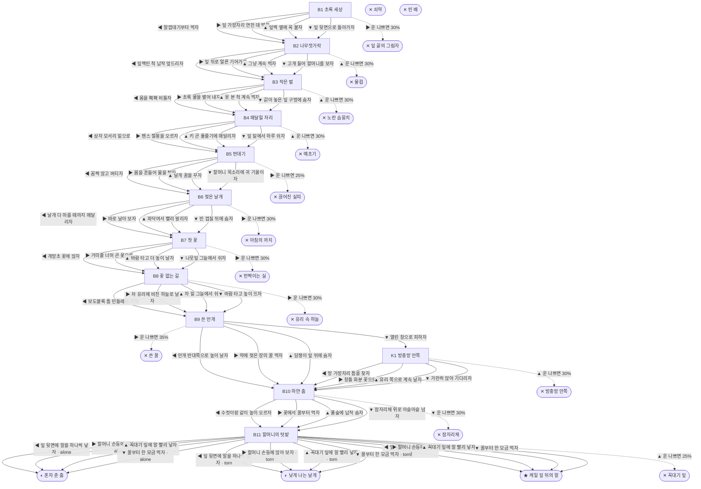

# 나비 (Pieris rapae)

> 이 문서는 `node scripts/scenario-docs.js`로 만든다. 고칠 때는 `js/data/species/butterfly.js`를 고친다.

- 몸길이 5cm · 눈높이 3cm · 시작 스탯 체력 100 / 포만 45 (장면마다 체력 -5 · 포만 -7)
- 체력이나 포만 중 하나라도 0이 되면 스토리와 상관없이 죽는다 (쇠약 / 굶주림)
- 해피엔딩: **케일 잎 뒤의 알** (생후 6주)
- 화단 구석 스티로폼 상자에 심은 케일, 그 잎 뒷면에 붙은 노란 알 속에서 눈을 떴어. 나는 배추흰나비 애벌레야. 지금은 쌀알보다 작은데, 언젠가 날개가 생긴대. 날개가 생기고 나면 두세 주밖에 못 산대.

## 흐름도
실선은 진행, 점선은 운이 나쁠 때(즉사 확률).

## 장면 (카드를 미는 방향 ◀ ▶ ▲ ▼, ★ 메인 루트)

| 장면 | 배경(등장) | 시기 | ◀ | ▶ | ▲ | ▼ |
|---|---|---|---|---|---|---|
| B1 초록 세상 | 아파트 단지 화단 (butterfly:eggShell, butterfly:kale, sparrow) | 생후 1일 | 알껍데기부터 먹자 (포만 +10) | 잎 가장자리 연한 데 먹자 (포만 +22 · 즉사 30%) | 잎맥 옆에 꼭 붙자 (체력 +5, 포만 +6) ★ | 잎 뒷면으로 돌아가자 (포만 +14 · 다침 30% 체력 -12) |
| B2 나무젓가락 | 아파트 단지 화단 (butterfly:styroBox, butterfly:chopsticks) | 생후 6일 | 잎맥인 척 납작 엎드리자 (체력 -3, 포만 +5) | 잎 뒤로 얼른 기어가자 (포만 +5 · 다침 35% 체력 -15) | 그냥 계속 먹자 (포만 +20 · 즉사 30%) | 고개 들어 할머니를 보자 (포만 +12, 체력 -2) ★ |
| B3 작은 벌 | 아파트 단지 화단 (butterfly:holeyLeaf, butterfly:wasp) | 생후 10일 | 몸을 홱홱 비틀자 (체력 -8) ★ | 초록 물을 뱉어 내자 (체력 -4, 포만 -6) | 못 본 척 계속 먹자 (포만 +22 · 즉사 30%) | 갉아 놓은 잎 구멍에 숨자 (포만 +10 · 다침 35% 체력 -14) |
| B4 매달릴 자리 | 아파트 단지 화단 (butterfly:grassStem, butterfly:fencePost, butterfly:trimmer) | 생후 13일 | 상자 모서리 밑으로 (체력 -8) | 펜스 철봉을 오르자 (체력 -6) ★ | 키 큰 풀줄기에 매달리자 (체력 -2 · 즉사 30%) | 잎 밑에서 하루 쉬자 (체력 +5, 포만 -5 · 다침 30% 체력 -12) |
| B5 번데기 | 아파트 단지 화단 (butterfly:fencePost, butterfly:puddle) | 생후 2주 | 꼼짝 않고 버티자 (체력 -6) | 몸을 흔들어 물을 털자 (체력 -2 · 즉사 25%) | 날개 꿈을 꾸자 (체력 +4 · 다침 35% 체력 -12) | 할머니 목소리에 귀 기울이자 (체력 +2) ★ |
| B6 젖은 날개 | 아파트 단지 화단 (butterfly:emptyPupa, magpie) | 생후 3주 | 날개 다 마를 때까지 매달리자 (체력 +5, 포만 -3) ★ | 바로 날아 보자 (포만 +5 · 즉사 30%) | 파닥여서 빨리 말리자 (체력 -3 · 플래그 torn) | 빈 껍질 뒤에 숨자 (체력 +3 · 다침 35% 체력 -15) |
| B7 첫 꽃 | 근린공원 (butterfly:fleabane, butterfly:orbWeb) | 생후 3주 | 개망초 꽃에 앉자 (포만 +25) ★ | 거미줄 너머 큰 꽃으로 (포만 +35 · 즉사 30%) | 바람 타고 더 높이 날자 (체력 -3, 포만 -4 · 다침 30% 체력 -14) | 나뭇잎 그늘에서 쉬자 (체력 +8, 포만 -4) |
| B8 꽃 없는 길 | 빌라 주차장 (butterfly:dandelion, butterfly:windshield) | 생후 4주 | 보도블록 틈 민들레로 가자 (포만 +18, 체력 -5 · 다침 35% 체력 -14) ★ | 차 유리에 비친 하늘로 날자 (포만 -3 · 즉사 30%) | 차 밑 그늘에서 쉬자 (체력 +6, 포만 -6) | 바람 타고 높이 뜨자 (체력 -6, 포만 -4) |
| B9 쓴 안개 | 빌라 골목 (butterfly:roseVine, butterfly:sprayer) | 생후 4주 | 안개 반대쪽으로 높이 날자 (체력 -3, 포만 -5) ★ | 약에 젖은 장미 꿀 먹자 (포만 +22 · 즉사 35%) | 담쟁이 잎 뒤에 숨자 (체력 -6 · 다침 40% 체력 -16) | 열린 창으로 피하자 (포만 -3) |
| K1 방충망 안쪽 | 가정집 거실 (butterfly:geranium, butterfly:screenMesh) | 생후 4주 | 망 가장자리 틈을 찾자 (체력 -10) | 창틀 화분 꽃으로 가자 (포만 +15 · 다침 35% 체력 -12) | 유리 쪽으로 계속 날자 (체력 -6, 포만 -6 · 즉사 30%) | 가만히 앉아 기다리자 (체력 +4, 포만 -6) |
| B10 하얀 춤 | 근린공원 (butterfly:mate, butterfly:bugNet) | 생후 4주 | 수컷이랑 같이 높이 오르자 (체력 -8, 포만 -4) ★ | 꽃에서 꿀부터 먹자 (포만 +20 · 플래그 alone) | 풀숲에 납작 숨자 (체력 +3 · 다침 35% 체력 -14) | 잠자리채 위로 아슬아슬 넘자 (포만 -3 · 즉사 30%) |
| B11 할머니의 텃밭 | 아파트 단지 화단 (butterfly:styroBox, butterfly:grandmaHand) | 생후 5주 | 잎 뒷면에 알을 하나씩 낳자 (자손 +120, 체력 -6) | 할머니 손등에 앉아 보자 (자손 +120, 체력 -2) ★ | 꼭대기 잎에 알 빨리 낳자 (자손 +150 · 즉사 25%) | 꿀부터 한 모금 먹자 (포만 +15, 자손 +90, 체력 -3) |

## 엔딩

| 엔딩 | 종류 | 사인(가해자) | 마지막 문장 |
|---|---|---|---|
| H1 케일 잎 뒤의 알 | 해피 | 노쇠 | 할머니가 잎 뒤 노란 알을 보고 웃었어. "조금만 먹고 나비 돼라." 바람이 따뜻해. 이만하면 참 좋은 오후야. |
| N1 혼자 춘 춤 | 노멀 | 노쇠 | 짝은 못 만났어. 그래도 개망초 꿀은 달았고, 하늘은 생각보다 훨씬 넓었어. |
| N2 낮게 나는 날개 | 노멀 | 노쇠 | 끝이 접힌 날개로는 상자 위까지 못 올라갔어. 화단 냉이 잎 뒤에 알 몇 개를 낳았어. 할머니가 거기도 봐 주면 좋겠다. |
| D1 잎 끝의 그림자 | 데드 | 참새 (sparrow) | 세상 구경, 겨우 한 입 했는데. |
| D2 물컵 | 데드 | 텃밭 주인의 젓가락 (butterfly:chopsticks) | 퐁. 물컵 속에 형제들이 동동 떠 있어. 케일은 할머니 거였으니까. |
| D3 노란 솜뭉치 | 데드 | 기생벌 (butterfly:wasp) | 그날부터 배 속이 간질거려. 나는 나비가 되는 대신, 작은 벌 새끼들의 집이 됐어. |
| D4 예초기 | 데드 | 제초 작업 (butterfly:trimmer) | 왱— 풀이 한꺼번에 눕고, 나도 같이 누웠어. |
| D5 끊어진 실띠 | 데드 | 번데기 추락 (butterfly:puddle) | 물웅덩이에 빠졌어. 날개가 생기는 날은 끝내 안 왔어. |
| D6 아침의 까치 | 데드 | 까치 (magpie) | 조금만 더 매달려 있을걸. 햇볕이 이렇게 따뜻했는데. |
| D7 반짝이는 실 | 데드 | 거미줄 (butterfly:orbWeb) | 반짝이는 게 다 꽃은 아니었어. |
| D8 유리 속 하늘 | 데드 | 차 유리 충돌 (butterfly:windshield) | 하늘이 유리 안에 있을 리가 없는데. |
| D9 쓴 꿀 | 데드 | 살충제 (butterfly:sprayer) | 진딧물 잡는 약이었대. 나는 진딧물이 아닌데. |
| D10 방충망 안쪽 | 데드 | 방충망에 갇혀 탈진 (butterfly:screenMesh) | 바깥이 다 보였어. 나갈 길만 없었어. |
| D11 잠자리채 | 데드 | 잠자리채 (butterfly:bugNet) | "와, 잡았다!" 아이 목소리는 신나 있었어. |
| D12 꼭대기 잎 | 데드 | 참새 (sparrow) | 맨 위 잎은 참새 눈에도 제일 잘 보였어. |
| W0 쇠약 | 데드 | 쇠약 | 몸이 무거워. 잎 그늘에서 잠깐만 쉬자. |
| W1 빈 배 | 데드 | 굶주림 | 잎 한 입, 꿀 한 방울만 더 있었으면. |
