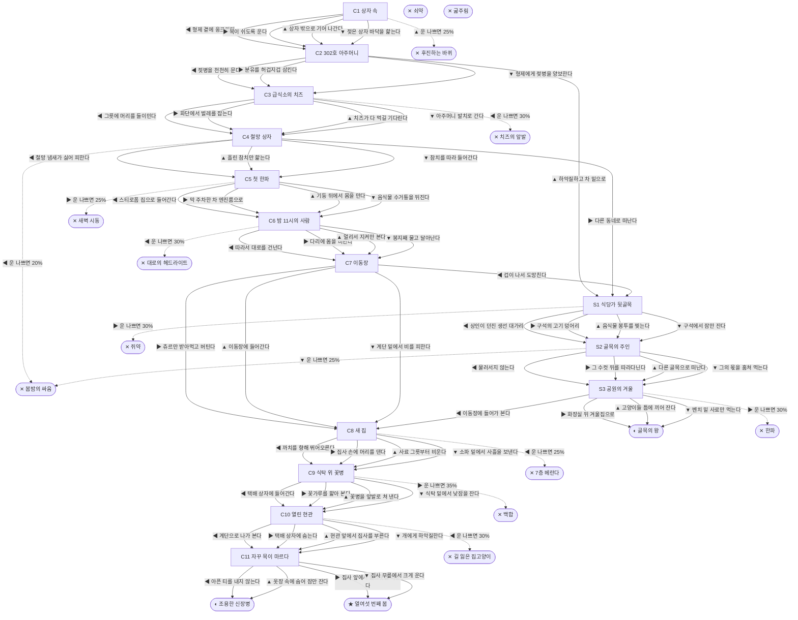

# 길고양이 (Felis catus)

> 이 문서는 `node scripts/scenario-docs.js`로 만든다. 고칠 때는 `js/data/species/cat.js`를 고친다.

- 몸길이 45cm · 눈높이 22cm · 시작 스탯 체력 90 / 포만 45 (장면마다 포만 -16)
- 체력이나 포만 중 하나라도 0이 되면 스토리와 상관없이 죽는다 (쇠약 / 굶주림)
- 해피엔딩: **열여섯 번째 봄** (생후 16년)
- 빌라 필로티 주차장 구석, 종이 상자 안에서 형제 넷과 함께 태어났다. 길 위의 고양이는 보통 2~3년, 집고양이는 15년 안팎을 산다.

## 흐름도
실선은 진행, 점선은 운이 나쁠 때(즉사 확률).

## 장면 (카드를 미는 방향 ◀ ▶ ▲ ▼, ★ 메인 루트)

| 장면 | 배경(등장) | 시기 | ◀ | ▶ | ▲ | ▼ |
|---|---|---|---|---|---|---|
| C1 상자 속 | 빌라 주차장 (kitten) | 생후 3주 | 형제 곁에 웅크린다 (포만 -5, 체력 +5) | 목이 쉬도록 운다 (체력 -5, 포만 +5) ★ | 상자 밖으로 기어 나간다 (포만 +15 · 즉사 25%) | 젖은 상자 바닥을 핥는다 (포만 +5 · 다침 40% 체력 -20) |
| C2 302호 아주머니 | 빌라 주차장 (auntie, kitten) | 생후 5주 | 젖병을 천천히 문다 (포만 +30) ★ | 분유를 허겁지겁 삼킨다 (포만 +45 · 다침 40% 체력 -25) | 하악질하고 차 밑으로 (포만 -5, 체력 -10) | 형제에게 젖병을 양보한다 (포만 +10) |
| C3 급식소의 치즈 | 아파트 단지 화단 (cheeseCat, auntie) | 생후 4개월 | 그릇에 머리를 들이민다 (포만 +35 · 즉사 30%) | 화단에서 벌레를 잡는다 (포만 +5 · 다침 30% 체력 -10) | 치즈가 다 먹길 기다린다 (포만 +15) ★ | 아주머니 발치로 간다 (포만 +25 · 다침 40% 체력 -20) |
| C4 철망 상자 | 분리수거장 (strayCat) | 생후 7개월 | 철망 냄새가 싫어 피한다 (포만 -5 · 즉사 20% · 다침 40% 체력 -25) | 다른 동네로 떠난다 (포만 -10) | 흘린 참치만 핥는다 (포만 +10 · 다침 40% 체력 -15) | 참치를 따라 들어간다 (체력 -10, 포만 +20) ★ |
| C5 첫 한파 | 빌라 주차장 (auntie) | 생후 9개월 | 스티로폼 집으로 들어간다 (체력 -5, 포만 +10 · 다침 30% 체력 -10) ★ | 막 주차한 차 엔진룸으로 (체력 +15 · 즉사 25%) | 기둥 뒤에서 몸을 만다 (포만 -5 · 다침 50% 체력 -25) | 음식물 수거통을 뒤진다 (포만 +25 · 다침 40% 체력 -20) |
| C6 밤 11시의 사람 | 편의점 앞 (owner) | 생후 1년 1개월 | 따라서 대로를 건넌다 (포만 +10 · 즉사 30%) | 다리에 몸을 비빈다 (포만 +15) ★ | 멀리서 지켜만 본다 (포만 +5) | 봉지째 물고 달아난다 (포만 +30 · 다침 40% 체력 -20) |
| C7 이동장 | 빌라 골목 (owner) | 생후 1년 2개월 | 겁이 나서 도망친다 (체력 -5) | 츄르만 받아먹고 버틴다 (포만 +15 · 다침 40% 체력 -15) | 이동장에 들어간다 (포만 +5 · 다침 30% 체력 -10) ★ | 계단 밑에서 비를 피한다 (포만 -10, 체력 +5) |
| C8 새 집 | 가정집 거실 (owner, magpie) | 생후 1년 2개월 | 까치를 향해 뛰어오른다 (즉사 25%) | 집사 손에 머리를 댄다 (포만 +10 · 다침 30% 체력 -10) | 사료 그릇부터 비운다 (포만 +30 · 다침 40% 체력 -15) | 소파 밑에서 사흘을 보낸다 (포만 +15, 체력 +10) ★ |
| C9 식탁 위 꽃병 | 가정집 부엌 (owner) | 생후 2년 | 택배 상자에 들어간다 (포만 +20) ★ | 꽃가루를 핥아 본다 (체력 -30 · 즉사 35%) | 꽃병을 앞발로 쳐 낸다 (포만 +5 · 다침 50% 체력 -15) | 식탁 밑에서 낮잠을 잔다 (포만 -5, 체력 +5) |
| C10 열린 현관 | 가정집 현관 (owner, dog) | 생후 5년 | 계단으로 나가 본다 (즉사 30%) | 택배 상자에 숨는다 (포만 -5, 체력 +5) | 현관 앞에서 집사를 부른다 (포만 +10) ★ | 개에게 하악질한다 (포만 +5 · 다침 40% 체력 -20) |
| C11 자꾸 목이 마르다 | 가정집 거실 (owner) | 생후 12년 | 아픈 티를 내지 않는다 | 집사 앞에서 물그릇을 비운다 ★ | 옷장 속에 숨어 잠만 잔다 (포만 -5) | 집사 무릎에서 크게 운다 (포만 +5) |
| S1 식당가 뒷골목 | 식당가 뒷골목 (worker) | +4주 | 상인이 던진 생선 대가리 (포만 +25) | 구석의 고기 덩어리 (포만 +40 · 즉사 30%) | 음식물 봉투를 찢는다 (포만 +30 · 다침 40% 체력 -20) | 구석에서 잠만 잔다 (포만 -5, 체력 +10) |
| S2 골목의 주인 | 식당가 뒷골목 (scarCat) | +6개월 | 물러서지 않는다 (체력 -20, 포만 +10 · 다침 40% 체력 -25) | 그 수컷 뒤를 따라다닌다 (포만 +15) | 다른 골목으로 떠난다 (포만 -10) | 그의 몫을 훔쳐 먹는다 (포만 +30 · 즉사 25%) |
| S3 공원의 겨울 | 근린공원 (auntie, strayCat) | 생후 2년 9개월 | 이동장에 들어가 본다 (포만 +20) | 화장실 뒤 겨울집으로 (포만 +5 · 즉사 30%) | 고양이들 틈에 끼어 잔다 (포만 -5 · 다침 40% 체력 -20) | 벤치 밑 사료만 먹는다 (포만 +15) |

## 엔딩

| 엔딩 | 종류 | 사인(가해자) | 마지막 문장 |
|---|---|---|---|
| H1 열여섯 번째 봄 | 해피 | 노환 | 집사의 무릎 위에서, 창밖 빌라 주차장을 내려다보며 잠들었다. 신장병은 일찍 발견됐고, 4년을 더 살았다. |
| N1 조용한 신장병 | 노멀 | 만성 신장병 | 집사가 알아챘을 땐 늦었다. 그래도 따뜻한 집이었다. |
| N2 골목의 왕 | 노멀 | 폐렴 | 겨울 끝에 숨이 가빠졌다. 길고양이 평균보다 두 배 가까이 살았다. |
| D1 후진하는 바퀴 | 데드 | 주차장 차량 (scooter) | 운전석에서는 상자 밖으로 나온 새끼 고양이가 보이지 않았다. |
| D2 치즈의 앞발 | 데드 | 상처 감염 (cheeseCat) | 얼굴의 상처가 곪았다. 급식소에도 순서가 있었다. |
| D3 봄밤의 싸움 | 데드 | 영역 다툼 (scarCat) | 목덜미의 상처가 끝내 아물지 않았다. |
| D4 새벽 시동 | 데드 | 엔진룸 (worker) | 겨울마다 보닛을 두드려 달라는 데는 이유가 있다. |
| D5 대로의 헤드라이트 | 데드 | 로드킬 (scooter) | 그 사람은 다음 날에도 편의점 앞에서 한참 기다렸다. |
| D6 7층 베란다 | 데드 | 고층 낙상 (magpie) | 방충망은 고양이를 막지 못한다. |
| D7 백합 | 데드 | 급성 신부전 (owner) | 백합은 꽃가루만으로도 고양이에게 치명적이다. |
| D8 길 잃은 집고양이 | 데드 | 실종 (dog) | 집고양이는 바깥 길을 모른다. 동네에 전단지가 붙었다. |
| D9 쥐약 | 데드 | 중독 (worker) | 쥐를 잡으려고 놓은 미끼였다. |
| D10 한파 | 데드 | 저체온 (strayCat) | 겨울집 자리를 빼앗기고 바깥에서 밤을 보냈다. |
| W0 쇠약 | 데드 | 상처와 병 | 몸이 더는 버티지 못했다. |
| W1 굶주림 | 데드 | 굶주림 | 마지막으로 먹은 게 언제였는지 기억나지 않았다. |
