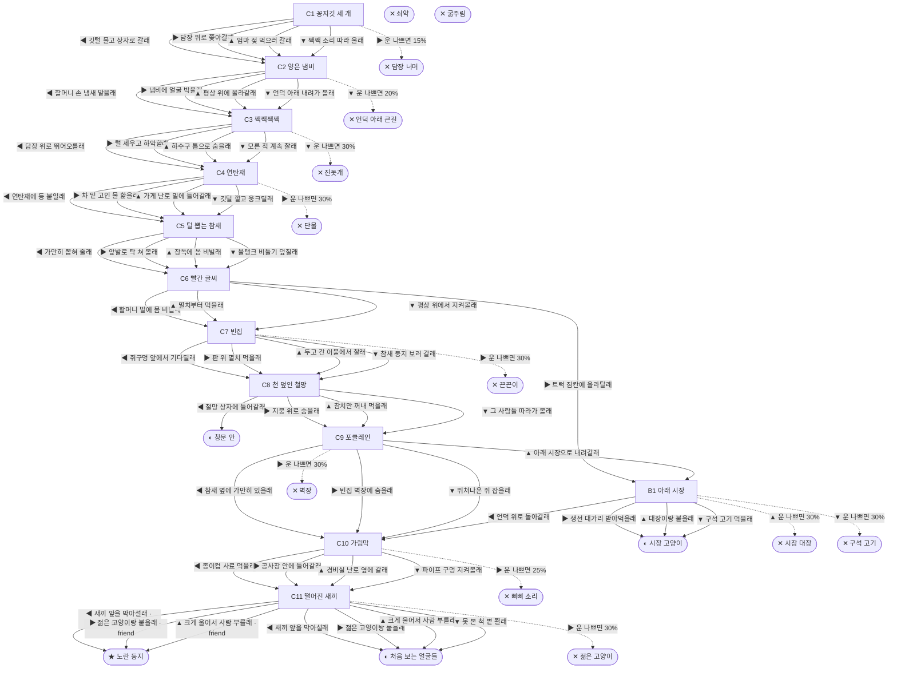

# 길고양이 (Felis catus)

> 이 문서는 `node scripts/scenario-docs.js`로 만든다. 고칠 때는 `js/data/species/cat.js`를 고친다.

- 몸길이 45cm · 눈높이 30cm · 시작 스탯 체력 80 / 포만 45 (장면마다 체력 -6 · 포만 -11)
- 체력이나 포만 중 하나라도 0이 되면 스토리와 상관없이 죽는다 (쇠약 / 굶주림)
- 해피엔딩: **노란 둥지** (생후 6년 4개월)
- 서울 언덕 꼭대기 골목, 할머니네 가게 뒤 연탄 창고. 나는 거기 종이 상자에서 형제 셋이랑 태어났어. 길에서 사는 고양이는 보통 두세 해를 산대. 우리 골목엔 할머니 할아버지가 많아. 참새도 많아. 집집이 기와지붕 틈에 둥지가 있거든.

## 흐름도
실선은 진행, 점선은 운이 나쁠 때(즉사 확률).

## 장면 (카드를 미는 방향 ◀ ▶ ▲ ▼, ★ 메인 루트)

| 장면 | 배경(등장) | 시기 | ◀ | ▶ | ▲ | ▼ |
|---|---|---|---|---|---|---|
| C1 꽁지깃 세 개 | 언덕 골목 (cat:threeFeathers, cat:jangdokSparrow) | 생후 6주 | 깃털 물고 상자로 갈래 (체력 +5, 포만 -5) ★ | 담장 위로 쫓아갈래 (포만 -5 · 즉사 15%) | 엄마 젖 먹으러 갈래 (포만 +20) | 짹짹 소리 따라 울래 (포만 +10) |
| C2 양은 냄비 | 언덕 골목 (cat:pyeongsang, cat:grandmaPot) | 생후 3개월 | 할머니 손 냄새 맡을래 (포만 +20) ★ | 냄비에 얼굴 박을래 (포만 +30 · 다침 40% 체력 -15) | 평상 위에 올라갈래 (체력 +10, 포만 +5) | 언덕 아래 내려가 볼래 (포만 +15 · 즉사 20%) |
| C3 짹짹짹짹 | 언덕 골목 (cat:sparrowAlarm, dog) | 생후 5개월 | 담장 위로 뛰어오를래 (포만 +5) ★ | 털 세우고 하악할래 (포만 +5 · 다침 50% 체력 -25) | 하수구 틈으로 숨을래 (체력 -5, 포만 -5) | 모른 척 계속 잘래 (체력 +10 · 즉사 30%) |
| C4 연탄재 | 언덕 골목 (cat:yeontanAsh, cat:antifreeze) | 생후 9개월 | 연탄재에 등 붙일래 (체력 +10, 포만 +15 · 다침 30% 체력 -10) ★ | 차 밑 고인 물 핥을래 (포만 +5 · 즉사 30%) | 가게 난로 밑에 들어갈래 (포만 +20 · 다침 30% 체력 -10) | 깃털 깔고 웅크릴래 (체력 +5, 포만 -5 · 다침 40% 체력 -15) |
| C5 털 뽑는 참새 | 옥상 (cat:furTufts, cat:furSparrow) | 생후 1년 1개월 | 가만히 뽑혀 줄래 (체력 +5, 포만 -5 · 플래그 friend) ★ | 앞발로 탁 쳐 볼래 (포만 +5) | 장독에 몸 비빌래 (포만 -5 · 다침 30% 체력 -10 · 플래그 friend) | 물탱크 비둘기 덮칠래 (포만 +25 · 다침 40% 체력 -15) |
| C6 빨간 글씨 | 이주가 시작된 골목 (cat:potLeft, grandma, cat:movingTruck) | 생후 1년 3개월 | 할머니 발에 몸 비빌래 (포만 +25) ★ | 트럭 짐칸에 올라탈래 (포만 +5 · 다침 30% 체력 -15) | 멸치부터 먹을래 (포만 +30) | 평상 위에서 지켜볼래 (체력 +10, 포만 +5) |
| C7 빈집 | 빈집 안방 (cat:ratHole, cat:glueTrap, cat:oldTv) | 생후 1년 6개월 | 쥐구멍 앞에서 기다릴래 (포만 +25 · 다침 30% 체력 -10) ★ | 판 위 멸치 먹을래 (포만 +15 · 즉사 30%) | 두고 간 이불에서 잘래 (체력 +15, 포만 -10) | 참새 둥지 보러 갈래 (체력 +5 · 플래그 friend) |
| C8 천 덮인 철망 | 이주가 시작된 골목 (cat:coveredTrap, cat:flashlightPerson) | 생후 1년 8개월 | 철망 상자에 들어갈래 (포만 +20) | 지붕 위로 숨을래 (체력 -5) ★ | 참치만 꺼내 먹을래 (포만 +20 · 다침 40% 체력 -15) | 그 사람들 따라가 볼래 (포만 +10) |
| C9 포클레인 | 철거 현장 (cat:tileRubble, cat:excavator) | 생후 1년 9개월 | 참새 옆에 가만히 있을래 (체력 +5 · 플래그 friend) ★ | 빈집 벽장에 숨을래 (체력 +10 · 즉사 30%) | 아래 시장으로 내려갈래 (포만 +10) | 뛰쳐나온 쥐 잡을래 (포만 +25 · 다침 40% 체력 -20) |
| B1 아래 시장 | 식당가 뒷골목 (cat:poisonMeat, scarCat, cat:fishTosser) | +3주 | 언덕 위로 돌아갈래 (포만 -5) | 생선 대가리 받아먹을래 (포만 +20) | 대장이랑 붙을래 (포만 +15 · 즉사 30%) | 구석 고기 먹을래 (포만 +35 · 즉사 30%) |
| C10 가림막 | 공사장 가림막 (cat:guardCup, cat:signSparrow) | 생후 3년 | 종이컵 사료 먹을래 (포만 +25) ★ | 공사장 안에 들어갈래 (포만 +15, 체력 +5 · 즉사 25%) | 경비실 난로 옆에 갈래 (체력 +15, 포만 -5 · 다침 30% 체력 -10) | 파이프 구멍 지켜볼래 (포만 -5) |
| C11 떨어진 새끼 | 아파트 단지 화단 (cat:fallenChick, cat:youngTom, cat:shrubSparrow) | 생후 4년 11개월 | 새끼 앞을 막아설래 (포만 +5 · 다침 30% 체력 -10) ★ | 젊은 고양이랑 붙을래 (포만 +5 · 즉사 30%) | 크게 울어서 사람 부를래 (포만 +10) | 못 본 척 볕 쬘래 (체력 +5) |

## 엔딩

| 엔딩 | 종류 | 사인(가해자) | 마지막 문장 |
|---|---|---|---|
| H1 노란 둥지 | 해피 | 노환 | 흰 점 참새랑 회양목 밑에서 자주 옛날 얘기를 해. 할머니 냄비, 연탄재, 기와 틈. 걔는 지금도 봄마다 내 등에서 털을 뽑아 가. "그래서 우리 애들은 고양이 냄새를 안 무서워해." "그럼 큰일이잖아." 둘이 한참 웃었어. |
| N1 시장 고양이 | 노멀 | 노환 | 생선 가게 평상 밑이 내 자리였어. 언덕 위 쿵쿵 소리는 몇 해 뒤에 그쳤어. 올라가 보진 않았어. |
| N2 창문 안 | 노멀 | 노환 | 언덕에서 구조된 고양이들이랑 같이 입양됐어. 밥은 늘 있어. 창밖에 참새가 지나가면 나는 정수리부터 봐. 흰 점이 있나. |
| N3 처음 보는 얼굴들 | 노멀 | 노환 | 새 화단 사람들은 다 친절했어. 다 처음 보는 얼굴이었어. 흰 점 참새는 언제부턴가 안 왔어. |
| D1 담장 너머 | 데드 | 오토바이 (scooter) | 참새는 날아서 넘어갔어. 나는 날개가 없다는 걸 깜빡했어. |
| D2 언덕 아래 큰길 | 데드 | 로드킬 (car) | 시장 냄새만 맡았어. 길이 그렇게 넓은 줄 몰랐어. |
| D3 진돗개 | 데드 | 개 습격 (dog) | 참새가 그렇게 깨웠는데. |
| D4 단물 | 데드 | 부동액 중독 (cat:antifreeze) | 그 물은 왜 그렇게 달았을까. |
| D5 끈끈이 | 데드 | 끈끈이 덫 (cat:glueTrap) | 쥐 잡으려고 놓은 판이었어. 판은 나랑 쥐를 구별 못 해. |
| D6 벽장 | 데드 | 철거 현장 매몰 (cat:excavator) | 포클레인 아저씨는 벽장 속에 내가 있는 줄 몰랐어. |
| D7 구석 고기 | 데드 | 쥐약 중독 (cat:poisonMeat) | 시장 쥐 잡으려고 놓은 고기였대. 그래도 배는 불렀어. |
| D8 삐삐 소리 | 데드 | 공사 차량 (cat:dumpTruck) | 삐삐 소리는 비키라는 소리였어. |
| D9 젊은 고양이 | 데드 | 영역 싸움 (cat:youngTom) | 이 화단은 이제 걔 자리야. 나도 옛날엔 저렇게 빨랐어. |
| D10 시장 대장 | 데드 | 영역 싸움 (scarCat) | 목덜미 상처가 끝내 안 아물었어. 언덕 위 골목에선 싸울 일이 없었는데. |
| W0 쇠약 | 데드 | 쇠약 | 다리가 무거워. 볕 드는 데까지 못 가겠어. |
| W1 굶주림 | 데드 | 굶주림 | 할머니 냄비가 자꾸 생각나. |
