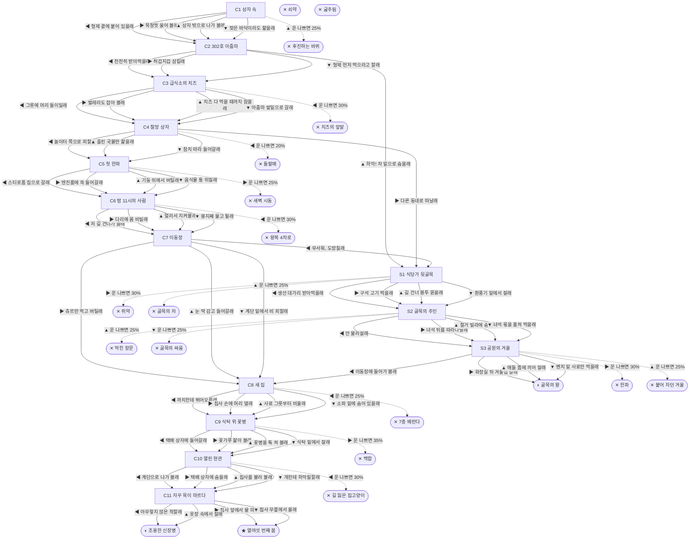

# 길고양이 (Felis catus)

> 이 문서는 `node scripts/scenario-docs.js`로 만든다. 고칠 때는 `js/data/species/cat.js`를 고친다.

- 몸길이 45cm · 눈높이 22cm · 시작 스탯 체력 90 / 포만 45 (장면마다 포만 -16)
- 체력이나 포만 중 하나라도 0이 되면 스토리와 상관없이 죽는다 (쇠약 / 굶주림)
- 해피엔딩: **열여섯 번째 봄** (생후 16년)
- 빌라 필로티 주차장 구석, 종이 상자 안. 나는 여기서 형제 넷이랑 같이 태어났어. 길에서 사는 고양이는 보통 2~3년, 집에서 사는 고양이는 15년쯤 산대.

## 흐름도
실선은 진행, 점선은 운이 나쁠 때(즉사 확률).

## 장면 (카드를 미는 방향 ◀ ▶ ▲ ▼, ★ 메인 루트)

| 장면 | 배경(등장) | 시기 | ◀ | ▶ | ▲ | ▼ |
|---|---|---|---|---|---|---|
| C1 상자 속 | 빌라 주차장 (cat:siblingsBox, cat:stairSlipper) | 생후 3주 | 형제 곁에 붙어 있을래 (포만 -5, 체력 +5) | 목청껏 울어 볼래 (체력 -5, 포만 +5) ★ | 상자 밖으로 나가 볼래 (포만 +15 · 즉사 25%) | 젖은 바닥이라도 핥을래 (포만 +5 · 다침 40% 체력 -20) |
| C2 302호 아줌마 | 빌라 주차장 (cat:auntieSyringe, kitten, cat:formulaCan) | 생후 5주 | 천천히 받아먹을래 (포만 +30) ★ | 허겁지겁 삼킬래 (포만 +45 · 다침 40% 체력 -25) | 하악! 차 밑으로 숨을래 (포만 -5, 체력 -10) | 형제 먼저 먹으라고 할래 (포만 +10) |
| C3 급식소의 치즈 | 아파트 단지 화단 (cat:grasshopper, cat:cheeseFirst, auntie) | 생후 4개월 | 그릇에 머리 들이밀래 (포만 +35 · 즉사 30%) | 벌레라도 잡아 볼래 (포만 +5 · 다침 30% 체력 -10) | 치즈 다 먹을 때까지 참을래 (포만 +15) ★ | 아줌마 발밑으로 갈래 (포만 +25 · 다침 40% 체력 -20) |
| C4 철망 상자 | 분리수거장 (cat:tnrTrap, cat:earTipCat, kid) | 생후 7개월 | 놀이터 쪽으로 피할래 (포만 -5 · 즉사 20% · 다침 40% 체력 -25) | 다른 동네로 떠날래 (포만 -10) | 흘린 국물만 핥을래 (포만 +10 · 다침 40% 체력 -15) | 참치 따라 들어갈래 (체력 -10, 포만 +20) ★ |
| C5 첫 한파 | 빌라 주차장 (cat:warmBonnet, cat:winterHouse, cat:snowWind) | 생후 9개월 | 스티로폼 집으로 갈래 (체력 -5, 포만 +10 · 다침 30% 체력 -10) ★ | 엔진룸에 쏙 들어갈래 (체력 +15 · 즉사 25%) | 기둥 뒤에서 버틸래 (포만 -5 · 다침 50% 체력 -25) | 음식물 통 뒤질래 (포만 +25 · 다침 40% 체력 -20) |
| C6 밤 11시의 사람 | 편의점 앞 (cat:crosswalk, cat:churuOwner) | 생후 1년 1개월 | 저 길 건너가 볼래 (포만 +10 · 즉사 30%) | 다리에 몸 비빌래 (포만 +15) ★ | 멀리서 지켜볼래 (포만 +5) | 봉지째 물고 튈래 (포만 +30 · 다침 40% 체력 -20) |
| C7 이동장 | 빌라 골목 (cat:umbrellaOwner, cat:openCarrier) | 생후 1년 2개월 | 무서워, 도망칠래 (체력 -5 · 다침 30% 체력 -10) | 츄르만 먹고 버틸래 (포만 +15 · 다침 40% 체력 -15) | 눈 딱 감고 들어갈래 (포만 +5 · 다침 30% 체력 -10) ★ | 계단 밑에서 비 피할래 (포만 -10, 체력 +5) |
| C8 새 집 | 가정집 거실 (cat:balconyWindow, cat:fancyBowl, owner) | 생후 1년 2개월 | 까치한테 뛰어오를래 (즉사 25%) | 집사 손에 머리 댈래 (포만 +10 · 다침 30% 체력 -10) | 사료 그릇부터 비울래 (포만 +30 · 다침 40% 체력 -15) | 소파 밑에 숨어 있을래 (포만 +15, 체력 +10) ★ |
| C9 식탁 위 꽃병 | 가정집 부엌 (cat:lilyTable, cat:openParcel, owner) | 생후 2년 | 택배 상자에 들어갈래 (포만 +20) ★ | 꽃가루 핥아 볼래 (체력 -30 · 즉사 35%) | 꽃병을 툭 쳐 볼래 (포만 +5 · 다침 50% 체력 -15) | 식탁 밑에서 잘래 (포만 -5, 체력 +5) |
| C10 열린 현관 | 가정집 현관 (cat:openDoor, cat:leashDog, cat:phoneOwner) | 생후 5년 | 계단으로 나가 볼래 (즉사 30%) | 택배 상자에 숨을래 (포만 -5, 체력 +5) | 집사를 불러 볼래 (포만 +10) ★ | 개한테 하악질할래 (포만 +5 · 다침 40% 체력 -20) |
| C11 자꾸 목이 마르다 | 가정집 거실 (cat:litterBox, cat:waterBowl, cat:ownerHand) | 생후 12년 | 아무렇지 않은 척할래 | 집사 앞에서 물 마실래 ★ | 옷장 속에서 잘래 (포만 -5) | 집사 무릎에서 울래 (포만 +5) |
| S1 식당가 뒷골목 | 식당가 뒷골목 (cat:poisonMeat, cat:fishTosser, cat:chickenBags) | +4주 | 생선 대가리 받아먹을래 (포만 +25) | 구석 고기 먹을래 (포만 +40 · 즉사 30%) | 길 건너 봉투 뜯을래 (포만 +30 · 즉사 25% · 다침 30% 체력 -20) | 환풍기 밑에서 잘래 (포만 -5, 체력 +10) |
| S2 골목의 주인 | 식당가 뒷골목 (cat:demolitionFence, cat:wallTom) | +6개월 | 안 물러설래 (체력 -20, 포만 +10 · 다침 40% 체력 -25) | 녀석 뒤를 따라다닐래 (포만 +15) | 철거 빌라에 숨을래 (포만 -10 · 즉사 25%) | 녀석 몫을 훔쳐 먹을래 (포만 +30 · 즉사 25%) |
| S3 공원의 겨울 | 근린공원 (cat:crowdedShelter, cat:benchCarrier) | 생후 2년 9개월 | 이동장에 들어가 볼래 (포만 +20) | 화장실 뒤 겨울집 갈래 (포만 +5 · 즉사 30%) | 애들 틈에 끼어 잘래 (포만 -5 · 즉사 25% · 다침 40% 체력 -20) | 벤치 밑 사료만 먹을래 (포만 +15) |

## 엔딩

| 엔딩 | 종류 | 사인(가해자) | 마지막 문장 |
|---|---|---|---|
| H1 열여섯 번째 봄 | 해피 | 노환 | 집사 무릎 위야. 창밖으로 빌라 주차장이 보여. 신장병을 일찍 알아챈 덕에 4년을 더 살았어. 이제 조금만 잘게. |
| N1 조용한 신장병 | 노멀 | 만성 신장병 | 너무 늦게 티를 냈나 봐. 그래도 따뜻한 집이었어. |
| N2 골목의 왕 | 노멀 | 폐렴 | 숨이 자꾸 가빠. 그래도 길에서 이만큼이면 두 배는 산 거래. |
| D1 후진하는 바퀴 | 데드 | 주차장 사고 (cat:reversingCar) | 운전석에선 내가 안 보였을 거야. 나는 너무 작았으니까. |
| D2 치즈의 앞발 | 데드 | 상처 감염 (cat:cheeseSwipe) | 얼굴 상처가 곪았어. 밥자리에도 순서가 있었나 봐. |
| D3 골목의 싸움 | 데드 | 영역 싸움 (scarCat) | 목덜미 상처가 끝내 안 아물었어. 이 골목, 좀 더 갖고 싶었는데. |
| D4 새벽 시동 | 데드 | 엔진룸 (cat:warmBonnet) | 겨울엔 다들 보닛을 한 번만 두드려 주면 좋겠어. |
| D5 왕복 4차로 | 데드 | 로드킬 (car) | 그 사람, 내일도 편의점 앞에서 기다리겠지. |
| D6 7층 베란다 | 데드 | 고층 낙상 (magpie) | 방충망은 날 못 막았어. 까치는 그냥 날아갔어. |
| D7 백합 | 데드 | 급성 신부전 (cat:lilyTable) | 꽃가루 조금이었는데. 집사가 자꾸 울어. |
| D8 길 잃은 집고양이 | 데드 | 실종 (cat:leashDog) | 집에 가는 길을 모르겠어. 집사 목소리가 듣고 싶어. |
| D9 쥐약 | 데드 | 중독 (cat:poisonMeat) | 쥐 잡으려고 놓은 고기였대. 그래도 배는 불렀는데. |
| D10 한파 | 데드 | 동사 (strayCat) | 겨울집 자리를 뺏겼어. 너무 졸려. 자면 안 되는데. |
| D11 돌팔매 | 데드 | 학대 (kid) | 사람 손은 밥도 주고, 돌도 던지는구나. |
| D12 골목의 차 | 데드 | 로드킬 (car) | 치킨 냄새만 따라왔어. 차 소리는 못 들었어. |
| D13 막힌 창문 | 데드 | 재개발 현장 고립 (cat:boardedWindow) | 밖에서 포클레인 소리만 들려. 아무도 여기 내가 있는 줄 몰라. |
| D14 붙어 자던 겨울 | 데드 | 범백 (cat:crowdedShelter) | 다 같이 붙어 자면 따뜻한 줄만 알았어. |
| W0 쇠약 | 데드 | 상처와 병 | 몸이 더는 말을 안 들어. |
| W1 굶주림 | 데드 | 굶주림 | 마지막으로 먹은 게 언제였더라. |
