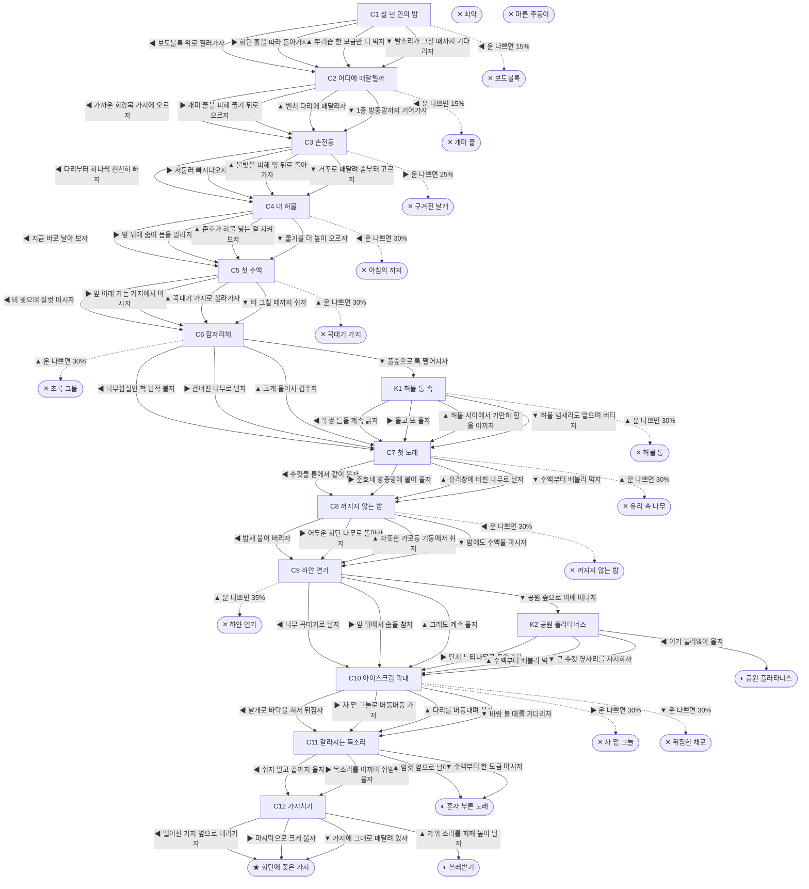

# 매미 (Cryptotympana atrata)

> 이 문서는 `node scripts/scenario-docs.js`로 만든다. 고칠 때는 `js/data/species/cicada.js`를 고친다.

- 몸길이 4.5cm · 눈높이 1.4cm · 시작 스탯 체력 100 / 포만 50 (장면마다 체력 -3 · 포만 -5)
- 체력이나 포만 중 하나라도 0이 되면 스토리와 상관없이 죽는다 (쇠약 / 굶주림)
- 해피엔딩: **화단에 꽂은 가지** (생후 4주)
- 아파트 화단 느티나무 밑, 흙 속에서 칠 년을 살았어. 나는 말매미 애벌레야. 뿌리에 주둥이를 꽂고 즙을 빨았어. 칠 년 동안 한 일은 그게 다야. 땅 위에선 한 달쯤 산대. 오늘 밤은 흙이 말랑해.

## 흐름도
실선은 진행, 점선은 운이 나쁠 때(즉사 확률).

## 장면 (카드를 미는 방향 ◀ ▶ ▲ ▼, ★ 메인 루트)

| 장면 | 배경(등장) | 시기 | ◀ | ▶ | ▲ | ▼ |
|---|---|---|---|---|---|---|
| C1 칠 년 만의 밤 | 아파트 단지 화단 (cicada:soilHole, cicada:paverEdge, cicada:sneaker) | 생후 1일 | 보도블록 위로 질러가자 (체력 -3 · 즉사 15%) | 화단 흙을 따라 돌아가자 (체력 -5) ★ | 뿌리즙 한 모금만 더 먹자 (포만 +15 · 다침 30% 체력 -12) | 발소리가 그칠 때까지 기다리자 (체력 +5, 포만 -5) |
| C2 어디에 매달릴까 | 아파트 단지 화단 (cicada:boxwood, cicada:antLine, cicada:barkTrunk) | 생후 1일 | 가까운 회양목 가지에 오르자 (체력 -3 · 즉사 15%) | 개미 줄을 피해 줄기 뒤로 오르자 (체력 -8) ★ | 벤치 다리에 매달리자 (체력 -5 · 다침 30% 체력 -12) | 1층 방충망까지 기어가자 (체력 -6, 포만 -4 · 다침 30% 체력 -12) |
| C3 손전등 | 아파트 단지 화단 (cicada:molting, cicada:flashlight) | 생후 1일 | 다리부터 하나씩 천천히 빼자 (체력 -8) ★ | 서둘러 빠져나오자 (체력 -3 · 즉사 25%) | 불빛을 피해 잎 뒤로 돌아가자 (체력 -6, 포만 -4 · 다침 30% 체력 -12) | 거꾸로 매달려 숨부터 고르자 (체력 +4, 포만 -5) |
| C4 내 허물 | 아파트 단지 화단 (cicada:emptyShell, cicada:shellBox, magpie) | 생후 2일 | 지금 바로 날아 보자 (포만 +5 · 즉사 30%) | 잎 뒤에 숨어 몸을 말리자 (체력 +5, 포만 -3) | 준호가 허물 넣는 걸 지켜보자 (체력 +4 · 다침 25% 체력 -10) ★ | 줄기를 더 높이 오르자 (체력 -8) |
| C5 첫 수액 | 근린공원 (cicada:sapOoze, cicada:bulbul) | 생후 4일 | 비 맞으며 실컷 마시자 (포만 +28 · 다침 35% 체력 -15) | 잎 아래 가는 가지에서 마시자 (포만 +20) ★ | 꼭대기 가지로 올라가자 (포만 +35 · 즉사 30%) | 비 그칠 때까지 쉬자 (체력 +8, 포만 -4) |
| C6 잠자리채 | 아파트 단지 화단 (cicada:bugNet, cicada:shellBox) | 생후 7일 | 나무껍질인 척 납작 붙자 (체력 -2, 포만 +6) ★ | 건너편 나무로 날자 (포만 -5 · 다침 35% 체력 -14) | 크게 울어서 겁주자 (포만 -5 · 즉사 30%) | 풀숲으로 툭 떨어지자 (체력 -5) |
| K1 허물 통 속 | 가정집 현관 (cicada:shellBox) | 생후 7일 | 뚜껑 틈을 계속 긁자 (체력 -12) | 울고 또 울자 (체력 -8, 포만 -5) | 허물 사이에서 가만히 힘을 아끼자 (체력 +5 · 즉사 30%) | 허물 냄새라도 맡으며 버티자 (포만 -2 · 다침 30% 체력 -10) |
| C7 첫 노래 | 아파트 단지 화단 (cicada:windowScreen, cicada:chorus) | 생후 10일 | 수컷들 틈에서 같이 울자 (체력 -3, 포만 -4) ★ | 준호네 방충망에 붙어 울자 (포만 -4 · 다침 35% 체력 -14) | 유리창에 비친 나무로 날자 (포만 -4 · 즉사 30%) | 수액부터 배불리 먹자 (포만 +20, 체력 -4) |
| C8 꺼지지 않는 밤 | 빌라 골목 (cicada:streetlamp, cicada:moths) | 생후 12일 | 밤새 울어 버리자 (체력 -10 · 즉사 30%) | 어두운 화단 나무로 돌아가자 (체력 +2, 포만 +5) ★ | 따뜻한 가로등 기둥에서 쉬자 (체력 +8 · 다침 40% 체력 -15) | 밤에도 수액을 마시자 (포만 +15, 체력 -5) |
| C9 하얀 연기 | 아파트 단지 화단 (cicada:foggingSmoke) | 생후 2주 | 나무 꼭대기로 날자 (포만 +4, 체력 -5) ★ | 잎 뒤에서 숨을 참자 (체력 -8 · 다침 40% 체력 -15) | 그래도 계속 울자 (포만 -4 · 즉사 35%) | 공원 숲으로 아예 떠나자 (포만 -8) |
| K2 공원 플라타너스 | 근린공원 (cicada:chorus, cicada:planeBark) | 생후 2주 | 여기 눌러앉아 울자 (포만 +10) | 단지 느티나무로 돌아가자 (포만 -4) | 수액부터 배불리 먹자 (포만 +20, 체력 -3) | 큰 수컷 옆자리를 차지하자 (포만 +5 · 다침 40% 체력 -14) |
| C10 아이스크림 막대 | 빌라 주차장 (cicada:hotAsphalt, cicada:catUnderCar, cicada:popsicle) | 생후 3주 | 날개로 바닥을 쳐서 뒤집자 (체력 -10) | 차 밑 그늘로 버둥버둥 가자 (체력 +5 · 즉사 30%) | 다리를 버둥대며 울자 (체력 -4) ★ | 바람 불 때를 기다리자 (체력 -5 · 즉사 30%) |
| C11 갈라지는 목소리 | 아파트 단지 화단 (cicada:dewLeaf, cicada:mate) | 생후 3주 | 쉬지 말고 끝까지 울자 (체력 -6) ★ | 목소리를 아끼며 쉬엄쉬엄 울자 (체력 +3, 포만 -3 · 다침 30% 체력 -10) | 암컷 옆으로 날아가자 (체력 -4) | 수액부터 한 모금 마시자 (포만 +15) |
| C12 가지치기 | 아파트 단지 화단 (cicada:deadTwig, cicada:pruningShears) | 생후 4주 | 떨어진 가지 옆으로 내려가자 (자손 +400, 체력 -6) | 마지막으로 크게 울자 (자손 +400, 체력 -4) ★ | 가위 소리를 피해 높이 날자 (자손 +400, 체력 -4) | 가지에 그대로 매달려 있자 (자손 +400, 체력 -3) |

## 엔딩

| 엔딩 | 종류 | 사인(가해자) | 마지막 문장 |
|---|---|---|---|
| H1 화단에 꽂은 가지 | 해피 | 노쇠 | 준호가 알 박힌 가지를 내가 나온 구멍 옆 흙에 꽂았어. 칠 년 뒤에 우리 애들이 올라올 때면, 준호는 고등학생이야. 그때도 허물을 모으려나. |
| N1 혼자 부른 노래 | 노멀 | 노쇠 | 짝은 못 만났어. 그래도 여름 내내 울었어. 이 단지 여름 소리엔 내 목소리도 들어 있었어. |
| N2 공원 플라타너스 | 노멀 | 노쇠 | 공원에서 짝을 만나 여름을 마쳤어. 우리 애들은 공원 흙으로 내려갈 거야. 단지 느티나무는 담장 너머로 조그맣게 보였어. |
| N3 쓰레받기 | 노멀 | 노쇠 | 알 박힌 가지는 아저씨 쓰레받기에 담겨 갔어. 짝은 다른 가지에도 낳았을 거야. 아마. |
| D1 보도블록 | 데드 | 밟힘 (cicada:sneaker) | 땅속에선 칠 년. 땅 위에선 일 분. |
| D2 개미 줄 | 데드 | 개미떼 (cicada:antLine) | 껍질도 못 벗었어. 개미들은 밤마다 이 나무 밑에서 기다려. |
| D3 구겨진 날개 | 데드 | 우화 실패 (cicada:emptyShell) | 날개가 구겨진 채로 굳었어. 가지엔 빈 허물이 남았어. 그건 준호가 가져가겠지. |
| D4 아침의 까치 | 데드 | 까치 (magpie) | 날개가 굳을 때까지만 참을걸. |
| D5 꼭대기 가지 | 데드 | 직박구리 (cicada:bulbul) | 제일 단 가지는 직박구리도 알고 있었어. |
| D6 허물 통 | 데드 | 채집통에 갇혀 탈진 (cicada:shellBox) | 투명한 벽 너머로 여름이 지나갔어. 준호는 할머니 댁에 있었어. |
| D7 초록 그물 | 데드 | 잠자리채 (cicada:bugNet) | "와, 잡았다!" 그물 안에서 크게 울었어. 아이들이 그 소리에 더 신이 났어. |
| D8 꺼지지 않는 밤 | 데드 | 가로등 아래 탈진 (cicada:streetlamp) | 끝까지 낮인 줄 알고 울었어. |
| D9 유리 속 나무 | 데드 | 유리창 충돌 (glassWall) | 유리에 비친 느티나무가 진짜 나무인 줄 알았어. |
| D10 하얀 연기 | 데드 | 방역 연무 (cicada:foggingSmoke) | 모기 잡으려고 뿌린 연기래. 연기는 모기랑 매미를 가리지 않았어. |
| D11 뒤집힌 채로 | 데드 | 폭염과 아스팔트 (cicada:hotAsphalt) | 뒤집힌 채로 하늘만 봤어. 땅속에선 못 보던 거야. |
| D12 차 밑 그늘 | 데드 | 길고양이 (strayCat) | 그늘은 고양이 자리였어. |
| W0 쇠약 | 데드 | 쇠약 | 울림판이 더는 안 떨려. 조금만 쉬자. |
| W1 마른 주둥이 | 데드 | 굶주림 | 수액 한 모금만 더 마셨으면. |
