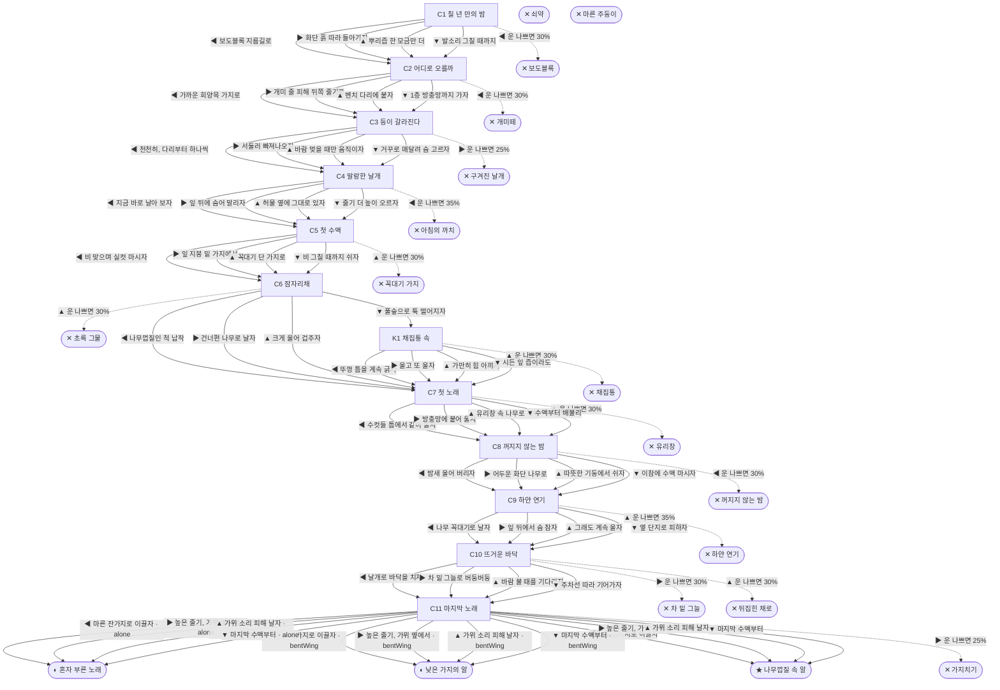

# 매미 (Cryptotympana atrata)

> 이 문서는 `node scripts/scenario-docs.js`로 만든다. 고칠 때는 `js/data/species/cicada.js`를 고친다.

- 몸길이 4.5cm · 눈높이 1.4cm · 시작 스탯 체력 100 / 포만 50 (장면마다 체력 -4 · 포만 -6)
- 체력이나 포만 중 하나라도 0이 되면 스토리와 상관없이 죽는다 (쇠약 / 굶주림)
- 해피엔딩: **나무껍질 속 알** (생후 4주)
- 칠 년. 아파트 화단 느티나무 뿌리 옆에서, 흙 속에 박혀 뿌리즙만 빨며 기다렸어. 나는 매미 애벌레야. 오늘 밤 흙이 말랑해. 지금이야. 땅 위에선 길어야 한 달이래.

## 흐름도
실선은 진행, 점선은 운이 나쁠 때(즉사 확률).

## 장면 (카드를 미는 방향 ◀ ▶ ▲ ▼, ★ 메인 루트)

| 장면 | 배경(등장) | 시기 | ◀ | ▶ | ▲ | ▼ |
|---|---|---|---|---|---|---|
| C1 칠 년 만의 밤 | 아파트 단지 화단 (cicada:soilHole, cicada:paverEdge, cicada:sneaker) | 생후 1일 | 보도블록 지름길로 (체력 -3 · 즉사 30%) | 화단 흙 따라 돌아가자 (체력 -5) ★ | 뿌리즙 한 모금만 더 (포만 +15 · 다침 35% 체력 -15) | 발소리 그칠 때까지 (체력 +5, 포만 -5) |
| C2 어디로 오를까 | 아파트 단지 화단 (cicada:boxwood, cicada:antLine, cicada:barkTrunk) | 생후 1일 | 가까운 회양목 가지로 (체력 -3 · 즉사 30%) | 개미 줄 피해 뒤쪽 줄기로 (체력 -8) ★ | 벤치 다리에 붙자 (체력 -5 · 다침 35% 체력 -15) | 1층 방충망까지 가자 (체력 -8, 포만 -5 · 다침 30% 체력 -15) |
| C3 등이 갈라진다 | 아파트 단지 화단 (cicada:barkTrunk, cicada:molting) | 생후 1일 | 천천히, 다리부터 하나씩 (체력 -8) ★ | 서둘러 빠져나오자 (체력 -3 · 즉사 25% · 플래그 bentWing) | 바람 멎을 때만 움직이자 (체력 -5, 포만 -5 · 다침 30% 체력 -15) | 거꾸로 매달려 숨 고르자 (체력 +5, 포만 -5) |
| C4 말랑한 날개 | 아파트 단지 화단 (cicada:emptyShell, cicada:dewLeaf, magpie) | 생후 2일 | 지금 바로 날아 보자 (포만 +5 · 즉사 35%) | 잎 뒤에 숨어 말리자 (체력 +5, 포만 -3) ★ | 허물 옆에 그대로 있자 (포만 0 · 다침 40% 체력 -20) | 줄기 더 높이 오르자 (체력 -8) |
| C5 첫 수액 | 근린공원 (cicada:sapOoze, cicada:bulbul) | 생후 4일 | 비 맞으며 실컷 마시자 (포만 +30 · 다침 40% 체력 -20) | 잎 지붕 밑 가지에서 (포만 +22) ★ | 꼭대기 단 가지로 (포만 +35 · 즉사 30%) | 비 그칠 때까지 쉬자 (체력 +8, 포만 -5) |
| C6 잠자리채 | 근린공원 (cicada:bugNet, cicada:bugBox) | 생후 7일 | 나무껍질인 척 납작 (체력 -5, 포만 +8) ★ | 건너편 나무로 날자 (포만 -5 · 다침 35% 체력 -15) | 크게 울어 겁주자 (포만 -5 · 즉사 30%) | 풀숲으로 툭 떨어지자 (체력 -5) |
| K1 채집통 속 | 가정집 현관 (cicada:bugBox, cicada:wiltLeaf) | 생후 7일 | 뚜껑 틈을 계속 긁자 (체력 -12) | 울고 또 울자 (체력 -8, 포만 -5) | 가만히 힘 아끼자 (체력 +5 · 즉사 30%) | 시든 잎 즙이라도 (포만 +5 · 다침 30% 체력 -10) |
| C7 첫 노래 | 아파트 단지 화단 (cicada:chorus, cicada:windowScreen) | 생후 10일 | 수컷들 틈에서 같이 울자 (포만 -5, 체력 -3) ★ | 방충망에 붙어 울자 (포만 -5 · 다침 35% 체력 -15) | 유리창 속 나무로 가자 (포만 -5 · 즉사 30%) | 수액부터 배불리 (포만 +20, 체력 -5) |
| C8 꺼지지 않는 밤 | 빌라 골목 (cicada:streetlamp, cicada:moths) | 생후 12일 | 밤새 울어 버리자 (체력 -10 · 즉사 30%) | 어두운 화단 나무로 (체력 -3, 포만 +5) ★ | 따뜻한 기둥에서 쉬자 (체력 +8 · 다침 40% 체력 -15) | 이참에 수액 마시자 (포만 +15, 체력 -5) |
| C9 하얀 연기 | 아파트 단지 화단 (cicada:foggingSmoke) | 생후 2주 | 나무 꼭대기로 날자 (포만 +5, 체력 -5) ★ | 잎 뒤에서 숨 참자 (체력 -8 · 다침 40% 체력 -15) | 그래도 계속 울자 (포만 -5 · 즉사 35%) | 옆 단지로 피하자 (포만 -10) |
| C10 뜨거운 바닥 | 빌라 주차장 (cicada:hotAsphalt, cicada:catUnderCar) | 생후 3주 | 날개로 바닥을 치자 (체력 -10) ★ | 차 밑 그늘로 버둥버둥 (체력 +5 · 즉사 30%) | 바람 불 때를 기다리자 (체력 -5 · 즉사 30%) | 주차선 따라 기어가자 (체력 -8, 포만 -5 · 다침 35% 체력 -15) |
| C11 마지막 노래 | 근린공원 (cicada:deadTwig, cicada:mate, cicada:pruningShears) | 생후 3주 | 마른 잔가지로 이끌자 (자손 +400, 체력 -8) ★ | 높은 줄기, 가위 옆에서 (자손 +300, 포만 +5 · 즉사 25%) | 가위 소리 피해 날자 (체력 +5 · 플래그 alone) | 마지막 수액부터 (포만 +20 · 플래그 alone) |

## 엔딩

| 엔딩 | 종류 | 사인(가해자) | 마지막 문장 |
|---|---|---|---|
| H1 나무껍질 속 알 | 해피 | 노쇠 | 칠 년을 기다리고 한 달을 노래했어. 내년 여름, 내 알들이 깨어 땅속으로 내려가겠지. 칠 년 뒤에 봐. |
| N1 혼자 부른 노래 | 노멀 | 노쇠 | 여름 내내 울었는데 짝은 못 만났어. 그래도 이 단지 여름 소리엔 내 목소리도 섞여 있었어. |
| N2 낮은 가지의 알 | 노멀 | 노쇠 | 접힌 날개로는 높이 못 갔어. 낮은 가지에 낳은 알들아, 가지치기 가위만은 피해 주렴. |
| D1 보도블록 | 데드 | 밟힘 (cicada:sneaker) | 칠 년을 기다렸는데, 일 분도 안 걸렸네. |
| D2 개미떼 | 데드 | 개미떼 (cicada:antLine) | 껍질도 못 벗었는데. 개미들은 밤마다 기다리고 있었구나. |
| D3 구겨진 날개 | 데드 | 우화 실패 (cicada:emptyShell) | 날개가 구겨진 채로 굳어 버렸어. 가지 위엔 빈 허물만 남았어. |
| D4 아침의 까치 | 데드 | 까치 (magpie) | 날개가 굳을 때까지만 참을걸. |
| D5 꼭대기 가지 | 데드 | 직박구리 (cicada:bulbul) | 제일 단 가지는 직박구리도 알고 있었어. |
| D6 채집통 | 데드 | 채집통에 갇혀 탈진 (cicada:bugBox) | 투명한 벽 너머로 여름이 지나가. |
| D7 초록 그물 | 데드 | 잠자리채 (cicada:bugNet) | 그물 안에서 마지막으로 크게 울었어. 그 소리는 들렸으려나. |
| D8 꺼지지 않는 밤 | 데드 | 가로등 아래 탈진 (cicada:streetlamp) | 밤인 줄 몰랐어. 끝까지 낮인 줄 알고 울었어. |
| D9 유리창 | 데드 | 유리창 충돌 (glassWall) | 저 나무가 진짜인 줄 알았어. |
| D10 하얀 연기 | 데드 | 방역 연무 (cicada:foggingSmoke) | 모기 잡으려던 연기래. 나도 그 안에 있었어. |
| D11 뒤집힌 채로 | 데드 | 폭염과 아스팔트 (cicada:hotAsphalt) | 뒤집힌 채로 하늘만 봤어. 여름 하늘이 너무 파래. |
| D12 차 밑 그늘 | 데드 | 길고양이 (strayCat) | 그늘은 고양이 자리였어. |
| D13 가지치기 | 데드 | 가지치기 (cicada:pruningShears) | 철컥. 그 가지에 내가 있었어. |
| W0 쇠약 | 데드 | 쇠약 | 울림판이 더는 안 떨려. 조금만 쉬자. |
| W1 마른 주둥이 | 데드 | 굶주림 | 수액 한 모금만 더 마셨으면. |
