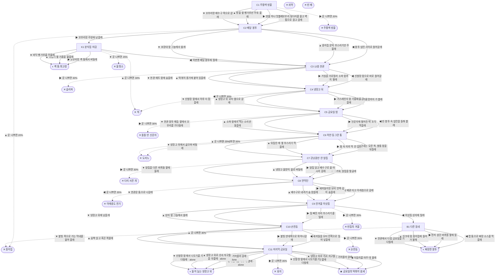

# 바퀴벌레 (Blattella germanica)

> 이 문서는 `node scripts/scenario-docs.js`로 만든다. 고칠 때는 `js/data/species/cockroach.js`를 고친다.

- 몸길이 1.3cm · 눈높이 0.5cm · 시작 스탯 체력 100 / 포만 50 (장면마다 체력 -4 · 포만 -9)
- 체력이나 포만 중 하나라도 0이 되면 스토리와 상관없이 죽는다 (쇠약 / 굶주림)
- 해피엔딩: **금요일의 떡볶이 냄새** (생후 9개월)
- 나는 독일바퀴야. 분식집 주방 벽 틈에서 형제 마흔이랑 같이 깼어. 제일 늦게 깬 막내는 더듬이 하나가 꼬부라져 있었어. 그래서 이름이 꼬부리야. 꼬부리는 어딜 가든 내 뒷다리에 더듬이를 대고 따라와.

## 흐름도
실선은 진행, 점선은 운이 나쁠 때(즉사 확률).

## 장면 (카드를 미는 방향 ◀ ▶ ▲ ▼, ★ 메인 루트)

| 장면 | 배경(등장) | 시기 | ◀ | ▶ | ▲ | ▼ |
|---|---|---|---|---|---|---|
| C1 주황색 방울 | 분식집 주방 (cockroach:kkobu, cockroach:gelSeam) | 생후 7일 | 꼬부리 뒷다리를 물고 벽 틈으로 끌고 갈래 (체력 +2, 포만 -4) ★ | 방울 하나 맛볼래 (포만 +20 · 즉사 20%) | 방울 옆 빵가루만 주워 올래 (포만 +12 · 다침 35% 체력 -12) | 꼬부리랑 배수구 쪽으로 갈래 (포만 +8 · 다침 30% 체력 -12) |
| C2 배달 봉투 | 분식집 주방 (cockroach:napkinBag, cockroach:kkobu, cockroach:roachHouse) | 생후 4주 | 봉투 냅킨 사이로 들어갈래 (포만 +8) ★ | 꼬부리랑 주방에 남을래 (포만 +15) | 종이집 문턱 부스러기만 주울래 (포만 +22 · 즉사 20%) | 포장대 밑 그늘에서 쉴래 (체력 +10, 포만 -4) |
| C3 12층 현관 | 가정집 현관 (cockroach:cabinetGap, cockroach:sneaker) | 생후 4주 | 신발장 밑으로 바로 들어갈래 (포만 -2 · 다침 30% 체력 -6) ★ | 거실을 가로질러 소파 밑까지 뛸래 (포만 +12 · 즉사 30%) | 떡볶이 용기에 붙어 있을래 (포만 +20 · 다침 40% 체력 -20) | 현관 매트 밑에 숨을래 (체력 +6, 포만 -5) |
| C4 냉장고 뒤 | 가정집 부엌 (cockroach:sinkDrip, cockroach:motorGrille) | 생후 5주 | 거름망까지 가 볼래 (포만 +30 · 즉사 30%) | 가스레인지 밑 기름때를 갉을래 (포만 +15 · 다침 35% 체력 -15) | 냉장고 뒤 모터 옆으로 갈래 (체력 +8, 포만 +16) ★ | 신발장 밑에서 하루 더 참을래 (체력 +4, 포만 -6) |
| C5 금요일 밤 | 가정집 거실 (cockroach:tteokTray) | 생후 5주 | 빈 봉투 속 냅킨을 들춰 볼래 (포만 +6 · 다침 30% 체력 -10) | 신문지에 떨어진 떡 조각 먹을래 (포만 +24 · 즉사 30%) | 소파 밑에서 먹는 소리만 들을래 (체력 +6, 포만 -4) | 현관 봉투 매듭 옆에서 꼬부리를 기다릴래 (포만 +6) ★ |
| C6 하얀 동그란 통 | 가정집 부엌 (cockroach:baitDisc, cockroach:flippedFriend) | 생후 3개월 | 단내는 모른 척, 쌀통 밑을 뒤질래 (포만 +10) ★ | 통 속 미끼 딱 한 입만 (포만 +25 · 즉사 35%) | 뒤집힌 애 옆 부스러기 먹을래 (포만 +15 · 즉사 25%) | 냉장고 뒤에서 굶으며 버틸래 (체력 +6, 포만 -8) |
| C7 강낭콩만 한 알집 | 가정집 부엌 (cockroach:eggCase, cockroach:bathDrain, centipede) | 생후 4개월 | 무거워, 알집을 떨굴래 (체력 +4, 포만 +8 · 플래그 alone) | 알집 달고 배수구로 물 마시러 갈래 (자손 +40, 포만 +12 · 즉사 30%) | 냉장고 물받이 물로 버틸래 (자손 +40, 체력 -6 · 다침 30% 체력 -6) ★ | 알집을 다른 바퀴들 옆에 둘래 (자손 +20) |
| C8 연막탄 | 가정집 부엌 (cockroach:fleeingRoaches, cockroach:smokeBomb) | 생후 5개월 | 배관 타고 아래층으로 갈래 (포만 +12 · 즉사 35%) | 새끼들이랑 모터 안쪽 깊이 숨을래 (체력 -14, 포만 +4 · 다침 30% 체력 -8) ★ | 배수구로 내려가 숨 참을래 (체력 -26) | 현관문 틈으로 나갈래 (포만 -10 · 다침 30% 체력 -14) |
| C9 한겨울 이삿짐 | 가정집 부엌 (cockroach:tapeRoll, cockroach:movingBoxes) | 생후 7개월 | 이삿짐 상자에 탈래 (포만 +8 · 다침 35% 체력 -15) | 짐 빠진 자리 부스러기를 털래 (포만 +28 · 즉사 35%) | 상자 밑 그늘에서 쉴래 (체력 +10, 포만 -6) | 냉장고 뒤에 남을래 (포만 +16) ★ |
| C10 손전등 | 가정집 부엌 (cockroach:babyCrowd, cockroach:flashBeam) | 생후 8개월 | 새끼들을 모터 안쪽으로 밀어 넣을래 (자손 +50, 체력 -6) | 불빛 반대쪽으로 뛰어나갈래 (포만 +10 · 즉사 35%) | 꼼짝 않고 죽은 척할래 (체력 -4, 포만 -4) | 불빛 쪽으로 가는 막내를 물어 올래 (자손 +60, 체력 -10 · 다침 35% 체력 -10) ★ |
| C11 마지막 금요일 | 가정집 현관 (cockroach:kkobuPeek) | 생후 9개월 | 더듬이를 마주 대 볼래 (체력 +2) ★ | 봉투 위로 기어올라 갈래 (포만 +6 · 즉사 35%) | 냉장고 뒤로 가서 식구들을 부를래 (체력 -4) | 신발장 밑에서 나오기를 기다릴래 (체력 +4) |
| K1 분식집 마감 | 분식집 주방 (cockroach:oilPuddle, cockroach:kkobu, cockroach:fryer) | 생후 2개월 | 이번엔 배달 봉투에 탈래 (포만 +5 · 다침 30% 체력 -10) | 꼬부리랑 벽 틈에서 버틸래 (체력 +10, 포만 -5) | 튀김기 옆 기름을 핥을래 (포만 +25 · 즉사 30% · 다침 40% 체력 -25) | 바닥 빵가루를 주울래 (포만 +15 · 즉사 25%) |
| B1 다른 동네 | 가정집 부엌 (cockroach:wrappedBowl) | 생후 7개월 | 랩 틈으로 짜장 소스를 먹을래 (포만 +20 · 다침 30% 체력 -10) | 먼저 살던 바퀴들 옆에 낄래 (체력 +6) | 싱크대 밑 종이집에 들어가 볼래 (포만 +20 · 즉사 30%) | 현관에서 다음 금요일을 기다릴래 (포만 -6) |

## 엔딩

| 엔딩 | 종류 | 사인(가해자) | 마지막 문장 |
|---|---|---|---|
| H1 금요일의 떡볶이 냄새 | 해피 | 노쇠 | 냅킨 밑에서 늙은 바퀴가 기어 나왔어. 더듬이 하나가 꼬부라져 있어. "누나한테서 냉장고 냄새 나." "너는 아직도 떡볶이 냄새 나." 그날 밤 냉장고 뒤에서 새끼들이 꼬부라진 삼촌 더듬이를 하나씩 만져 봤어. |
| N1 둘이 눕는 냉장고 뒤 | 노멀 | 노쇠 | 꼬부리가 봉투를 타고 왔어. 냉장고 뒤는 둘이 눕기에 넓어. 꼬부리는 모터 소리가 시끄럽대. 나는 그 소리가 좋은데. |
| N2 짜장면 봉투 | 노멀 | 노쇠 | 새 집에도 금요일마다 배달이 와. 늘 짜장면이야. 그래도 나는 금요일마다 현관에 가서 냅킨 밑을 들여다봐. |
| N3 벽 틈 최고령 | 노멀 | 노쇠 | 꼬부리랑 나는 분식집 벽 틈 최고령이야. 주황색 방울을 짜 놓는 날이면 내가 꼬부리 뒷다리를 물어. 이 나이에도 꼬부리는 버둥거려. |
| D1 주황색 방울 | 데드 | 먹이형 살충제 (cockroach:gelDrop) | 그렇게 단 건 처음이었어. 꼬부리가 날 따라 먹지 않았으면 좋겠어. |
| D2 종이집 | 데드 | 끈끈이 트랩 (cockroach:stuckInHouse) | 안에 친구들이 많더라. 다 나처럼 붙어 있었어. |
| D3 슬리퍼 | 데드 | 슬리퍼 (cockroach:slipperSole) | 거실 한가운데엔 숨을 데가 없더라. |
| D4 칙 | 데드 | 살충제 스프레이 (sprayCan) | 불 켜지고 0.5초. 내가 딱 0.5초 늦었어. |
| D5 도미노 | 데드 | 먹이형 살충제 (cockroach:flippedFriend) | 독은 천천히 와. 그리고 내 몸을 핥는 다음 애한테 넘어가. |
| D6 다리 서른 개 | 데드 | 그리마 (centipede) | 알집이 무거워서 뛸 수가 없었어. |
| D7 아래층도 연기 | 데드 | 연막 살충제 (cockroach:smokeBomb) | 단지 전체가 방역하는 날이었대. 갈 데가 없었어. |
| D8 빈집의 겨울 | 데드 | 추위 (cockroach:coldDraft) | 부스러기는 많았는데. 따뜻한 데가 없었어. |
| D9 손전등 | 데드 | 방역 살충제 (cockroach:flashBeam) | 눈이 부셔서 어디로 뛰는지도 몰랐어. |
| D10 물청소 | 데드 | 세제 물 (cockroach:soapFlood) | 꼬부리는 벽 틈에 있었어. 다행이야. |
| D11 돌돌 만 신문지 | 데드 | 신문지 (cockroach:rolledPaper) | 고향 떡볶이 한 조각이었는데. |
| D12 휴지 | 데드 | 휴지 (cockroach:tissueHand) | 꼬부라진 더듬이까지 딱 한 뼘이었어. |
| W0 쇠약 | 데드 | 쇠약 | 더듬이가 이제 안 움직여. 좀 쉬고 싶었어. |
| W1 빈 배 | 데드 | 굶주림 | 부스러기 하나 못 찾은 날이 너무 길었어. |
