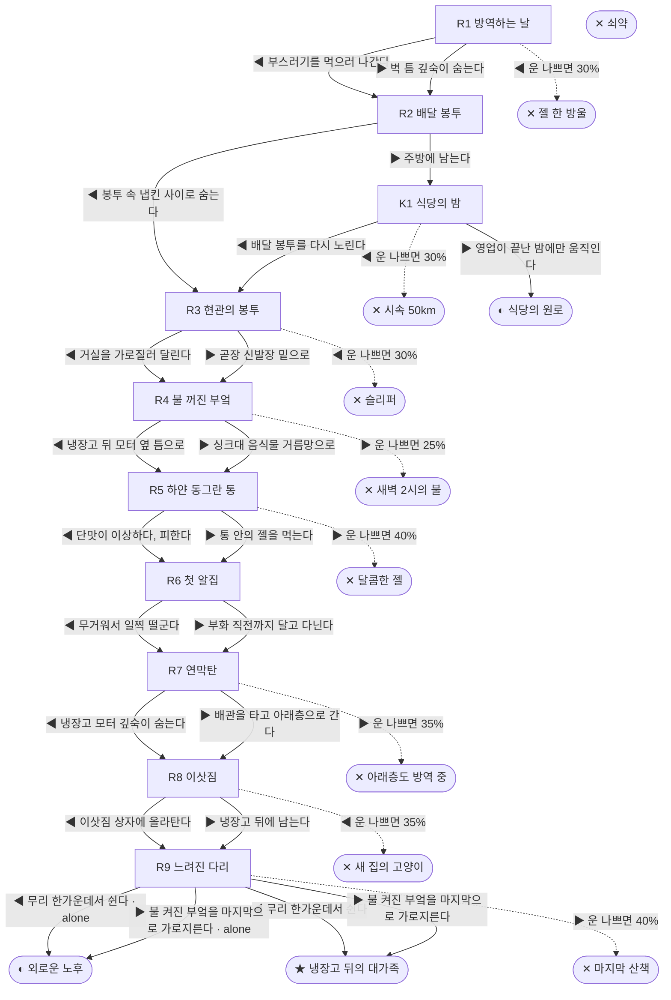

# 바퀴벌레 (Blattella germanica)

> 이 문서는 `node scripts/scenario-docs.js`로 만든다. 고칠 때는 `js/data/species/cockroach.js`를 고친다.

- 몸길이 1.3cm · 눈높이 0.5cm · 시작 스탯 체력 100 / 포만 60 (장면마다 포만 -12)
- 해피엔딩: **냉장고 뒤의 대가족** (생후 9개월)
- 도심 식당가, 분식집 주방 벽 틈의 알집에서 형제 39마리와 함께 깼다. 독일바퀴는 식당과 아파트에 사는 종이다. 암컷은 알집을 부화 직전까지 몸에 달고 다닌다.

## 흐름도
실선은 진행, 점선은 운이 나쁠 때(즉사 확률).

## 장면 (◀ 왼쪽 / ▶ 오른쪽, ★ 메인 루트)

| 장면 | 배경 | 시기 | ◀ 왼쪽 | ▶ 오른쪽 |
|---|---|---|---|---|
| R1 방역하는 날 | 식당 주방 | 생후 7일 | 부스러기를 먹으러 나간다 (포만 +25 · 즉사 30%) | 벽 틈 깊숙이 숨는다 (포만 -5) ★ |
| R2 배달 봉투 | 식당 주방 | 생후 6주 | 봉투 속 냅킨 사이로 숨는다 (포만 +5) ★ | 주방에 남는다 (포만 +20) |
| R3 현관의 봉투 | 가정집 현관 | 생후 6주 | 거실을 가로질러 달린다 (즉사 30%) | 곧장 신발장 밑으로 ★ |
| R4 불 꺼진 부엌 | 가정집 부엌 | 생후 7주 | 냉장고 뒤 모터 옆 틈으로 (포만 +25, 체력 +10) ★ | 싱크대 음식물 거름망으로 (포만 +35 · 즉사 25%) |
| R5 하얀 동그란 통 | 가정집 부엌 | 생후 3개월 | 단맛이 이상하다, 피한다 (포만 +10) ★ | 통 안의 젤을 먹는다 (포만 +20 · 즉사 40%) |
| R6 첫 알집 | 가정집 부엌 | 생후 4개월 | 무거워서 일찍 떨군다 (포만 +10 · 플래그 alone) | 부화 직전까지 달고 다닌다 (자손 +40, 포만 -5) ★ |
| R7 연막탄 | 가정집 부엌 | 생후 5개월 | 냉장고 모터 깊숙이 숨는다 (체력 -15, 포만 +5) ★ | 배관을 타고 아래층으로 간다 (포만 +10 · 즉사 35%) |
| R8 이삿짐 | 가정집 부엌 | 생후 7개월 | 이삿짐 상자에 올라탄다 (즉사 35% · 플래그 alone) | 냉장고 뒤에 남는다 (자손 +80, 포만 +25) ★ |
| R9 느려진 다리 | 가정집 부엌 | 생후 9개월 | 무리 한가운데서 쉰다 ★ | 불 켜진 부엌을 마지막으로 가로지른다 (즉사 40%) |
| K1 식당의 밤 | 식당 주방 | 생후 2개월 | 배달 봉투를 다시 노린다 (포만 +5 · 즉사 30%) | 영업이 끝난 밤에만 움직인다 |

## 엔딩

| 엔딩 | 종류 | 사인 | 마지막 문장 |
|---|---|---|---|
| H1 냉장고 뒤의 대가족 | 해피 | 노쇠 | 알 120개, 손주까지 300마리. 냉장고 모터의 온기 속에서 조용히 멈췄다. |
| N1 식당의 원로 | 노멀 | 노쇠 | 주방 벽 틈의 최고령. 다음 방역은 다음 주다. |
| N2 외로운 노후 | 노멀 | 노쇠 | 오래 살았지만 냉장고 뒤는 조용했다. |
| D1 젤 한 방울 | 데드 | 먹이형 살충제 | 바퀴가 먹으면 독이 천천히 온몸에 퍼진다. |
| D2 시속 50km | 데드 | 추락 | 배달통은 생각보다 미끄러웠다. |
| D3 슬리퍼 | 데드 | 슬리퍼 | 거실 한가운데에는 숨을 데가 없다. |
| D4 새벽 2시의 불 | 데드 | 슬리퍼 | 불이 켜지면 바퀴는 0.5초 늦는다. |
| D5 달콤한 젤 | 데드 | 먹이형 살충제 | 일부 독일바퀴는 이 단맛을 피하도록 진화했다. 당신은 아니었다. |
| D6 아래층도 방역 중 | 데드 | 연막 살충제 | 아파트 단지 일괄 방역의 날이었다. |
| D7 새 집의 고양이 | 데드 | 고양이 | 새 집에는 고양이가 있었다. 길에서 데려온 고양이라고 했다. |
| D8 마지막 산책 | 데드 | 슬리퍼 | 형광등은 생각보다 밝았다. |
| W0 쇠약 | 데드 | 굶주림 | 더듬이가 더는 움직이지 않았다. |
