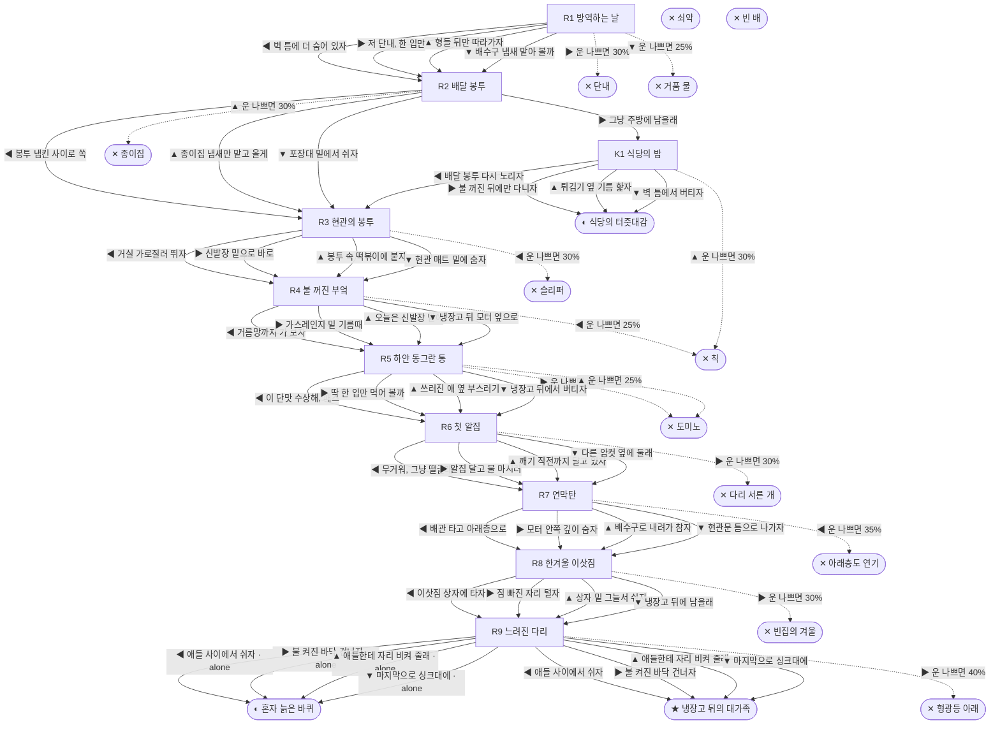

# 바퀴벌레 (Blattella germanica)

> 이 문서는 `node scripts/scenario-docs.js`로 만든다. 고칠 때는 `js/data/species/cockroach.js`를 고친다.

- 몸길이 1.3cm · 눈높이 0.5cm · 시작 스탯 체력 100 / 포만 50 (장면마다 포만 -12)
- 체력이나 포만 중 하나라도 0이 되면 스토리와 상관없이 죽는다 (쇠약 / 굶주림)
- 해피엔딩: **냉장고 뒤의 대가족** (생후 9개월)
- 나는 독일바퀴야. 분식집 주방 벽 틈 알집에서 형제 서른아홉이랑 같이 깼어. 우리 종은 식당이랑 아파트에서만 살아. 엄마는 알집을 깨기 직전까지 꽁무니에 달고 다녔대.

## 흐름도
실선은 진행, 점선은 운이 나쁠 때(즉사 확률).

## 장면 (카드를 미는 방향 ◀ ▶ ▲ ▼, ★ 메인 루트)

| 장면 | 배경(등장) | 시기 | ◀ | ▶ | ▲ | ▼ |
|---|---|---|---|---|---|---|
| R1 방역하는 날 | 식당 주방 (cockroach:gelSeam, cockroach:emptyCrack) | 생후 7일 | 벽 틈에 더 숨어 있자 (포만 -5) | 저 단내, 한 입만 (포만 +30 · 즉사 30%) | 형들 뒤만 따라가자 (포만 +12 · 다침 50% 체력 -10) ★ | 배수구 냄새 맡아 볼까 (포만 +8 · 즉사 25%) |
| R2 배달 봉투 | 식당 주방 (cockroach:roachHouse, cockroach:napkinBag) | 생후 6주 | 봉투 냅킨 사이로 쏙 (포만 +5) ★ | 그냥 주방에 남을래 (포만 +20) | 종이집 냄새만 맡고 올게 (포만 +25 · 즉사 30%) | 포장대 밑에서 쉬자 (포만 -3, 체력 +10) |
| R3 현관의 봉투 | 가정집 현관 (cockroach:cabinetGap, spider, cockroach:sneaker) | 생후 6주 | 거실 가로질러 뛰자 (포만 +10 · 즉사 30%) | 신발장 밑으로 바로 (포만 -3 · 다침 30% 체력 -10) ★ | 봉투 속 떡볶이에 붙자 (포만 +20 · 다침 40% 체력 -25) | 현관 매트 밑에 숨자 (포만 -5, 체력 +5) |
| R4 불 꺼진 부엌 | 가정집 부엌 (cockroach:sinkDrip, cockroach:motorGrille) | 생후 7주 | 거름망까지 가 보자 (포만 +35 · 즉사 25%) | 가스레인지 밑 기름때 (포만 +15 · 다침 40% 체력 -20) | 오늘은 신발장 밑에 (포만 -5) | 냉장고 뒤 모터 옆으로 (포만 +25, 체력 +10) ★ |
| R5 하얀 동그란 통 | 가정집 부엌 (cockroach:baitDisc, cockroach:flippedFriend) | 생후 3개월 | 이 단맛 수상해, 패스 (포만 +10) ★ | 딱 한 입만 먹어 볼까 (포만 +25 · 즉사 40%) | 쓰러진 애 옆 부스러기 (포만 +15 · 즉사 25%) | 냉장고 뒤에서 버티자 (포만 -8, 체력 +5) |
| R6 첫 알집 | 가정집 부엌 (cockroach:eggCase, cockroach:bathDrain, centipede) | 생후 4개월 | 무거워, 그냥 떨굴래 (포만 +10 · 플래그 alone) | 알집 달고 물 마시러 (자손 +40, 포만 +20 · 즉사 30%) | 깨기 직전까지 달고 있자 (자손 +40, 포만 -5 · 다침 50% 체력 -15) ★ | 다른 암컷 옆에 둘래 (자손 +20) |
| R7 연막탄 | 가정집 부엌 (cockroach:fleeingRoaches, cockroach:smokeBomb) | 생후 5개월 | 배관 타고 아래층으로 (포만 +15 · 즉사 35%) | 모터 안쪽 깊이 숨자 (체력 -15, 포만 +5 · 다침 30% 체력 -10) ★ | 배수구로 내려가 참자 (체력 -25) | 현관문 틈으로 나가자 (포만 -10 · 다침 30% 체력 -15) |
| R8 한겨울 이삿짐 | 가정집 부엌 (cockroach:tapeRoll, cockroach:movingBoxes) | 생후 7개월 | 이삿짐 상자에 타자 (포만 +10 · 다침 40% 체력 -20 · 플래그 alone) | 짐 빠진 자리 털자 (포만 +30 · 즉사 30%) | 상자 밑 그늘서 쉬자 (포만 -5, 체력 +10) | 냉장고 뒤에 남을래 (자손 +80, 포만 +25) ★ |
| R9 느려진 다리 | 가정집 부엌 (cockroach:babyCrowd, cockroach:motorGrille) | 생후 9개월 | 애들 사이에서 쉬자 ★ | 불 켜진 바닥 건너자 (포만 +10 · 즉사 40%) | 애들한테 자리 비켜 줄래 (포만 -5) | 마지막으로 싱크대에 (포만 +15 · 다침 40% 체력 -20) |
| K1 식당의 밤 | 식당 주방 (cockroach:oilPuddle, roachFriend, cockroach:fryer) | 생후 2개월 | 배달 봉투 다시 노리자 (포만 +5 · 다침 30% 체력 -10) | 불 꺼진 뒤에만 다니자 (포만 +5) | 튀김기 옆 기름 핥자 (포만 +25 · 즉사 30% · 다침 40% 체력 -30) | 벽 틈에서 버티자 (포만 -5, 체력 +10) |

## 엔딩

| 엔딩 | 종류 | 사인(가해자) | 마지막 문장 |
|---|---|---|---|
| H1 냉장고 뒤의 대가족 | 해피 | 노쇠 | 알 120개, 손주까지 300마리. 모터 소리 들으면서 자는 거, 나쁘지 않았어. |
| N1 식당의 터줏대감 | 노멀 | 노쇠 | 주방 벽 틈 최고령이 나야. 다음 방역은 다음 주래. 난 못 보겠네. |
| N2 혼자 늙은 바퀴 | 노멀 | 노쇠 | 오래 살긴 했어. 냉장고 뒤가 좀 조용했을 뿐이야. |
| D1 단내 | 데드 | 먹이형 살충제 (cockroach:gelDrop) | 그렇게 단 건 처음이었어. 처음이자 마지막. |
| D2 종이집 | 데드 | 끈끈이 트랩 (cockroach:stuckInHouse) | 안에 친구들이 많더라. 다 나처럼 붙어 있었어. |
| D3 슬리퍼 | 데드 | 슬리퍼 (cockroach:slipperSole) | 거실 한가운데엔 숨을 데가 없더라. |
| D4 칙 | 데드 | 살충제 스프레이 (sprayCan) | 불 켜지고 0.5초. 내가 딱 0.5초 늦었어. |
| D5 도미노 | 데드 | 먹이형 살충제 (cockroach:flippedFriend) | 독은 천천히 와. 그리고 내 몸 핥는 다음 애한테 넘어가. |
| D6 다리 서른 개 | 데드 | 그리마 (centipede) | 돈벌레라더니. 나한텐 그냥 저승사자였어. |
| D7 아래층도 연기 | 데드 | 연막 살충제 (cockroach:smokeBomb) | 단지 전체가 방역하는 날이었대. 갈 데가 없었어. |
| D8 빈집의 겨울 | 데드 | 추위 (cockroach:coldDraft) | 부스러기는 많았는데. 따뜻한 데가 없었어. |
| D9 형광등 아래 | 데드 | 휴지 (cockroach:tissueHand) | 형광등이 이렇게 밝은 줄 몰랐어. 마지막 산책치곤 화려했지. |
| D10 거품 물 | 데드 | 세제 물 (cockroach:soapFlood) | 설거지 물이 이렇게 미끄러울 줄이야. |
| W0 쇠약 | 데드 | 쇠약 | 더듬이가 이제 안 움직여. 좀 쉬고 싶었어. |
| W1 빈 배 | 데드 | 굶주림 | 부스러기 하나 못 찾은 날이 너무 길었어. |
