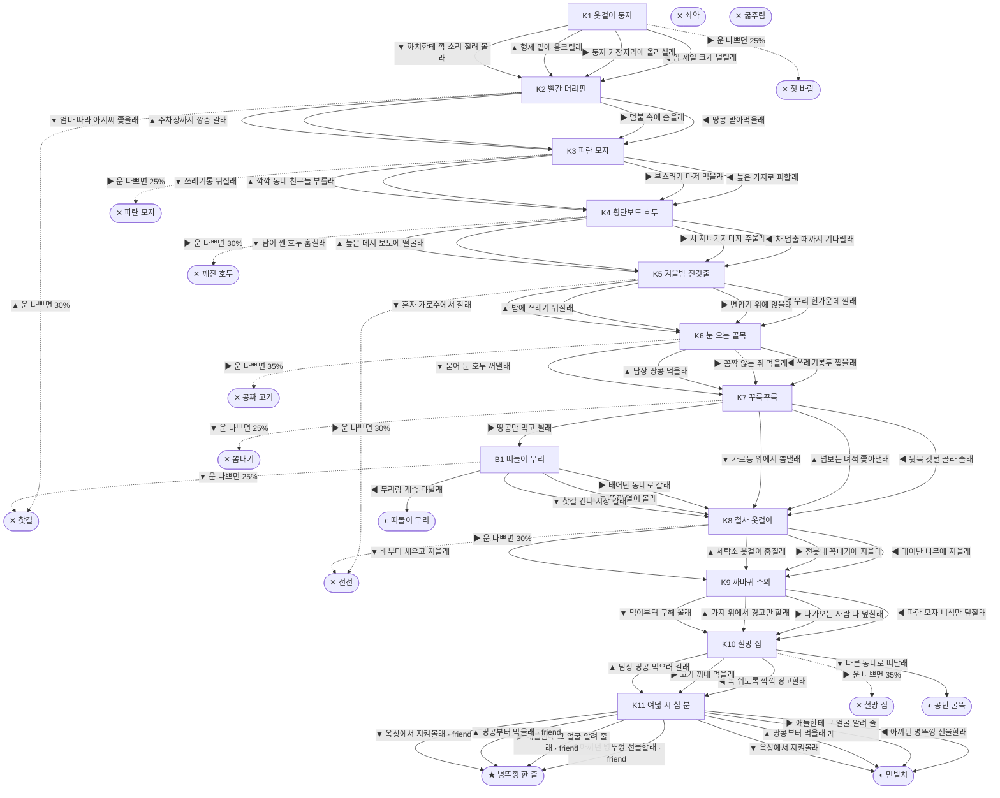

# 까마귀 (Corvus macrorhynchos)

> 이 문서는 `node scripts/scenario-docs.js`로 만든다. 고칠 때는 `js/data/species/crow.js`를 고친다.

- 몸길이 55cm · 눈높이 340cm · 시작 스탯 체력 65 / 포만 50 (장면마다 체력 -5 · 포만 -13)
- 체력이나 포만 중 하나라도 0이 되면 스토리와 상관없이 죽는다 (쇠약 / 굶주림)
- 해피엔딩: **병뚜껑 한 줄** (생후 8년 1개월)
- 나는 아파트 단지 느티나무 꼭대기에서 깼어. 엄마아빠가 베란다에서 훔쳐 온 철사 옷걸이로 지은 집이야. 도시 까마귀는 보통 일고여덟 해를 산대. 우리는 한 번 본 얼굴을 안 잊어.

## 흐름도
실선은 진행, 점선은 운이 나쁠 때(즉사 확률).

## 장면 (카드를 미는 방향 ◀ ▶ ▲ ▼, ★ 메인 루트)

| 장면 | 배경(등장) | 시기 | ◀ | ▶ | ▲ | ▼ |
|---|---|---|---|---|---|---|
| K1 옷걸이 둥지 | 아파트 단지 화단 (crow:hangerNest, magpie) | 생후 3주 | 입 제일 크게 벌릴래 (포만 +25 · 다침 30% 체력 -10) | 둥지 가장자리에 올라설래 (포만 +15 · 즉사 25%) | 형제 밑에 웅크릴래 (체력 +10, 포만 -5) ★ | 까치한테 깍 소리 질러 볼래 (포만 +10 · 다침 30% 체력 -10) |
| K2 빨간 머리핀 | 아파트 단지 화단 (crow:peanutGirl, crow:swoopParent) | 생후 5주 | 땅콩 받아먹을래 (포만 +25 · 플래그 friend) ★ | 덤불 속에 숨을래 (체력 +5, 포만 +10) | 주차장까지 깡충 갈래 (포만 +15 · 즉사 30%) | 엄마 따라 아저씨 쫓을래 (포만 +10 · 다침 40% 체력 -15) |
| K3 파란 모자 | 근린공원 (crow:stoneBoy) | 생후 3개월 | 높은 가지로 피할래 (체력 +5, 포만 +5) ★ | 부스러기 마저 먹을래 (포만 +30 · 즉사 25%) | 깍깍 동네 친구들 부를래 (포만 +10 · 다침 30% 체력 -10) | 쓰레기통 뒤질래 (포만 +20 · 다침 30% 체력 -10) |
| K4 횡단보도 호두 | 편의점 앞 (crow:walnutCross, pigeonFlock) | 생후 6개월 | 차 멈출 때까지 기다릴래 (포만 +25) ★ | 차 지나가자마자 주울래 (포만 +35 · 즉사 30%) | 높은 데서 보도에 떨굴래 (포만 +10) | 남이 깬 호두 훔칠래 (포만 +25 · 다침 40% 체력 -15) |
| K5 겨울밤 전깃줄 | 빌라 골목 (crow:roostWires) | 생후 8개월 | 무리 한가운데 낄래 (체력 +10, 포만 -5) ★ | 변압기 위에 앉을래 (체력 +20 · 즉사 30%) | 밤에 쓰레기 뒤질래 (포만 +25 · 다침 40% 체력 -15) | 혼자 가로수에서 잘래 (체력 +5 · 다침 40% 체력 -15) |
| K6 눈 오는 골목 | 빌라 골목 (crow:tornBag, crow:poisonRat) | 생후 9개월 | 쓰레기봉투 찢을래 (포만 +30 · 다침 40% 체력 -15) | 꼼짝 않는 쥐 먹을래 (포만 +35 · 즉사 35% · 다침 30% 체력 -20) | 담장 땅콩 먹을래 (포만 +20 · 플래그 friend) ★ | 묻어 둔 호두 꺼낼래 (포만 +15) |
| K7 꾸룩꾸룩 | 근린공원 (crow:suitor, magpie) | 생후 1년 11개월 | 뒷목 깃털 골라 줄래 (포만 +10) ★ | 땅콩만 먹고 튈래 (포만 +15) | 넘보는 녀석 쫓아낼래 (포만 +5 · 다침 40% 체력 -15) | 가로등 위에서 뽐낼래 (포만 +5 · 즉사 25%) |
| B1 떠돌이 무리 | 식당가 뒷골목 (crow:youngGang) | 생후 2년 | 무리랑 계속 다닐래 (포만 +20) | 태어난 동네로 갈래 (포만 -5) | 통 뚜껑 열어 볼래 (포만 +30 · 다침 40% 체력 -15) | 찻길 건너 시장 갈래 (포만 +25 · 즉사 25%) |
| K8 철사 옷걸이 | 빌라 골목 (crow:hangerRack) | 생후 2년 1개월 | 태어난 나무에 지을래 (포만 +15 · 다침 30% 체력 -10) ★ | 전봇대 꼭대기에 지을래 (포만 +10 · 즉사 30%) | 세탁소 옷걸이 훔칠래 (포만 +5 · 다침 40% 체력 -15) | 배부터 채우고 지을래 (포만 +25) |
| K9 까마귀 주의 | 아파트 단지 화단 (crow:warnSign, crow:fledglings, crow:blueCapTeen) | 생후 2년 2개월 | 파란 모자 녀석만 덮칠래 (자손 +3, 포만 +10 · 다침 30% 체력 -10) ★ | 다가오는 사람 다 덮칠래 (자손 +4 · 다침 50% 체력 -20) | 가지 위에서 경고만 할래 (자손 +2) | 먹이부터 구해 올래 (자손 +2, 포만 +25) |
| K10 철망 집 | 근린공원 (crow:trapCage, worker) | 생후 3년 | 목 쉬도록 깍깍 경고할래 (포만 -5) | 고기 꺼내 먹을래 (포만 +35 · 즉사 35%) | 담장 땅콩 먹으러 갈래 (포만 +15) ★ | 다른 동네로 떠날래 (포만 +10) |
| K11 여덟 시 십 분 | 아파트 단지 화단 (crow:capLedge, crow:grownGirl) | 생후 7년 11개월 | 아끼던 병뚜껑 선물할래 (포만 +15) ★ | 애들한테 그 얼굴 알려 줄래 (포만 +10) | 땅콩부터 먹을래 (포만 +20) | 옥상에서 지켜볼래 (체력 +5) |

## 엔딩

| 엔딩 | 종류 | 사인(가해자) | 마지막 문장 |
|---|---|---|---|
| H1 병뚜껑 한 줄 | 해피 | 노환 | 그 사람 창틀엔 내가 준 병뚜껑이 한 줄로 놓여 있어. 우리 손주들도 그 얼굴을 알아. 땅콩 주는 사람 얼굴. |
| N1 떠돌이 무리 | 노멀 | 노환 | 둥지는 없었지만 심심할 틈은 없었어. 골목마다 친구가 있었으니까. |
| N2 먼발치 | 노멀 | 노환 | 그 사람은 내가 누군지 모를 거야. 그래도 난 여덟 해 동안 그 얼굴을 지켜봤어. |
| N3 공단 굴뚝 | 노멀 | 노환 | 굴뚝 위는 따뜻했어. 가끔 강 건너 아파트 쪽 하늘을 봤어. |
| D1 첫 바람 | 데드 | 길고양이 (strayCat) | 하루만 더 둥지 안에 있을걸. |
| D2 찻길 | 데드 | 차량 충돌 (car) | 바퀴가 그렇게 빠를 줄 몰랐어. |
| D3 파란 모자 | 데드 | 돌팔매 (crow:flyingStone) | 그 얼굴, 끝까지 기억할 거야. |
| D4 깨진 호두 | 데드 | 오토바이 (scooter) | 신호를 기다릴걸. 사람들처럼. |
| D5 전선 | 데드 | 감전 (crow:spark) | 전깃줄에 그렇게 센 전기가 흐르는 줄 몰랐어. |
| D6 공짜 고기 | 데드 | 쥐약 중독 (crow:poisonPacket) | 그 쥐가 왜 거기 누워 있었는지 생각했어야 했어. |
| D7 뽐내기 | 데드 | 참매 (hawk) | 그 애한테 잘 보이고 싶었을 뿐이야. |
| D8 철망 집 | 데드 | 포획틀 (crow:cageInside) | 갇힌 애가 왜 그렇게 울었는지 이제 알겠어. |
| W0 쇠약 | 데드 | 쇠약 | 날개를 펴는데 몸이 안 따라와. |
| W1 굶주림 | 데드 | 굶주림 | 그렇게 머리를 굴렸는데, 오늘은 아무것도 못 찾았어. |
