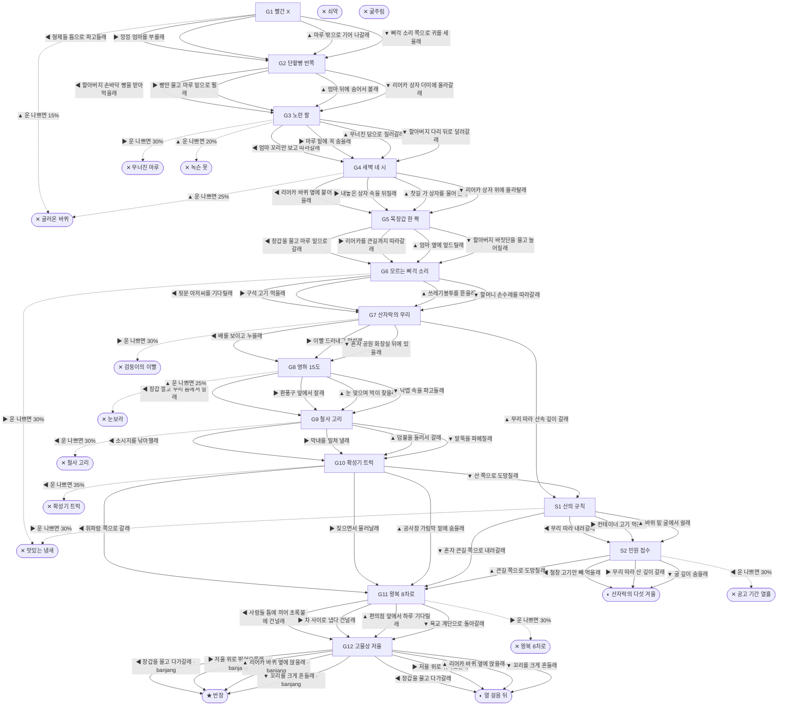

# 들개 (Canis familiaris)

> 이 문서는 `node scripts/scenario-docs.js`로 만든다. 고칠 때는 `js/data/species/dog.js`를 고친다.

- 몸길이 55cm · 눈높이 27cm · 시작 스탯 체력 80 / 포만 50 (장면마다 체력 -6 · 포만 -11)
- 체력이나 포만 중 하나라도 0이 되면 스토리와 상관없이 죽는다 (쇠약 / 굶주림)
- 해피엔딩: **반장** (생후 10년)
- 대문에 빨간 X가 그려진 빈집, 마루 밑에서 태어났어. 엄마는 누가 이 동네에 두고 간 개야. 목에 끊어진 빨간 목줄이 아직 달려 있어. 이 골목에 남은 사람은 옆집 할아버지 하나뿐이야.

## 흐름도
실선은 진행, 점선은 운이 나쁠 때(즉사 확률).

## 장면 (카드를 미는 방향 ◀ ▶ ▲ ▼, ★ 메인 루트)

| 장면 | 배경(등장) | 시기 | ◀ | ▶ | ▲ | ▼ |
|---|---|---|---|---|---|---|
| G1 빨간 X | 재개발 골목 (dog:pupNest, dog:redXHouse) | 생후 3주 | 형제들 틈으로 파고들래 (체력 +6, 포만 +6) ★ | 낑낑 엄마를 부를래 (포만 +14, 체력 -4) | 마루 밖으로 기어 나갈래 (포만 +16 · 즉사 15%) | 삐걱 소리 쪽으로 귀를 세울래 (포만 +6, 체력 +2) |
| G2 단팥빵 반쪽 | 재개발 골목 (dog:breadGrandpa) | 생후 7주 | 할아버지 손바닥 빵을 받아먹을래 (포만 +20 · 플래그 banjang) ★ | 빵만 물고 마루 밑으로 뛸래 (포만 +18 · 다침 30% 체력 -8) | 엄마 뒤에 숨어서 볼래 (체력 +6, 포만 +6) | 리어카 상자 더미에 올라갈래 (포만 +8, 체력 +4 · 다침 35% 체력 -12) |
| G3 노란 팔 | 재개발 골목 (dog:motherDog, dog:excavator) | 생후 3개월 | 엄마 꼬리만 보고 따라갈래 (포만 +6, 체력 -3) | 마루 밑에 꼭 숨을래 (체력 +5 · 즉사 30%) | 무너진 담으로 질러갈래 (포만 +14 · 즉사 20%) | 할아버지 다리 뒤로 달려갈래 (포만 +8, 체력 +2) ★ |
| G4 새벽 네 시 | 편의점 앞 (dog:cartPull) | 생후 4개월 | 리어카 바퀴 옆에 붙어 걸을래 (포만 +10, 체력 -4 · 플래그 banjang) | 내놓은 상자 속을 뒤질래 (포만 +18 · 다침 35% 체력 -12) | 찻길 가 상자를 물어 올래 (포만 +12 · 즉사 25%) | 리어카 상자 위에 올라탈래 (체력 +6, 포만 -2) ★ |
| G5 목장갑 한 짝 | 재개발 골목 (dog:glove, dog:movingCart) | 생후 5개월 | 장갑을 물고 마루 밑으로 갈래 (체력 +6, 포만 -2) ★ | 리어카를 큰길까지 따라갈래 (포만 +4, 체력 -4 · 다침 30% 체력 -10) | 엄마 옆에 엎드릴래 (체력 +8, 포만 -4) | 할아버지 바짓단을 물고 늘어질래 (포만 +8 · 다침 30% 체력 -8) |
| G6 모르는 삐걱 소리 | 식당가 뒷골목 (dog:poisonBait, dog:backdoorCook) | 생후 7개월 | 뒷문 아저씨를 기다릴래 (포만 +24, 체력 +4) ★ | 구석 고기 먹을래 (포만 +38 · 즉사 30%) | 쓰레기봉투를 뜯을래 (포만 +22 · 다침 40% 체력 -16) | 할머니 손수레를 따라갈래 (포만 +8, 체력 +5) |
| G7 산자락의 무리 | 근린공원 (dog:packLeader, dog:packDogs) | 생후 8개월 | 배를 보이고 누울래 (체력 -6, 포만 +15 · 다침 30% 체력 -10) ★ | 이빨 드러내고 맞설래 (포만 +20, 체력 -10 · 즉사 30%) | 무리 따라 산속 깊이 갈래 (포만 +10) | 혼자 공원 화장실 뒤에 있을래 (포만 +8 · 다침 35% 체력 -14) |
| G8 영하 15도 | 근린공원 (dog:glove, dog:snowHuddle, dog:ventSteam) | 생후 9개월 | 장갑 깔고 무리 틈에서 잘래 (체력 +4, 포만 -2) ★ | 환풍구 앞에서 잘래 (체력 +15 · 다침 40% 체력 -22) | 눈 맞으며 먹이 찾을래 (포만 +25, 체력 -10 · 즉사 25%) | 낙엽 속을 파고들래 (체력 +6, 포만 -4) |
| G9 철사 고리 | 근린공원 (dog:snare, dog:packDogs) | 생후 1년 1개월 | 소시지를 낚아챌래 (포만 +25 · 즉사 30%) | 막내를 밀쳐 낼래 (체력 -3, 포만 +6) ★ | 덤불을 둘러서 갈래 (포만 +10 · 다침 30% 체력 -12) | 말뚝을 파헤칠래 (포만 +15 · 다침 40% 체력 -18) |
| G10 확성기 트럭 | 빌라 골목 (dog:dogTruck) | 생후 1년 3개월 | 휘파람 쪽으로 갈래 (포만 +20 · 즉사 35%) | 짖으면서 물러날래 (체력 -1, 포만 +12) ★ | 공사장 가림막 밑에 숨을래 (체력 +5, 포만 -4 · 다침 30% 체력 -10) | 산 쪽으로 도망칠래 (포만 -4) |
| G11 왕복 8차로 | 편의점 앞 (dog:crossSignal) | 생후 1년 6개월 | 사람들 틈에 끼어 초록불에 건널래 (포만 +4 · 다침 25% 체력 -8) ★ | 차 사이로 냅다 건널래 (포만 +2 · 즉사 30%) | 편의점 앞에서 하루 기다릴래 (포만 +18, 체력 +4) | 육교 계단으로 돌아갈래 (체력 -8, 포만 -2) |
| G12 고물상 저울 | 고물상 마당 (dog:junkScale, dog:oldCart) | 생후 1년 6개월 | 장갑을 물고 다가갈래 (포만 +10) ★ | 저울 위로 뛰어오를래 (포만 +6) | 리어카 바퀴 옆에 앉을래 (체력 +5) | 꼬리를 크게 흔들래 (포만 +4, 체력 +2) |
| S1 산의 규칙 | 근린공원 (dog:hillDen, dog:containerMeat) | +4주 | 무리 따라 내려갈래 (포만 +25 · 다침 30% 체력 -18) | 컨테이너 고기 먹을래 (포만 +35 · 즉사 30%) | 바위 밑 굴에서 쉴래 (체력 +10, 포만 -5) | 혼자 큰길 쪽으로 내려갈래 (포만 -4) |
| S2 민원 접수 | 분리수거장 (dog:cageTrap, dog:catchPole) | +2개월 | 철창 고기만 빼 먹을래 (포만 +25 · 즉사 30%) | 무리 따라 산 깊이 갈래 (포만 -5) | 큰길 쪽으로 도망칠래 (포만 -5 · 다침 30% 체력 -14) | 굴 깊이 숨을래 (체력 +5, 포만 -10) |

## 엔딩

| 엔딩 | 종류 | 사인(가해자) | 마지막 문장 |
|---|---|---|---|
| H1 반장 | 해피 | 노환 | "반장이냐?" 할아버지가 장갑을 주워 리어카 손잡이에 걸었어. 이제 장갑이 두 짝이야. 새벽마다 나는 상자 더미 맨 위에 앉아 가. "반장, 니가 제일 무겁다." |
| N1 산자락의 다섯 겨울 | 노멀 | 심장사상충 | 무리랑 다섯 번 겨울을 났어. 겨울마다 장갑에 코를 묻고 잤어. 냄새는 진작 없어졌는데. |
| N2 열 걸음 뒤 | 노멀 | 노쇠 | 할아버지는 다 큰 나를 못 알아봤어. 그래도 새벽마다 삐걱 소리 열 걸음 뒤를 따라 걸었어. 가끔 리어카에서 단팥빵 반쪽이 떨어졌어. |
| D1 무너진 마루 | 데드 | 철거 현장 매몰 (dog:excavator) | 노란 팔은 마루 밑에 내가 있는 줄 몰랐어. |
| D2 굴러온 바퀴 | 데드 | 로드킬 (truck) | 운전석에선 내가 안 보였을 거야. 나는 너무 작았으니까. |
| D3 맛있는 냄새 | 데드 | 쥐약 중독 (dog:poisonBait) | 누가 일부러 놓은 고기였대. 그래도 배는 불렀는데. |
| D4 검둥이의 이빨 | 데드 | 영역 싸움 (dog:packLeader) | 산자락에도 자리가 다 정해져 있었어. |
| D5 눈보라 | 데드 | 동사 (dog:snowHuddle) | 장갑을 어디 떨어뜨렸는지 모르겠어. 너무 졸려. |
| D6 철사 고리 | 데드 | 올무 (dog:snare) | 고라니 잡으려고 놓은 거래. 막내는 무사해. |
| D7 확성기 트럭 | 데드 | 개장수 (dog:dogTruck) | 철창 안 애들 눈이 다 나랑 똑같았어. |
| D8 왕복 8차로 | 데드 | 로드킬 (car) | 건너편에서 삐걱 소리가 났었는데. |
| D9 공고 기간 열흘 | 데드 | 보호소 안락사 (dog:catchPole) | 보호소 철창엔 "누렁이, 두 살 추정"이라고 붙었어. 내 이름은 그게 아닌데. |
| D10 녹슨 못 | 데드 | 파상풍 (dog:rubbleNail) | 입이 안 벌어져. 엄마가 자꾸 핥아 줘. |
| W0 쇠약 | 데드 | 상처와 병 | 다리가 더는 말을 안 들어. 조금만 누워 있을게. |
| W1 굶주림 | 데드 | 굶주림 | 단팥빵 반쪽만 있었으면. |
