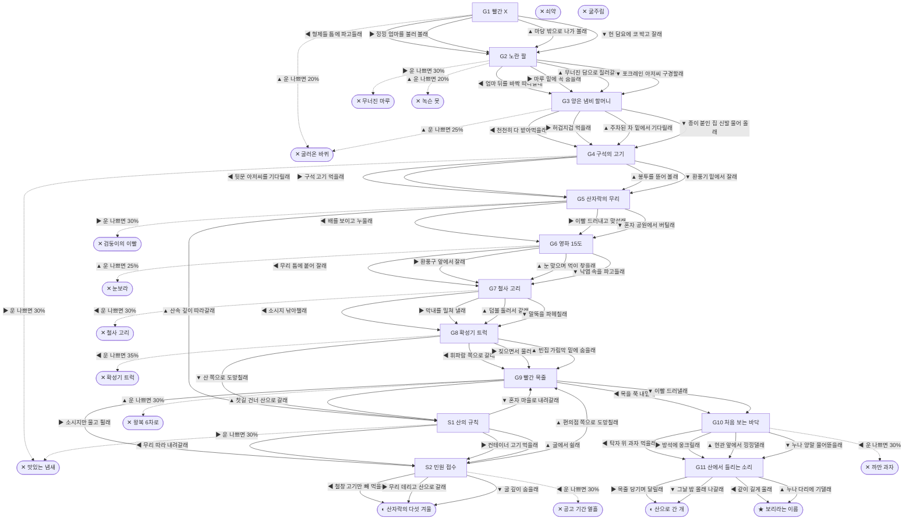

# 들개 (Canis familiaris)

> 이 문서는 `node scripts/scenario-docs.js`로 만든다. 고칠 때는 `js/data/species/dog.js`를 고친다.

- 몸길이 55cm · 눈높이 27cm · 시작 스탯 체력 90 / 포만 50 (장면마다 체력 -6 · 포만 -16)
- 체력이나 포만 중 하나라도 0이 되면 스토리와 상관없이 죽는다 (쇠약 / 굶주림)
- 해피엔딩: **보리라는 이름** (생후 13년)
- 대문에 빨간 X가 그려진 재개발 구역 빈집, 마루 밑. 엄마는 누가 버리고 간 개야. 목에 끊어진 목줄 자국이 있어. 길에서 태어난 개는 보통 3~5년을 산대.

## 흐름도
실선은 진행, 점선은 운이 나쁠 때(즉사 확률).

## 장면 (카드를 미는 방향 ◀ ▶ ▲ ▼, ★ 메인 루트)

| 장면 | 배경(등장) | 시기 | ◀ | ▶ | ▲ | ▼ |
|---|---|---|---|---|---|---|
| G1 빨간 X | 빌라 골목 (dog:redXHouse, dog:pupNest) | 생후 3주 | 형제들 틈에 파고들래 (포만 +5, 체력 +5) ★ | 낑낑 엄마를 불러 볼래 (포만 +10, 체력 -5) | 마당 밖으로 나가 볼래 (포만 +15 · 즉사 20%) | 헌 담요에 코 박고 잘래 (체력 +8, 포만 -5 · 다침 30% 체력 -15) |
| G2 노란 팔 | 빌라 골목 (dog:excavator, dog:motherDog) | 생후 2개월 | 엄마 뒤를 바짝 따라갈래 (포만 +5) ★ | 마루 밑에 꼭 숨을래 (체력 +5 · 즉사 30%) | 무너진 담으로 질러갈래 (포만 +15 · 즉사 20%) | 포크레인 아저씨 구경할래 (포만 +15 · 다침 30% 체력 -15) |
| G3 양은 냄비 할머니 | 빌라 주차장 (dog:complaintNote, dog:grandmaBowl) | 생후 4개월 | 천천히 다 받아먹을래 (포만 +35) ★ | 허겁지겁 먹을래 (포만 +45 · 다침 40% 체력 -20) | 주차된 차 밑에서 기다릴래 (체력 +10, 포만 +15 · 즉사 25%) | 종이 붙인 집 신발 물어 올래 (포만 +5 · 다침 40% 체력 -15) |
| G4 구석의 고기 | 식당가 뒷골목 (dog:backdoorCook, dog:poisonBait) | 생후 7개월 | 뒷문 아저씨를 기다릴래 (포만 +25) ★ | 구석 고기 먹을래 (포만 +40 · 즉사 30%) | 봉투를 뜯어 볼래 (포만 +25 · 다침 40% 체력 -20) | 환풍기 밑에서 잘래 (포만 -5, 체력 +10) |
| G5 산자락의 무리 | 근린공원 (dog:packDogs, dog:packLeader) | 생후 8개월 | 배를 보이고 누울래 (체력 -10, 포만 +15 · 다침 30% 체력 -10) ★ | 이빨 드러내고 맞설래 (포만 +20, 체력 -10 · 즉사 30%) | 산속 깊이 따라갈래 (포만 +10) | 혼자 공원에서 버틸래 (포만 +5 · 다침 40% 체력 -15) |
| G6 영하 15도 | 근린공원 (dog:ventSteam, dog:snowHuddle) | 생후 10개월 | 무리 틈에 붙어 잘래 (체력 -5, 포만 +5 · 다침 40% 체력 -15) | 환풍구 앞에서 잘래 (체력 +15 · 다침 40% 체력 -25) | 눈 맞으며 먹이 찾을래 (포만 +25, 체력 -10 · 즉사 25%) | 낙엽 속을 파고들래 (체력 +5) ★ |
| G7 철사 고리 | 근린공원 (dog:packDogs, dog:snare) | 생후 1년 1개월 | 소시지 낚아챌래 (포만 +25 · 즉사 30%) | 막내를 밀쳐 낼래 (체력 -10, 포만 +10) ★ | 덤불 둘러서 갈래 (포만 +10 · 다침 30% 체력 -15) | 말뚝을 파헤칠래 (포만 +15 · 다침 40% 체력 -20) |
| G8 확성기 트럭 | 빌라 골목 (dog:dogTruck) | 생후 1년 6개월 | 휘파람 쪽으로 갈래 (포만 +20 · 즉사 35%) | 짖으면서 물러날래 (체력 -5, 포만 +15) ★ | 빈집 가림막 밑에 숨을래 (체력 +5, 포만 -5 · 다침 30% 체력 -10) | 산 쪽으로 도망칠래 (포만 -5) |
| G9 빨간 목줄 | 편의점 앞 (dog:albaLeash, dog:sausageTray) | 생후 1년 8개월 | 목을 쭉 내밀래 (포만 +25) ★ | 소시지만 물고 튈래 (포만 +20) | 찻길 건너 산으로 갈래 (포만 +5 · 즉사 30%) | 이빨 드러낼래 (포만 +5 · 다침 30% 체력 -10) |
| G10 처음 보는 바닥 | 가정집 거실 (dog:cushionBed, dog:chocoTable, owner) | 생후 1년 9개월 | 탁자 위 과자 먹을래 (포만 +10, 체력 -15 · 즉사 30%) | 방석에 웅크릴래 (체력 +10, 포만 +30) ★ | 현관 앞에서 낑낑댈래 (포만 +5 · 다침 30% 체력 -10) | 누나 양말 물어뜯을래 (포만 +10 · 다침 30% 체력 -15) |
| G11 산에서 들리는 소리 | 근린공원 (dog:howlRidge, dog:walkOwner) | 생후 4년 | 같이 길게 울래 | 목줄 당기며 달릴래 | 누나 다리에 기댈래 (포만 +5) ★ | 그날 밤 몰래 나갈래 (포만 -5) |
| S1 산의 규칙 | 근린공원 (dog:containerMeat, dog:hillDen) | +4주 | 무리 따라 내려갈래 (포만 +25 · 다침 30% 체력 -20) | 컨테이너 고기 먹을래 (포만 +35 · 즉사 30%) | 굴에서 쉴래 (체력 +10, 포만 -5) | 혼자 마을로 내려갈래 (포만 -5) |
| S2 민원 접수 | 분리수거장 (dog:cageTrap, dog:catchPole) | +2개월 | 철창 고기만 빼 먹을래 (포만 +25 · 즉사 30%) | 무리 데리고 산으로 갈래 (포만 -5) | 편의점 쪽으로 도망칠래 (포만 -5 · 다침 30% 체력 -15) | 굴 깊이 숨을래 (체력 +5, 포만 -10) |

## 엔딩

| 엔딩 | 종류 | 사인(가해자) | 마지막 문장 |
|---|---|---|---|
| H1 보리라는 이름 | 해피 | 노환 | 엄마 목엔 끊어진 목줄 자국이 있었어. 내 목엔 이름표가 있어. 보리. 누나 무릎 위야. 이제 조금만 잘게. |
| N1 산자락의 다섯 겨울 | 노멀 | 심장사상충 | 무리랑 다섯 번 겨울을 났어. 들개치고는 오래 산 거래. |
| N2 산으로 간 개 | 노멀 | 노쇠 | 목줄 대신 바람을 골랐어. 가끔 그 방석 냄새가 생각나. |
| D1 무너진 마루 | 데드 | 철거 현장 매몰 (dog:excavator) | 노란 팔은 마루 밑에 내가 있는 줄 몰랐어. |
| D2 굴러온 바퀴 | 데드 | 로드킬 (car) | 운전석에선 내가 안 보였을 거야. 나는 너무 작았으니까. |
| D3 맛있는 냄새 | 데드 | 쥐약 중독 (dog:poisonBait) | 누가 일부러 놓은 고기였대. 그래도 배는 불렀는데. |
| D4 검둥이의 이빨 | 데드 | 영역 싸움 (dog:packLeader) | 산자락에도 자리가 정해져 있었나 봐. |
| D5 눈보라 | 데드 | 동사 (dog:snowHuddle) | 무리 냄새가 눈에 덮였어. 너무 졸려. 자면 안 되는데. |
| D6 철사 고리 | 데드 | 올무 (dog:snare) | 고라니 잡으려고 놓은 거래. 막내는 무사해서 다행이야. |
| D7 확성기 트럭 | 데드 | 개장수 (dog:dogTruck) | 철창 안 애들 눈이 다 나랑 똑같았어. |
| D8 왕복 6차로 | 데드 | 로드킬 (car) | 누나는 내일 새벽에도 소시지를 까 놓고 기다리겠지. |
| D9 공고 기간 열흘 | 데드 | 보호소 안락사 (dog:catchPole) | 열흘 동안 아무도 날 찾으러 오지 않았어. |
| D10 까만 과자 | 데드 | 초콜릿 중독 (dog:chocoTable) | 달콤한 냄새였는데. 누나가 자꾸 미안하대. |
| D11 녹슨 못 | 데드 | 파상풍 (dog:rubbleNail) | 입이 안 벌어져. 엄마가 자꾸 핥아 줘. |
| W0 쇠약 | 데드 | 상처와 병 | 다리가 더는 말을 안 들어. |
| W1 굶주림 | 데드 | 굶주림 | 마지막으로 먹은 게 언제였더라. |
