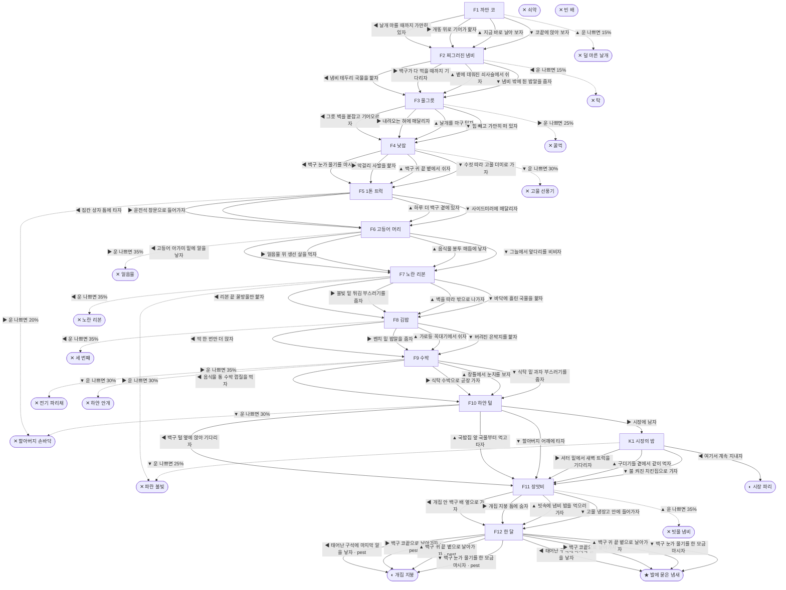

# 똥파리 (Musca domestica)

> 이 문서는 `node scripts/scenario-docs.js`로 만든다. 고칠 때는 `js/data/species/fly.js`를 고친다.

- 몸길이 0.7cm · 눈높이 2.5cm · 시작 스탯 체력 100 / 포만 40 (장면마다 체력 -7 · 포만 -8)
- 체력이나 포만 중 하나라도 0이 되면 스토리와 상관없이 죽는다 (쇠약 / 굶주림)
- 해피엔딩: **발에 묻은 냄새** (생후 4주)
- 고물상 마당 구석, 개똥 무더기 밑 흙 속에서 번데기로 며칠을 잤어. 나는 집파리야. 사람들은 똥파리라고 불러. 길어야 한 달 산대. 이 마당에 묶여 사는 개는 열두 살이래.

## 흐름도
실선은 진행, 점선은 운이 나쁠 때(즉사 확률).

## 장면 (카드를 미는 방향 ◀ ▶ ▲ ▼, ★ 메인 루트)

| 장면 | 배경(등장) | 시기 | ◀ | ▶ | ▲ | ▼ |
|---|---|---|---|---|---|---|
| F1 까만 코 | 고물상 마당 (fly:pupaCase, fly:dogNose) | 생후 1일 | 날개 마를 때까지 가만히 있자 (체력 +4, 포만 +6) ★ | 개똥 위로 기어가 핥자 (포만 +15 · 다침 30% 체력 -12) | 지금 바로 날아 보자 (포만 +5 · 즉사 15%) | 코끝에 앉아 보자 (포만 +8, 체력 -3 · 다침 30% 체력 -10) |
| F2 찌그러진 냄비 | 고물상 마당 (fly:chain, fly:dogBowl) | 생후 2일 | 냄비 테두리 국물을 핥자 (포만 +20 · 즉사 15%) | 백구가 다 먹을 때까지 기다리자 (포만 +14) ★ | 볕에 데워진 쇠사슬에서 쉬자 (체력 +8) | 냄비 밖에 튄 밥알을 줍자 (포만 +14 · 다침 30% 체력 -12) |
| F3 물그릇 | 고물상 마당 (fly:waterBowl, fly:dogTongue) | 생후 4일 | 그릇 벽을 붙잡고 기어오르자 (체력 -12 · 다침 35% 체력 -10) | 내려오는 혀에 매달리자 (체력 -4 · 즉사 25%) | 날개를 마구 털자 (체력 -10 · 다침 35% 체력 -12) | 힘 빼고 가만히 떠 있자 (체력 -6) ★ |
| F4 낮잠 | 고물상 마당 (fly:makgeolli, fly:sleepyEar) | 생후 6일 | 백구 눈가 물기를 마시자 (포만 +16 · 플래그 pest) | 막걸리 사발을 핥자 (포만 +20 · 다침 35% 체력 -14) | 백구 귀 끝 볕에서 쉬자 (체력 +10) ★ | 수컷 따라 고물 더미로 가자 (포만 +8, 체력 +4 · 즉사 30%) |
| F5 1톤 트럭 | 고물상 마당 (fly:truckBed) | 생후 8일 | 짐칸 상자 틈에 타자 (체력 -2) ★ | 운전석 창문으로 들어가자 (포만 +15 · 즉사 20%) | 하루 더 백구 곁에 있자 (체력 +6, 포만 -4) | 사이드미러에 매달리자 (체력 -8 · 다침 35% 체력 -14) |
| F6 고등어 머리 | 식당가 뒷골목 (fly:fishCrate, swatter) | 생후 10일 | 고등어 아가미 밑에 알을 낳자 (자손 +120, 체력 -6, 포만 +10) ★ | 얼음물 위 생선 살을 먹자 (포만 +22 · 즉사 35%) | 음식물 봉투 매듭에 낳자 (자손 +90, 포만 +8 · 다침 30% 체력 -12) | 그늘에서 앞다리를 비비자 (체력 +8, 포만 -3) |
| F7 노란 리본 | 식당 주방 (fly:honeyRibbon, fly:friedCrumbs, fly:zapperGlow) | 생후 13일 | 리본 끝 꿀방울만 핥자 (포만 +20 · 즉사 35%) | 불빛 밑 튀김 부스러기를 줍자 (포만 +18 · 즉사 30%) | 벽을 따라 밖으로 나가자 (포만 -2) | 바닥에 흘린 국물을 핥자 (포만 +16 · 다침 35% 체력 -12) ★ |
| F8 김밥 | 근린공원 (fly:riceGrains, fly:gimbapHand) | 생후 2주 | 딱 한 번만 더 앉자 (포만 +28 · 즉사 35%) | 벤치 밑 밥알을 줍자 (포만 +18 · 다침 35% 체력 -12) | 가로등 꼭대기에서 쉬자 (체력 +10, 포만 -3) | 버려진 은박지를 핥자 (포만 +20) ★ |
| F9 수박 | 가정집 부엌 (fly:wasteCaddy, fly:sprayIdle, fly:watermelon, eSwatter) | 생후 3주 | 음식물 통 수박 껍질을 먹자 (포만 +22) ★ | 식탁 수박으로 곧장 가자 (포만 +32 · 즉사 35%) | 창틀에서 눈치를 보자 (체력 +6, 포만 -3) | 식탁 밑 과자 부스러기를 줍자 (포만 +15 · 즉사 30%) |
| F10 하얀 털 | 식당가 뒷골목 (fly:truckBed, fly:furTuft) | 생후 3주 | 백구 털 옆에 앉아 기다리자 (체력 +4) ★ | 시장에 남자 (포만 +10) | 국밥집 앞 국물부터 먹고 타자 (포만 +20 · 다침 35% 체력 -14) | 할아버지 어깨에 타자 (포만 +3 · 즉사 30%) |
| K1 시장의 밤 | 식당가 뒷골목 (fly:fishCrate, fly:maggots) | 생후 4주 | 여기서 계속 지내자 (포만 +10) | 셔터 밑에서 새벽 트럭을 기다리자 (체력 -6) | 구더기들 곁에서 같이 먹자 (포만 +14 · 다침 30% 체력 -12) | 불 켜진 치킨집으로 가자 (포만 +20 · 즉사 25%) |
| F11 장맛비 | 고물상 마당 (fly:raindrops, fly:doghouse) | 생후 4주 | 개집 안 백구 배 옆으로 가자 (체력 +12) ★ | 개집 지붕 틈에 숨자 (체력 +5) | 빗속에 냄비 밥을 먹으러 가자 (포만 +20 · 즉사 35%) | 고물 냉장고 안에 들어가자 (포만 +6 · 다침 35% 체력 -14) |
| F12 한 달 | 고물상 마당 (fly:dungPile, fly:sleepyEar) | 생후 4주 | 태어난 구석에 마지막 알을 낳자 (자손 +100, 체력 -4) | 백구 코끝으로 날아가자 (자손 +60, 체력 -2) ★ | 백구 귀 끝 볕으로 날아가자 (자손 +60, 체력 +2) | 백구 눈가 물기를 한 모금 마시자 (자손 +80, 포만 +10 · 플래그 pest) |

## 엔딩

| 엔딩 | 종류 | 사인(가해자) | 마지막 문장 |
|---|---|---|---|
| H1 발에 묻은 냄새 | 해피 | 노쇠 | 백구 귀가 한 번 움찔했어. 그러고는 코를 내 발에 대고 오래 킁킁댔어. 시장 냄새, 공원 냄새, 수박 냄새가 묻어 있었을 거야. 다 백구가 못 가 본 데야. 열흘 뒤면 내 새끼들이 네 코에 앉을 거야. 그때도 한 번만 봐줘. |
| N1 시장 파리 | 노멀 | 노쇠 | 시장 생선 상자 위에서 한 달을 채웠어. 가끔 바람에 흙냄새가 섞여 오면, 그쪽으로 고개를 돌렸어. |
| N2 개집 지붕 | 노멀 | 노쇠 | 백구가 고개를 홱 털었어. 눈가가 짓물러서 얼굴 근처 파리라면 다 질색이야. 나도 그 파리들 중 하나였으니까. 개집 지붕에 앉아 백구 숨소리를 들었어. |
| D1 덜 마른 날개 | 데드 | 참새 (sparrow) | 조금만 더 기다릴걸. 날개는 금방 마르는데. |
| D2 탁 | 데드 | 개 (fly:dogJaw) | 백구는 그냥 귀찮았던 거야. 나는 그냥 배고팠고. |
| D3 꿀꺽 | 데드 | 개 (fly:dogTongue) | 백구는 물을 마셨을 뿐이야. 더운 날이었으니까. |
| D4 고물 선풍기 | 데드 | 거미 (spider) | 선풍기는 고장 났어도 거미줄은 멀쩡했어. |
| D5 할아버지 손바닥 | 데드 | 손바닥 (fly:palmSlap) | 할아버지는 날 몰라. 나는 할아버지 트럭을 아는데. |
| D6 얼음물 | 데드 | 파리채 (swatter) | 고등어 살 한 입. 그게 마지막 맛이었어. |
| D7 노란 리본 | 데드 | 끈끈이 리본 (fly:honeyRibbon) | 꿀 냄새 진짜 좋았어. 다들 그래서 거기 붙어 있었구나. |
| D8 파란 불빛 | 데드 | 전기 해충퇴치기 (fly:zapperGlow) | 알면서도 자꾸 그쪽으로 가게 되는 게 있어. |
| D9 세 번째 | 데드 | 손바닥 (fly:palmSlap) | 단무지 한 조각이었어. 손은 세 번째에 안 놓쳤어. |
| D10 전기 파리채 | 데드 | 전기 파리채 (eSwatter) | 타닥. 마지막이 수박 냄새라 다행이야. |
| D11 하얀 안개 | 데드 | 살충제 스프레이 (sprayCan) | 과자 부스러기 몇 개였어. 숨 한 번에 다리가 풀렸어. |
| D12 빗물 냄비 | 데드 | 물에 빠짐 (fly:dogBowl) | 빗물이 냄비를 채웠어. 된장국 맛이 났어. |
| W0 쇠약 | 데드 | 쇠약 | 날개가 더는 안 떨려. 볕 드는 데서 조금만 쉬자. |
| W1 빈 배 | 데드 | 굶주림 | 발로 맛볼 게 하나도 없어. |
