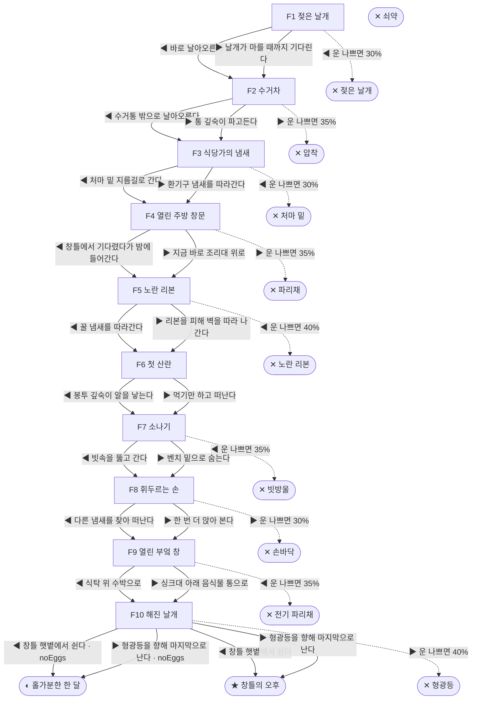

# 집파리 (Musca domestica)

> 이 문서는 `node scripts/scenario-docs.js`로 만든다. 고칠 때는 `js/data/species/fly.js`를 고친다.

- 몸길이 0.7cm · 눈높이 2.5cm · 시작 스탯 체력 100 / 포만 50 (장면마다 포만 -8)
- 해피엔딩: **창틀의 오후** (생후 4주)
- 아파트 분리수거장, 음식물 수거통 가장자리에서 번데기 껍질을 찢고 나왔다. 집파리의 한살이는 길어야 한 달이다.

## 흐름도
실선은 진행, 점선은 운이 나쁠 때(즉사 확률).

## 장면 (◀ 왼쪽 / ▶ 오른쪽, ★ 메인 루트)

| 장면 | 배경 | 시기 | ◀ 왼쪽 | ▶ 오른쪽 |
|---|---|---|---|---|
| F1 젖은 날개 | 분리수거장 | 생후 1일 | 바로 날아오른다 (즉사 30%) | 날개가 마를 때까지 기다린다 ★ |
| F2 수거차 | 분리수거장 | 생후 2일 | 수거통 밖으로 날아오른다 (포만 -5) ★ | 통 깊숙이 파고든다 (포만 +15 · 즉사 35%) |
| F3 식당가의 냄새 | 식당가 뒷골목 | 생후 4일 | 처마 밑 지름길로 간다 (포만 +5 · 즉사 30%) | 환기구 냄새를 따라간다 (포만 +10) ★ |
| F4 열린 주방 창문 | 식당 주방 | 생후 6일 | 창틀에서 기다렸다가 밤에 들어간다 (포만 +15) ★ | 지금 바로 조리대 위로 (포만 +30 · 즉사 35%) |
| F5 노란 리본 | 식당 주방 | 생후 8일 | 꿀 냄새를 따라간다 (포만 +15 · 즉사 40%) | 리본을 피해 벽을 따라 나간다 (포만 -5) ★ |
| F6 첫 산란 | 식당가 뒷골목 | 생후 10일 | 봉투 깊숙이 알을 낳는다 (자손 +120, 체력 -10, 포만 +10) ★ | 먹기만 하고 떠난다 (포만 +20 · 플래그 noEggs) |
| F7 소나기 | 근린공원 | 생후 2주 | 빗속을 뚫고 간다 (포만 +10 · 즉사 35%) | 벤치 밑으로 숨는다 ★ |
| F8 휘두르는 손 | 근린공원 | 생후 3주 | 다른 냄새를 찾아 떠난다 ★ | 한 번 더 앉아 본다 (포만 +20 · 즉사 30%) |
| F9 열린 부엌 창 | 가정집 부엌 | 생후 3주 | 식탁 위 수박으로 (포만 +30 · 즉사 35%) | 싱크대 아래 음식물 통으로 (포만 +25) ★ |
| F10 해진 날개 | 가정집 부엌 | 생후 4주 | 창틀 햇볕에서 쉰다 ★ | 형광등을 향해 마지막으로 난다 (즉사 40%) |

## 엔딩

| 엔딩 | 종류 | 사인 | 마지막 문장 |
|---|---|---|---|
| H1 창틀의 오후 | 해피 | 노쇠 | 햇볕 아래에서 다리를 모았다. 골목 어딘가에서 120마리가 날개를 말리고 있다. |
| N1 홀가분한 한 달 | 노멀 | 노쇠 | 한 달을 다 살았다. 남긴 것은 없었다. |
| D1 젖은 날개 | 데드 | 익사 | 음식물 국물 속으로 떨어졌다. |
| D2 압착 | 데드 | 쓰레기 수거차 | 압착기가 닫혔다. |
| D3 처마 밑 | 데드 | 거미 | 줄 끝에서 주인이 내려왔다. |
| D4 파리채 | 데드 | 파리채 | 떡볶이는 맛있었다. |
| D5 노란 리본 | 데드 | 끈끈이 | 버둥댈수록 날개도 붙었다. |
| D6 빗방울 | 데드 | 빗방울 | 소나기는 금방 그쳤다. |
| D7 손바닥 | 데드 | 손바닥 | 김밥 한 줄의 대가였다. |
| D8 전기 파리채 | 데드 | 전기 파리채 | 타닥. |
| D9 형광등 | 데드 | 탈진 | 파리는 빛을 떠나지 못한다. |
| W0 쇠약 | 데드 | 굶주림 | 날개가 더는 떨리지 않았다. |
