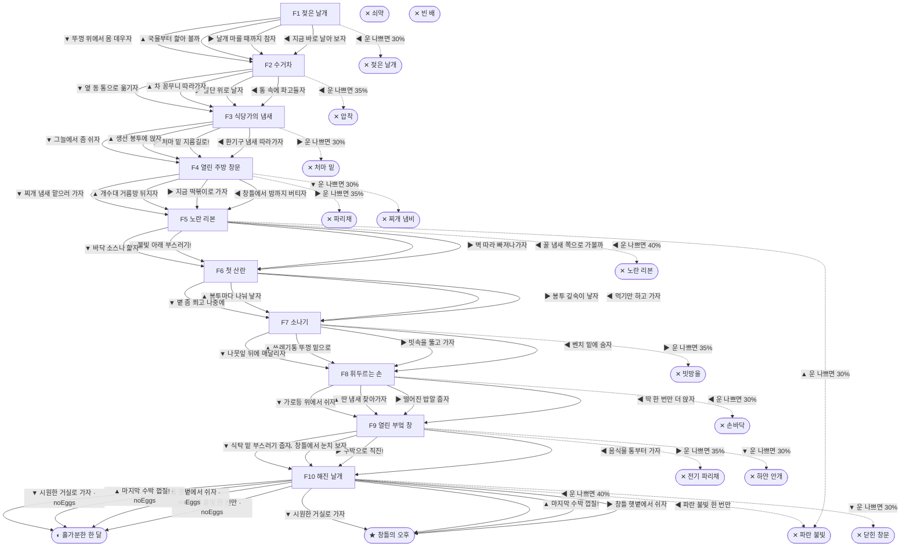

# 집파리 (Musca domestica)

> 이 문서는 `node scripts/scenario-docs.js`로 만든다. 고칠 때는 `js/data/species/fly.js`를 고친다.

- 몸길이 0.7cm · 눈높이 2.5cm · 시작 스탯 체력 100 / 포만 40 (장면마다 포만 -12)
- 체력이나 포만 중 하나라도 0이 되면 스토리와 상관없이 죽는다 (쇠약 / 굶주림)
- 해피엔딩: **창틀의 오후** (생후 4주)
- 아파트 분리수거장, 음식물 수거통 가장자리에서 번데기 껍질을 찢고 나왔어. 나는 집파리야. 길어야 한 달 살아. 그러니까 하루하루가 아까워.

## 흐름도
실선은 진행, 점선은 운이 나쁠 때(즉사 확률).

## 장면 (카드를 미는 방향 ◀ ▶ ▲ ▼, ★ 메인 루트)

| 장면 | 배경(등장) | 시기 | ◀ | ▶ | ▲ | ▼ |
|---|---|---|---|---|---|---|
| F1 젖은 날개 | 분리수거장 (sparrow) | 생후 1일 | 지금 바로 날아 보자 (포만 +5 · 즉사 30%) | 날개 마를 때까지 참자 (포만 +2) ★ | 국물부터 핥아 볼까 (포만 +15 · 다침 40% 체력 -25) | 뚜껑 위에서 몸 데우자 (체력 +10, 포만 -5) |
| F2 수거차 | 분리수거장 (truck, worker) | 생후 2일 | 통 속에 파고들자 (포만 +25 · 즉사 35%) | 일단 위로 날자 (포만 -5) | 차 꽁무니 따라가자 (포만 +15 · 다침 35% 체력 -20) | 옆 동 통으로 옮기자 (포만 +8) ★ |
| F3 식당가의 냄새 | 식당가 뒷골목 (web, spider) | 생후 4일 | 환기구 냄새 따라가자 (포만 +15) ★ | 처마 밑 지름길로! (포만 +25 · 즉사 30%) | 생선 봉투에 앉자 (포만 +25 · 다침 40% 체력 -25) | 그늘에서 좀 쉬자 (체력 +10, 포만 -5) |
| F4 열린 주방 창문 | 식당 주방 (worker, swatter) | 생후 6일 | 창틀에서 밤까지 버티자 (포만 0) | 지금 떡볶이로 가자 (포만 +35 · 즉사 35%) | 개수대 거름망 뒤지자 (포만 +25 · 다침 35% 체력 -20) ★ | 찌개 냄새 맡으러 가자 (포만 +25 · 즉사 30%) |
| F5 노란 리본 | 식당 주방 (ribbon, zapper) | 생후 8일 | 꿀 냄새 쪽으로 가볼까 (포만 +20 · 즉사 40%) | 벽 따라 빠져나가자 (포만 -5) | 불빛 아래 부스러기! (포만 +20 · 즉사 30%) | 바닥 소스나 핥자 (포만 +15 · 다침 40% 체력 -20) ★ |
| F6 첫 산란 | 식당가 뒷골목 (strayCat) | 생후 10일 | 먹기만 하고 가자 (포만 +20 · 플래그 noEggs) | 봉투 깊숙이 낳자 (자손 +120, 체력 -10, 포만 +5) ★ | 봉투마다 나눠 낳자 (자손 +150, 체력 -15 · 다침 35% 체력 -20) | 볕 좀 쬐고 나중에 (체력 +10, 포만 -5 · 플래그 noEggs) |
| F7 소나기 | 근린공원 (magpie) | 생후 2주 | 벤치 밑에 숨자 (포만 0) | 빗속을 뚫고 가자 (포만 +25 · 즉사 35%) | 쓰레기통 뚜껑 밑으로 (포만 +20 · 다침 40% 체력 -15) ★ | 나뭇잎 뒤에 매달리자 (체력 +5, 포만 -5) |
| F8 휘두르는 손 | 근린공원 (owner, hand) | 생후 3주 | 딱 한 번만 더 앉자 (포만 +30 · 즉사 30%) | 떨어진 밥알 줍자 (포만 +20 · 다침 40% 체력 -20) ★ | 딴 냄새 찾아가자 (포만 -5) | 가로등 위에서 쉬자 (체력 +10, 포만 -5) |
| F9 열린 부엌 창 | 가정집 부엌 (owner, eSwatter, sprayCan) | 생후 3주 | 음식물 통부터 가자 (포만 +20) ★ | 수박으로 직진! (포만 +35 · 즉사 35%) | 창틀에서 눈치 보자 (체력 +5, 포만 -5) | 식탁 밑 부스러기 줍자 (포만 +15 · 즉사 30%) |
| F10 해진 날개 | 가정집 부엌 (zapper, owner) | 생후 4주 | 파란 불빛 한 번만 (포만 0 · 즉사 40%) | 창틀 햇볕에서 쉬자 (체력 +5) ★ | 마지막 수박 껍질! (포만 +20 · 다침 40% 체력 -30) | 시원한 거실로 가자 (포만 -5 · 즉사 30%) |

## 엔딩

| 엔딩 | 종류 | 사인(가해자) | 마지막 문장 |
|---|---|---|---|
| H1 창틀의 오후 | 해피 | 노쇠 | 햇볕 좋다. 골목 어딘가에서 내 새끼들이 날개를 말리고 있겠지. |
| N1 홀가분한 한 달 | 노멀 | 노쇠 | 한 달 꽉 채워 살았어. 남긴 건 없지만, 뭐 가볍네. |
| D1 젖은 날개 | 데드 | 참새 (sparrow) | 참새가 먼저 봤네. 좀만 참을걸. |
| D2 압착 | 데드 | 쓰레기 수거차 (truck) | 깜깜하고 꽉 끼어. 그래도 배는 불렀어. |
| D3 처마 밑 | 데드 | 거미 (spider) | 지름길은 거미가 먼저 알고 있었어. |
| D4 파리채 | 데드 | 파리채 (swatter) | 떡볶이는 맛있었어. 그거면 됐지 뭐. |
| D5 노란 리본 | 데드 | 끈끈이 리본 (ribbon) | 꿀 냄새 진짜 좋았는데. 다들 그래서 붙어 있었구나. |
| D6 빗방울 | 데드 | 빗방울과 까치 (magpie) | 젖은 날개로 기는 동안 까치가 내려왔어. 기다리고 있었구나. |
| D7 손바닥 | 데드 | 손바닥 (hand) | 김밥 한 줄에 목숨 건 건 나뿐이었어. |
| D8 전기 파리채 | 데드 | 전기 파리채 (eSwatter) | 타닥. 마지막이 수박 냄새라 다행이야. |
| D9 파란 불빛 | 데드 | 전기 해충퇴치기 (zapper) | 알면서도 못 끊는 게 있더라. |
| D10 하얀 안개 | 데드 | 살충제 스프레이 (sprayCan) | 부스러기 몇 개였는데. 바닥이 이렇게 넓었나. |
| D11 닫힌 창문 | 데드 | 창문에 갇혀 탈진 (owner) | 바깥이 바로 저기 보이는데. 유리는 끝까지 안 비켜 줬어. |
| D12 찌개 냄비 | 데드 | 국물에 빠짐 (worker) | 국물 맛은 끝내줬어. 헤엄을 못 쳐서 그렇지. |
| W0 쇠약 | 데드 | 쇠약 | 날개가 더는 안 떨려. 조금만 쉬자. |
| W1 빈 배 | 데드 | 굶주림 | 배가 너무 고파. 날아오를 힘이 없어. |
