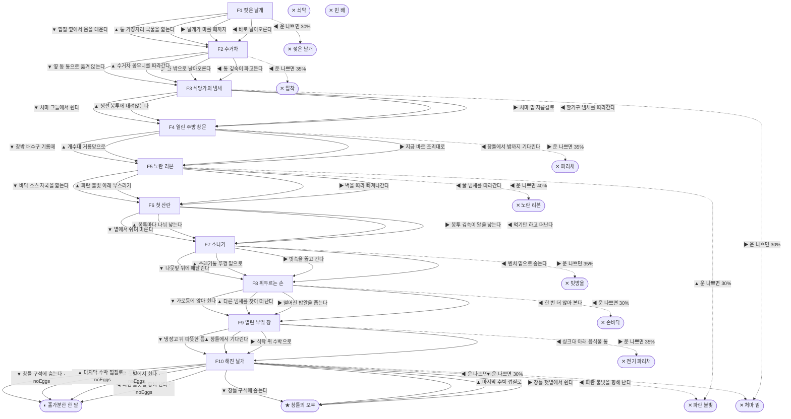

# 집파리 (Musca domestica)

> 이 문서는 `node scripts/scenario-docs.js`로 만든다. 고칠 때는 `js/data/species/fly.js`를 고친다.

- 몸길이 0.7cm · 눈높이 2.5cm · 시작 스탯 체력 100 / 포만 40 (장면마다 포만 -12)
- 체력이나 포만 중 하나라도 0이 되면 스토리와 상관없이 죽는다 (쇠약 / 굶주림)
- 해피엔딩: **창틀의 오후** (생후 4주)
- 아파트 분리수거장, 음식물 수거통 가장자리에서 번데기 껍질을 찢고 나왔다. 집파리의 한살이는 길어야 한 달이다.

## 흐름도
실선은 진행, 점선은 운이 나쁠 때(즉사 확률).

## 장면 (카드를 미는 방향 ◀ ▶ ▲ ▼, ★ 메인 루트)

| 장면 | 배경(등장) | 시기 | ◀ | ▶ | ▲ | ▼ |
|---|---|---|---|---|---|---|
| F1 젖은 날개 | 분리수거장 (sparrow) | 생후 1일 | 바로 날아오른다 (포만 +5 · 즉사 30%) | 날개가 마를 때까지 (포만 +2) ★ | 통 가장자리 국물을 핥는다 (포만 +15 · 다침 40% 체력 -25) | 껍질 옆에서 몸을 데운다 (체력 +10, 포만 -5) |
| F2 수거차 | 분리수거장 (truck, worker) | 생후 2일 | 통 깊숙이 파고든다 (포만 +25 · 즉사 35%) | 통 밖으로 날아오른다 (포만 -5) | 수거차 꽁무니를 따라간다 (포만 +15 · 다침 35% 체력 -20) | 옆 동 통으로 옮겨 앉는다 (포만 +8) ★ |
| F3 식당가의 냄새 | 식당가 뒷골목 (web, spider) | 생후 4일 | 환기구 냄새를 따라간다 (포만 +15) ★ | 처마 밑 지름길로 (포만 +25 · 즉사 30%) | 생선 봉투에 내려앉는다 (포만 +25 · 다침 40% 체력 -25) | 처마 그늘에서 쉰다 (체력 +10, 포만 -5) |
| F4 열린 주방 창문 | 식당 주방 (worker, swatter) | 생후 6일 | 창틀에서 밤까지 기다린다 (포만 0) | 지금 바로 조리대로 (포만 +35 · 즉사 35%) | 개수대 거름망으로 (포만 +25 · 다침 35% 체력 -20) ★ | 창밖 배수구 기름때 (포만 +10) |
| F5 노란 리본 | 식당 주방 (ribbon, zapper) | 생후 8일 | 꿀 냄새를 따라간다 (포만 +20 · 즉사 40%) | 벽을 따라 빠져나간다 (포만 -5) | 파란 불빛 아래 부스러기 (포만 +20 · 즉사 30%) | 바닥 소스 자국을 핥는다 (포만 +15 · 다침 40% 체력 -20) ★ |
| F6 첫 산란 | 식당가 뒷골목 (strayCat) | 생후 10일 | 먹기만 하고 떠난다 (포만 +20 · 플래그 noEggs) | 봉투 깊숙이 알을 낳는다 (자손 +120, 체력 -10, 포만 +5) ★ | 봉투마다 나눠 낳는다 (자손 +150, 체력 -15 · 다침 35% 체력 -20) | 볕에서 쉬며 미룬다 (체력 +10, 포만 -5 · 플래그 noEggs) |
| F7 소나기 | 근린공원 (magpie) | 생후 2주 | 벤치 밑으로 숨는다 (포만 0) | 빗속을 뚫고 간다 (포만 +25 · 즉사 35%) | 쓰레기통 뚜껑 밑으로 (포만 +20 · 다침 40% 체력 -15) ★ | 나뭇잎 뒤에 매달린다 (체력 +5, 포만 -5) |
| F8 휘두르는 손 | 근린공원 (owner, hand) | 생후 3주 | 한 번 더 앉아 본다 (포만 +30 · 즉사 30%) | 떨어진 밥알을 줍는다 (포만 +20 · 다침 40% 체력 -20) ★ | 다른 냄새를 찾아 떠난다 (포만 -5) | 가로등에 앉아 쉰다 (체력 +10, 포만 -5) |
| F9 열린 부엌 창 | 가정집 부엌 (owner, eSwatter) | 생후 3주 | 싱크대 아래 음식물 통 (포만 +20) ★ | 식탁 위 수박으로 (포만 +35 · 즉사 35%) | 창틀에서 기다린다 (체력 +5, 포만 -5) | 냉장고 뒤 따뜻한 틈 (포만 +10 · 다침 35% 체력 -20) |
| F10 해진 날개 | 가정집 부엌 (zapper, web) | 생후 4주 | 파란 불빛을 향해 난다 (포만 0 · 즉사 40%) | 창틀 햇볕에서 쉰다 (체력 +5) ★ | 마지막 수박 껍질로 (포만 +20 · 다침 40% 체력 -30) | 창틀 구석에 숨는다 (포만 -5 · 즉사 30%) |

## 엔딩

| 엔딩 | 종류 | 사인(가해자) | 마지막 문장 |
|---|---|---|---|
| H1 창틀의 오후 | 해피 | 노쇠 | 햇볕 아래에서 다리를 모았다. 골목 어딘가에서 내 새끼들이 날개를 말리고 있다. |
| N1 홀가분한 한 달 | 노멀 | 노쇠 | 한 달을 다 살았다. 남긴 것은 없었다. |
| D1 젖은 날개 | 데드 | 참새 (sparrow) | 바닥에서 버둥대는 것을 참새가 먼저 봤다. |
| D2 압착 | 데드 | 쓰레기 수거차 (truck) | 압착기가 닫혔다. |
| D3 처마 밑 | 데드 | 거미 (spider) | 줄 끝에서 주인이 내려왔다. |
| D4 파리채 | 데드 | 파리채 (swatter) | 떡볶이는 맛있었다. |
| D5 노란 리본 | 데드 | 끈끈이 (ribbon) | 버둥댈수록 날개도 붙었다. |
| D6 빗방울 | 데드 | 빗방울과 까치 (magpie) | 젖은 날개로 기는 사이 까치가 내려왔다. |
| D7 손바닥 | 데드 | 손바닥 (hand) | 김밥 한 줄의 대가였다. |
| D8 전기 파리채 | 데드 | 전기 파리채 (eSwatter) | 타닥. |
| D9 파란 불빛 | 데드 | 전기 해충퇴치기 (zapper) | 파리는 빛을 떠나지 못한다. |
| W0 쇠약 | 데드 | 쇠약 | 날개가 더는 떨리지 않았다. |
| W1 빈 배 | 데드 | 굶주림 | 한나절을 굶은 파리는 다시 날지 못했다. |
