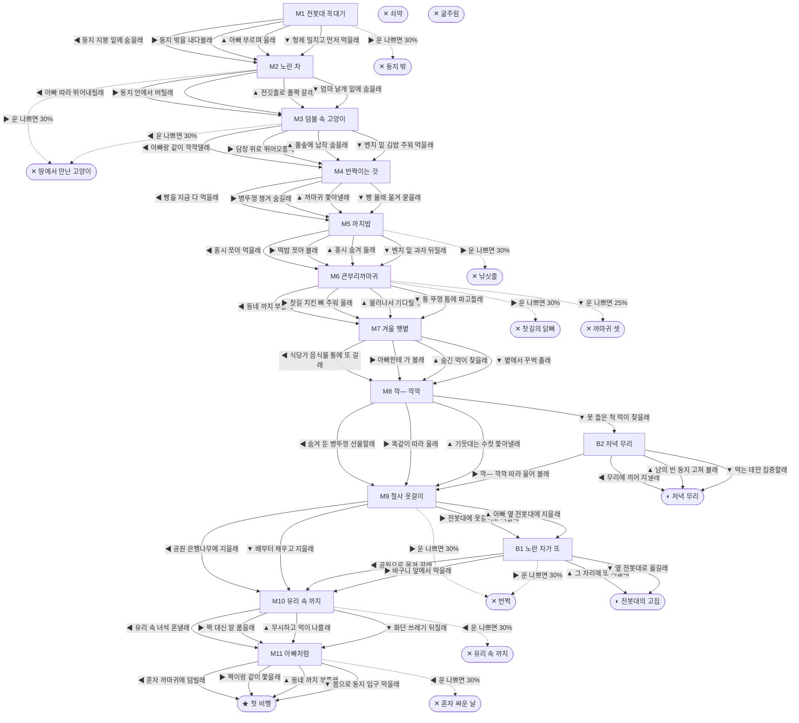

# 까치 (Pica serica)

> 이 문서는 `node scripts/scenario-docs.js`로 만든다. 고칠 때는 `js/data/species/magpie.js`를 고친다.

- 몸길이 45cm · 눈높이 270cm · 시작 스탯 체력 75 / 포만 45 (장면마다 체력 -5 · 포만 -14)
- 체력이나 포만 중 하나라도 0이 되면 스토리와 상관없이 죽는다 (쇠약 / 굶주림)
- 해피엔딩: **첫 비행** (생후 4년 11개월)
- 나는 빌라 골목 전봇대 꼭대기에서 깼어. 나뭇가지랑 철사 옷걸이로 엮은, 지붕까지 덮인 동그란 집이야. 사람들은 까치가 울면 반가운 손님이 온다고 좋아한대. 근데 전봇대 위 우리 집은 해마다 철거된대.

## 흐름도
실선은 진행, 점선은 운이 나쁠 때(즉사 확률).

## 장면 (카드를 미는 방향 ◀ ▶ ▲ ▼, ★ 메인 루트)

| 장면 | 배경(등장) | 시기 | ◀ | ▶ | ▲ | ▼ |
|---|---|---|---|---|---|---|
| M1 전봇대 꼭대기 | 빌라 골목 (magpie:poleNest, magpie:dadMob) | 생후 2주 | 둥지 지붕 밑에 숨을래 (체력 +10, 포만 -5) | 둥지 밖을 내다볼래 (포만 +10 · 즉사 30%) | 아빠 부르며 울래 (포만 +20) ★ | 형제 밀치고 먼저 먹을래 (포만 +25 · 다침 40% 체력 -10) |
| M2 노란 차 | 빌라 골목 (magpie:bucketTruck, magpie:poleNest) | 생후 4주 | 아빠 따라 뛰어내릴래 (포만 +10 · 다침 30% 체력 -10) ★ | 둥지 안에서 버틸래 (포만 +5 · 즉사 30%) | 전깃줄로 폴짝 갈래 (체력 +5 · 다침 40% 체력 -15) | 엄마 날개 밑에 숨을래 (체력 +5, 포만 +5) |
| M3 덤불 속 고양이 | 아파트 단지 화단 (magpie:mobWall, strayCat) | 생후 5주 | 아빠랑 같이 깍깍댈래 (포만 +10 · 즉사 30%) | 담장 위로 뛰어오를래 (포만 +10) ★ | 풀숲에 납작 숨을래 (체력 +5, 포만 -5) | 벤치 밑 김밥 주워 먹을래 (포만 +25 · 다침 40% 체력 -15) |
| M4 반짝이는 것 | 아파트 단지 화단 (magpie:capGlint, magpie:bigCrow) | 생후 3개월 | 빵을 지금 다 먹을래 (포만 +25 · 다침 30% 체력 -5) | 병뚜껑 챙겨 숨길래 (체력 +5, 포만 -5) | 까마귀 쫓아낼래 (포만 +20 · 다침 50% 체력 -20) | 빵 몰래 옮겨 묻을래 (포만 +15) ★ |
| M5 까치밥 | 근린공원 (magpie:persimmon, magpie:lineTangle) | 생후 7개월 | 홍시 쪼아 먹을래 (포만 +20) ★ | 떡밥 쪼아 볼래 (포만 +25 · 즉사 30%) | 홍시 숨겨 둘래 (체력 +5, 포만 +10) | 벤치 밑 과자 뒤질래 (포만 +15 · 다침 30% 체력 -10) |
| M6 큰부리까마귀 | 식당가 뒷골목 (magpie:foodBin, magpie:crowGang) | 생후 8개월 | 동네 까치 부를래 (포만 +25 · 다침 30% 체력 -15) | 찻길 치킨 뼈 주워 올래 (포만 +30 · 즉사 30%) | 물러나서 기다릴래 (포만 +5) ★ | 통 뚜껑 틈에 파고들래 (포만 +25 · 즉사 25%) |
| M7 겨울 햇볕 | 빌라 골목 (magpie:sunWall, magpie:oldDad) | 생후 9개월 | 식당가 음식물 통에 또 갈래 (포만 +20 · 다침 40% 체력 -15) | 아빠한테 가 볼래 (포만 +5 · 다침 30% 체력 -10) | 숨긴 먹이 찾을래 (포만 +25 · 다침 30% 체력 -10) | 볕에서 꾸벅 졸래 (체력 +15, 포만 -5) ★ |
| M8 깍— 깍깍 | 아파트 단지 화단 (magpie:mateCall) | 생후 1년 10개월 | 숨겨 둔 병뚜껑 선물할래 (다침 30% 체력 -10) | 똑같이 따라 울래 (포만 +20) ★ | 기웃대는 수컷 쫓아낼래 (포만 +5 · 다침 40% 체력 -15) | 못 들은 척 먹이 찾을래 (포만 +15) |
| M9 철사 옷걸이 | 빌라 골목 (magpie:hangerPile, magpie:poleTop) | 생후 1년 11개월 | 공원 은행나무에 지을래 (포만 +15) ★ | 전봇대에 옷걸이로 지을래 (포만 +5 · 즉사 30%) | 아빠 옆 전봇대에 지을래 (포만 +10 · 다침 30% 체력 -10) | 배부터 채우고 지을래 (포만 +20 · 다침 30% 체력 -10) |
| B1 노란 차가 또 | 빌라 골목 (magpie:bucketTruck, magpie:hangerNest) | +12일 | 공원으로 옮겨 갈래 (포만 -5 · 다침 30% 체력 -10) | 바구니 앞에서 막을래 (포만 -5 · 즉사 30%) | 그 자리에 또 지을래 (포만 +5) | 옆 전봇대로 옮길래 (포만 +10 · 다침 30% 체력 -10) |
| B2 저녁 무리 | 근린공원 (magpie:duskFlock) | +2개월 | 무리에 끼어 지낼래 (포만 +10) | 깍— 깍깍 따라 울어 볼래 (포만 +5) | 남의 빈 둥지 고쳐 볼래 (포만 +5 · 다침 30% 체력 -10) | 먹는 데만 집중할래 (포만 +20 · 다침 30% 체력 -10) |
| M10 유리 속 까치 | 아파트 단지 화단 (magpie:glassWindow, magpie:broodNest) | 생후 2년 | 유리 속 녀석 혼낼래 (포만 -5 · 즉사 30%) | 짝 대신 알 품을래 (체력 +10, 포만 -10) | 무시하고 먹이 나를래 (포만 +15 · 다침 30% 체력 -10) ★ | 화단 쓰레기 뒤질래 (포만 +25 · 다침 40% 체력 -15) |
| M11 아빠처럼 | 근린공원 (magpie:chickNest) | 생후 2년 1개월 | 혼자 까마귀에 덤빌래 (자손 +5 · 즉사 30%) | 짝이랑 같이 쫓을래 (자손 +5, 포만 +5 · 다침 40% 체력 -10) ★ | 동네 까치 부를래 (자손 +4, 포만 +5) | 몸으로 둥지 입구 막을래 (자손 +3 · 다침 40% 체력 -15) |

## 엔딩

| 엔딩 | 종류 | 사인(가해자) | 마지막 문장 |
|---|---|---|---|
| H1 첫 비행 | 해피 | 노환 | 새끼들이 하나씩 둥지 끝에서 뛰어내려. 날갯짓 반, 떨어지기 반이야. 나도 처음엔 그랬어. 길 건너 전봇대에서 꼬리깃 꺾인 까치가 깍깍 울어. 아빠, 봤어? |
| N1 전봇대의 고집 | 노멀 | 노환 | 전봇대 둥지는 해마다 짓고 해마다 철거됐어. 그래도 봄이면 또 옷걸이를 물어 날랐어. 그게 까치니까. |
| N2 저녁 무리 | 노멀 | 노환 | 짝은 없었지만 저녁마다 같이 떠들 애들은 많았어. 날 부르던 그 깍— 깍깍 소리는 끝내 못 잊었어. |
| D1 둥지 밖 | 데드 | 큰부리까마귀 (magpie:crowLunge) | 아빠가 둥지 지붕 밑에 있으랬는데. |
| D2 땅에서 만난 고양이 | 데드 | 길고양이 (strayCat) | 날개가 하루만 더 자랐으면 날 수 있었을 텐데. |
| D3 낚싯줄 | 데드 | 낚싯줄 얽힘 (magpie:lineTangle) | 발가락이 까매졌어. 이젠 나뭇가지를 못 쥐어. |
| D4 찻길의 닭뼈 | 데드 | 차량 충돌 (car) | 뼈 한 조각이었는데. |
| D5 유리 속 까치 | 데드 | 유리창 충돌 (magpie:glassPane) | 유리 속에서 날 노려보던 까치가 나였다는 걸, 끝까지 몰랐어. |
| D6 번쩍 | 데드 | 감전 (magpie:sparkPole) | 노란 차가 왜 우리 집을 실어 갔는지 이제 알았어. |
| D7 까마귀 셋 | 데드 | 큰부리까마귀 (magpie:crowGang) | 배고픈 건 걔네도 마찬가지였어. |
| D8 혼자 싸운 날 | 데드 | 큰부리까마귀 (magpie:crowLunge) | 새끼들아, 둥지 지붕 밑에 꼭 붙어 있어. 우리 아빠도 그렇게 말했어. |
| W0 쇠약 | 데드 | 쇠약 | 꼬리가 무거워. 이제 전깃줄까지 못 올라가. |
| W1 굶주림 | 데드 | 굶주림 | 먹이 숨겨 둔 데를 다 뒤졌는데, 남은 게 없어. |
