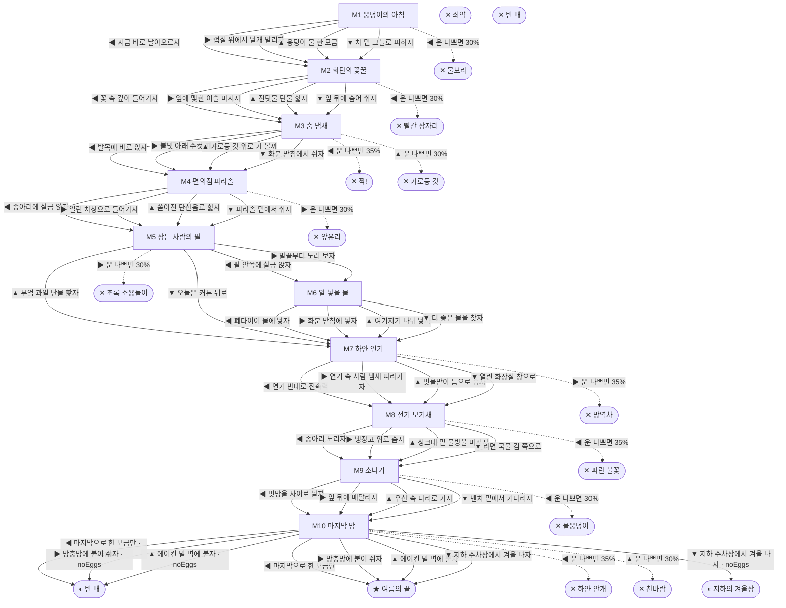

# 모기 (Culex pipiens)

> 이 문서는 `node scripts/scenario-docs.js`로 만든다. 고칠 때는 `js/data/species/mosquito.js`를 고친다.

- 몸길이 0.5cm · 눈높이 2.5cm · 시작 스탯 체력 100 / 포만 40 (장면마다 체력 -7 · 포만 -12)
- 체력이나 포만 중 하나라도 0이 되면 스토리와 상관없이 죽는다 (쇠약 / 굶주림)
- 해피엔딩: **여름의 끝** (생후 4주)
- 빌라 주차장 구석, 사흘째 안 마른 웅덩이에서 번데기 껍질을 가르고 나왔어. 나는 빨간집모기, 암컷이야. 길어야 한 달. 그 안에 피 한 모금 마시고 알을 낳아야 해.

## 흐름도
실선은 진행, 점선은 운이 나쁠 때(즉사 확률).

## 장면 (카드를 미는 방향 ◀ ▶ ▲ ▼, ★ 메인 루트)

| 장면 | 배경(등장) | 시기 | ◀ | ▶ | ▲ | ▼ |
|---|---|---|---|---|---|---|
| M1 웅덩이의 아침 | 빌라 주차장 (mosquito:pupaSkin, mosquito:puddleLarvae) | 생후 1일 | 지금 바로 날아오르자 (포만 +5 · 즉사 30%) | 껍질 위에서 날개 말리자 (체력 +5 · 다침 35% 체력 -15) | 웅덩이 물 한 모금 (포만 +10 · 다침 30% 체력 -15) | 차 밑 그늘로 피하자 (체력 +8, 포만 -4) ★ |
| M2 화단의 꽃꿀 | 아파트 단지 화단 (mosquito:hostaFlower, mosquito:aphidLeaf, mosquito:dragonfly) | 생후 2일 | 꽃 속 깊이 들어가자 (포만 +25 · 즉사 30%) | 잎에 맺힌 이슬 마시자 (포만 +8) ★ | 진딧물 단물 핥자 (포만 +18 · 다침 35% 체력 -15) | 잎 뒤에 숨어 쉬자 (체력 +10, 포만 -5) |
| M3 숨 냄새 | 빌라 골목 (mosquito:maleSwarm, mosquito:breathCloud, mosquito:slipperAnkle) | 생후 4일 | 발목에 바로 앉자 (포만 +30 · 즉사 35%) | 불빛 아래 수컷 떼로 (포만 +3, 체력 +5) ★ | 가로등 갓 위로 가 볼까 (포만 +12 · 즉사 30%) | 화분 받침에서 쉬자 (체력 +8, 포만 -5) |
| M4 편의점 파라솔 | 편의점 앞 (mosquito:taxiDoor, mosquito:sodaSpill, mosquito:hairyCalf) | 생후 6일 | 종아리에 살금 앉자 (포만 +35 · 다침 40% 체력 -15) ★ | 열린 차창으로 들어가자 (포만 +35 · 즉사 30%) | 쏟아진 탄산음료 핥자 (포만 +15) | 파라솔 밑에서 쉬자 (체력 +8, 포만 -5) |
| M5 잠든 사람의 팔 | 가정집 거실 (mosquito:electricFan, mosquito:mosquitoCoil, mosquito:sleepingArm) | 생후 7일 | 팔 안쪽에 살금 앉자 (포만 +40 · 다침 35% 체력 -10) ★ | 발끝부터 노려 보자 (포만 +40 · 즉사 30%) | 부엌 과일 단물 핥자 (포만 +15 · 플래그 noEggs) | 오늘은 커튼 뒤로 (체력 +8, 포만 -5 · 플래그 noEggs) |
| M6 알 낳을 물 | 빌라 주차장 (mosquito:oldTire, mosquito:eggRaft, mosquito:saucerWater) | 생후 9일 | 폐타이어 물에 낳자 (자손 +200, 체력 -10) ★ | 화분 받침에 낳자 (자손 +150, 체력 -5 · 다침 35% 체력 -15) | 여기저기 나눠 낳자 (자손 +240, 체력 -15 · 다침 40% 체력 -15) | 더 좋은 물을 찾자 (포만 -5 · 플래그 noEggs) |
| M7 하얀 연기 | 빌라 골목 (mosquito:fogNozzle, mosquito:drainGrate) | 생후 12일 | 연기 반대로 전속력 (포만 -6) | 연기 속 사람 냄새 따라가자 (포만 +30 · 즉사 35%) | 빗물받이 틈으로 숨자 (포만 +2 · 다침 35% 체력 -15) | 열린 화장실 창으로 (포만 +8) ★ |
| M8 전기 모기채 | 가정집 부엌 (mosquito:faucetDrip, mosquito:racketZap) | 생후 2주 | 종아리 노리자 (포만 +40 · 즉사 35%) | 냉장고 위로 숨자 (체력 +8, 포만 -5) | 싱크대 밑 물방울 마시자 (포만 +10) ★ | 라면 국물 김 쪽으로 (포만 +12 · 다침 40% 체력 -15) |
| M9 소나기 | 근린공원 (mosquito:umbrellaLegs, mosquito:leafShelter, mosquito:bigRaindrop) | 생후 3주 | 빗방울 사이로 날자 (포만 +5 · 즉사 30%) | 잎 뒤에 매달리자 (체력 +8, 포만 -5) | 우산 속 다리로 가자 (포만 +30 · 다침 35% 체력 -10) ★ | 벤치 밑에서 기다리자 (포만 -2) |
| M10 마지막 밤 | 가정집 거실 (mosquito:windowScreen, mosquito:acVent, mosquito:sprayIdle) | 생후 4주 | 마지막으로 한 모금만 (포만 +25 · 즉사 35%) | 방충망에 붙어 쉬자 (체력 +5) ★ | 에어컨 밑 벽에 붙자 (체력 +10 · 즉사 30%) | 지하 주차장에서 겨울 나자 (포만 -5) |

## 엔딩

| 엔딩 | 종류 | 사인(가해자) | 마지막 문장 |
|---|---|---|---|
| H1 여름의 끝 | 해피 | 노쇠 | 타이어 물 위에서 장구벌레들이 꼬물대겠지. 내년 여름엔 걔들이 앵— 할 거야. |
| N1 빈 배 | 노멀 | 노쇠 | 한 달을 꽉 채워 날았어. 알은 못 남겼지만, 짝짝 소리는 끝까지 피했잖아. |
| N2 지하의 겨울잠 | 노멀 | 겨울잠 | 보일러관 옆 천장에 매달렸어. 봄이 오면, 그땐 꼭 피를 마실 거야. |
| D1 물보라 | 데드 | 자동차 바퀴 (mosquito:tireSplash) | 태어난 웅덩이로 다시 돌아갔어. 겨우 한 시간 만에. |
| D2 빨간 잠자리 | 데드 | 고추잠자리 (mosquito:dragonfly) | 꿀은 진짜 달았어. 잠자리도 그렇게 생각했겠지. |
| D3 짝! | 데드 | 손바닥 (mosquito:palmClap) | 처음 마신 피가 마지막이 됐어. 손바닥에 빨간 점 하나. |
| D4 가로등 갓 | 데드 | 거미 (spider) | 불빛은 거미가 제일 잘 알더라. |
| D5 앞유리 | 데드 | 달리는 차에 갇힘 (mosquito:windshield) | 바깥이 쌩쌩 지나가. 유리는 끝까지 안 열렸어. |
| D6 초록 소용돌이 | 데드 | 모기향 (mosquito:mosquitoCoil) | 그 매운 연기가 날 노린 거였구나. |
| D7 방역차 | 데드 | 방역 연막 (mosquito:fogNozzle) | 골목이 온통 하얘. 사람 냄새가 거기 있었는데. |
| D8 파란 불꽃 | 데드 | 전기 모기채 (mosquito:racketZap) | 타닥. 라면 냄새가 마지막이네. |
| D9 물웅덩이 | 데드 | 빗방울 (mosquito:bigRaindrop) | 웅덩이에서 태어나서 웅덩이로. 날개가 안 펴져. |
| D10 하얀 안개 | 데드 | 모기약 스프레이 (mosquito:sprayMist) | 한 모금만 더였는데. 바닥이 차갑다. |
| D11 찬바람 | 데드 | 에어컨 냉기 (mosquito:acVent) | 여름에 얼어 죽는 모기도 있구나. |
| W0 쇠약 | 데드 | 쇠약 | 날개가 더는 안 떨려. 앵 소리도 안 나. |
| W1 빈 배 | 데드 | 굶주림 | 배가 너무 고파. 숨 냄새가 나는데 날 힘이 없어. |
