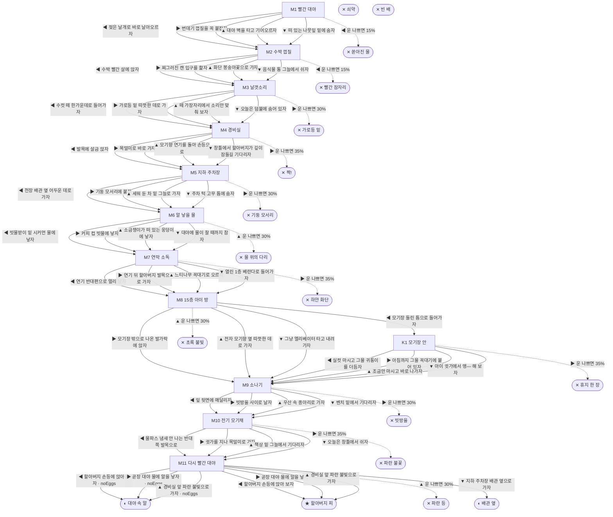

# 모기 (Culex pipiens)

> 이 문서는 `node scripts/scenario-docs.js`로 만든다. 고칠 때는 `js/data/species/mosquito.js`를 고친다.

- 몸길이 0.5cm · 눈높이 2.5cm · 시작 스탯 체력 100 / 포만 45 (장면마다 체력 -6 · 포만 -8)
- 체력이나 포만 중 하나라도 0이 되면 스토리와 상관없이 죽는다 (쇠약 / 굶주림)
- 해피엔딩: **할아버지 피** (생후 4주)
- 아파트 경비실 옆 수돗가, 빨간 고무 대야에 고인 빗물 속에서 자랐어. 경비 할아버지가 화단에 물 줄 때 쓰는 대야야. 나는 빨간집모기 암컷이야. 길어야 한 달 산대. 그 안에 피를 마시고 알을 낳아야 해.

## 흐름도
실선은 진행, 점선은 운이 나쁠 때(즉사 확률).

## 장면 (카드를 미는 방향 ◀ ▶ ▲ ▼, ★ 메인 루트)

| 장면 | 배경(등장) | 시기 | ◀ | ▶ | ▲ | ▼ |
|---|---|---|---|---|---|---|
| M1 빨간 대야 | 경비실 옆 빨간 대야 (mosquito:pupaSkin, mosquito:wigglers, mosquito:rimHand) | 생후 1일 | 젖은 날개로 바로 날아오르자 (체력 -3 · 즉사 15%) | 번데기 껍질을 꼭 붙잡자 (체력 +2 · 다침 30% 체력 -14) | 대야 벽을 타고 기어오르자 (체력 +4) ★ | 떠 있는 나뭇잎 밑에 숨자 (체력 +3, 포만 +2 · 다침 30% 체력 -12) |
| M2 수박 껍질 | 분리수거장 (mosquito:melonRind, mosquito:sodaSpill, mosquito:dragonfly) | 생후 2일 | 수박 빨간 살에 앉자 (포만 +24 · 즉사 15%) | 찌그러진 캔 입구를 핥자 (포만 +16 · 다침 30% 체력 -12) | 화단 봉숭아꽃으로 가자 (포만 +12) ★ | 음식물 통 그늘에서 쉬자 (체력 +8, 포만 -3) |
| M3 날갯소리 | 근린공원 (mosquito:maleSwarm, mosquito:bat) | 생후 3일 | 수컷 떼 한가운데로 들어가자 (체력 -3, 포만 -2) ★ | 가로등 밑 따뜻한 데로 가자 (체력 +4, 포만 -2 · 즉사 30%) | 떼 가장자리에서 소리만 맞춰 보자 (포만 -3) | 오늘은 덤불에 숨어 있자 (체력 +6, 포만 -6) |
| M4 경비실 | 아파트 경비실 (mosquito:mosquitoCoil, mosquito:slipperAnkle, mosquito:mulpas) | 생후 4일 | 발목에 살금 앉자 (포만 +38 · 다침 35% 체력 -10) ★ | 목덜미로 바로 가자 (포만 +40 · 즉사 35%) | 모기향 연기를 돌아 손등으로 (포만 +32 · 다침 40% 체력 -15) | 창틀에서 할아버지가 깊이 잠들길 기다리자 (포만 +26, 체력 -4) |
| M5 지하 주차장 | 지하 주차장 (mosquito:parkingStop, spider) | 생후 5일 | 천장 배관 옆 어두운 데로 가자 (체력 +8, 포만 -4) ★ | 기둥 모서리에 붙자 (체력 +8, 포만 -2 · 즉사 30%) | 세워 둔 차 밑 그늘로 가자 (체력 +4, 포만 -4 · 다침 35% 체력 -14) | 주차 턱 고무 틈에 숨자 (체력 +3, 포만 -2) |
| M6 알 낳을 물 | 빌라 주차장 (mosquito:drainGrate, mosquito:iceCup, mosquito:waterStrider) | 생후 7일 | 빗물받이 밑 시커먼 물에 낳자 (자손 +180, 체력 -12) ★ | 커피 컵 빗물에 낳자 (체력 -4 · 플래그 noEggs) | 소금쟁이가 떠 있는 웅덩이에 낳자 (자손 +200, 체력 -6 · 즉사 30%) | 대야에 물이 찰 때까지 참자 (체력 -6, 포만 -2 · 플래그 noEggs) |
| M7 연막 소독 | 아파트 단지 화단 (mosquito:hostaFlower, mosquito:fogNozzle) | 생후 9일 | 연기 반대편으로 멀리 날자 (체력 -8, 포만 -6) ★ | 연기 뒤 할아버지 발목으로 가자 (포만 +25 · 즉사 35%) | 느티나무 꼭대기로 오르자 (체력 -6, 포만 -3 · 다침 30% 체력 -12) | 열린 1층 베란다로 들어가자 (포만 +8 · 다침 30% 체력 -10) |
| M8 15층 아이 방 | 가정집 거실 (mosquito:liquidVape, mosquito:kidNet) | 생후 12일 | 모기장 들린 틈으로 들어가자 (포만 -2) | 모기장 밖으로 나온 발가락에 앉자 (포만 +36 · 다침 35% 체력 -10) ★ | 전자 모기향 옆 따뜻한 데로 가자 (체력 -4 · 즉사 30%) | 그냥 엘리베이터 타고 내려가자 (포만 -6, 체력 +2) |
| K1 모기장 안 | 가정집 거실 (mosquito:kidNet, mosquito:kidFoot) | 생후 12일 | 실컷 마시고 그물 귀퉁이를 더듬자 (포만 +40, 체력 -6 · 다침 30% 체력 -12) | 아침까지 그물 꼭대기에 붙어 있자 (포만 +36, 체력 +4 · 즉사 35%) | 조금만 마시고 바로 나가자 (포만 +18) | 아이 귓가에서 앵— 해 보자 (포만 +6 · 다침 35% 체력 -14) |
| M9 소나기 | 근린공원 (mosquito:leafShelter, mosquito:bigRaindrop, mosquito:umbrellaLegs) | 생후 2주 | 잎 뒷면에 매달리자 (체력 +10, 포만 -5) ★ | 빗방울 사이로 날자 (포만 +4 · 즉사 30%) | 우산 속 종아리로 가자 (포만 +28 · 다침 35% 체력 -12) | 벤치 밑에서 기다리자 (체력 +2, 포만 -2) |
| M10 전기 모기채 | 아파트 경비실 (mosquito:racketZap, mosquito:slipperAnkle, mosquito:mulpas) | 생후 3주 | 물파스 냄새 안 나는 반대쪽 발목으로 (포만 +36 · 다침 35% 체력 -8) ★ | 귓가를 지나 목덜미로 가자 (포만 +38 · 즉사 35%) | 책상 밑 그늘에서 기다리자 (포만 +24, 체력 -4) | 오늘은 창틀에서 쉬자 (체력 +6, 포만 -6) |
| M11 다시 빨간 대야 | 경비실 옆 빨간 대야 (mosquito:eggRaft, mosquito:fanHand) | 생후 3주 | 할아버지 손등에 앉아 보자 (자손 +120) ★ | 곧장 대야 물에 알을 낳자 (자손 +140, 체력 -6) | 경비실 앞 파란 불빛으로 가자 (자손 +120, 체력 +2 · 즉사 30%) | 지하 주차장 배관 옆으로 가자 (체력 +2) |

## 엔딩

| 엔딩 | 종류 | 사인(가해자) | 마지막 문장 |
|---|---|---|---|
| H1 할아버지 피 | 해피 | 노쇠 | 대야 가장자리에서 날개를 접었어. 빗물받이 밑에선 내 첫 아이들이 꼬물거려. 할아버지 피로 만든 애들이야. 할아버지는 오늘 밤에도 자기 무릎을 철썩 쳐. |
| N1 대야 속 알 | 노멀 | 노쇠 | 대야 물 위에 알 뗏목 하나가 떠 있어. 다음 주면 할아버지가 또 물을 버리겠지. 그래도 오늘 밤 대야는 잔잔해. |
| N2 배관 옆 | 노멀 | 노쇠 | 배관 옆은 서늘하고 조용해. 마지막 알은 끝내 못 낳았어. 계단 위에서 할아버지 라디오 소리가 내려와. |
| D1 쏟아진 물 | 데드 | 대야 물 버리기 (mosquito:rimHand) | 동생들이랑 같이 화단 흙 위로 쏟아졌어. 날개는 끝내 안 말랐어. |
| D2 빨간 잠자리 | 데드 | 고추잠자리 (mosquito:dragonfly) | 수박 단물이 아직 입가에 묻어 있었어. |
| D3 가로등 밑 | 데드 | 집박쥐 (mosquito:bat) | 불빛 아래 모인 날벌레를 박쥐도 다 보고 있었어. |
| D4 짝! | 데드 | 손바닥 (mosquito:palmClap) | 그날은 할아버지 손이 무릎 말고 목덜미를 쳤어. |
| D5 기둥 모서리 | 데드 | 집거미 (spider) | 서늘하고 조용한 데는 거미도 좋아해. |
| D6 물 위의 다리 | 데드 | 소금쟁이 (mosquito:waterStrider) | 물 위에 서는 건 나만 할 줄 아는 줄 알았어. |
| D7 하얀 화단 | 데드 | 방역 연막 (mosquito:fogNozzle) | 화단이 온통 하얘. 할아버지는 내가 거기 있는 줄 몰랐어. |
| D8 초록 불빛 | 데드 | 전자 모기향 (mosquito:liquidVape) | 아이는 끝까지 깨지 않았어. 초록 불은 아침까지 깜빡였어. |
| D9 휴지 한 장 | 데드 | 휴지 (mosquito:tissuePinch) | 아이 엄마가 휴지를 꼭 접었어. 휴지에 빨간 점이 하나 찍혔어. |
| D10 빗방울 | 데드 | 소나기 (mosquito:bigRaindrop) | 날개가 물에 붙어서 안 떨어져. 비는 금방 그쳤어. |
| D11 파란 불꽃 | 데드 | 전기 모기채 (mosquito:racketZap) | 타닥. 할아버지가 처음으로 한 마리 잡았어. |
| D12 파란 등 | 데드 | 해충퇴치기 (mosquito:zapperLamp) | 따뜻해서 가 본 거야. 대야가 바로 저긴데. |
| W0 쇠약 | 데드 | 쇠약 | 날개를 떨어 봐도 앵 소리가 안 나. |
| W1 빈 배 | 데드 | 굶주림 | 숨 냄새는 나는데 날아갈 힘이 없어. |
