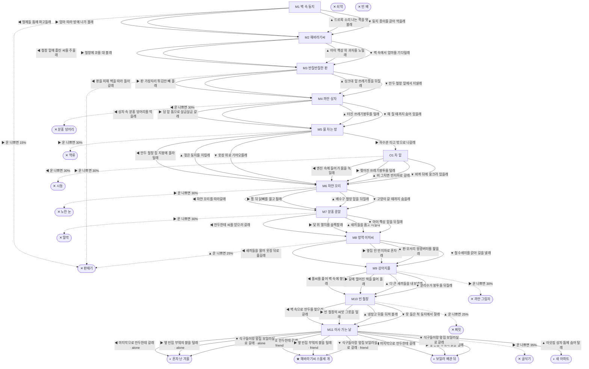

# 생쥐 (Mus musculus)

> 이 문서는 `node scripts/scenario-docs.js`로 만든다. 고칠 때는 `js/data/species/mouse.js`를 고친다.

- 몸길이 7cm · 눈높이 2.5cm · 시작 스탯 체력 100 / 포만 50 (장면마다 체력 -6 · 포만 -10)
- 체력이나 포만 중 하나라도 0이 되면 스토리와 상관없이 죽는다 (쇠약 / 굶주림)
- 해피엔딩: **해바라기씨 스물세 개** (생후 1년 2개월)
- 나는 생쥐야. 빌라 반지하 방 벽 속에서 형제 여섯이랑 같이 태어났어. 벽 너머엔 아이 하나랑 아이 엄마가 살아. 우리 생쥐는 사람 사는 데서만 살고, 길어야 한두 해 산대.

## 흐름도
실선은 진행, 점선은 운이 나쁠 때(즉사 확률).

## 장면 (카드를 미는 방향 ◀ ▶ ▲ ▼, ★ 메인 루트)

| 장면 | 배경(등장) | 시기 | ◀ | ▶ | ▲ | ▼ |
|---|---|---|---|---|---|---|
| M1 벽 속 둥지 | 반지하 방 (mouse:paperNest, mouse:wallHole) | 생후 3주 | 형제들 틈에 파고들래 (체력 +8, 포만 -2) ★ | 엄마 따라 방에 나가 볼래 (포만 +18 · 즉사 15%) | 드르륵 소리 나는 쪽을 엿볼래 (포만 +6) | 둥지 종이를 갉아 먹을래 (포만 +5, 체력 -2) |
| M2 해바라기씨 | 반지하 방 (mouse:hamsterCage, mouse:seedHulls) | 생후 4주 | 철창 밑에 흘린 씨를 주울래 (포만 +14) | 철창에 코를 대 볼래 (포만 +20 · 플래그 friend) ★ | 아이 책상 위 과자를 노릴래 (포만 +26 · 다침 35% 체력 -14) | 벽 속에서 엄마를 기다릴래 (체력 +6, 포만 -4) |
| M3 반질반질한 판 | 가정집 부엌 (mouse:sinkPipe, mouse:glueBoard) | 생후 7주 | 판을 피해 벽을 따라 돌아갈래 (포만 +10) | 판 가장자리 튀김만 빼 올래 (포만 +28 · 즉사 30%) | 싱크대 밑 쓰레기통을 뒤질래 (포만 +20 · 다침 35% 체력 -15) | 만두 철창 밑에서 지낼래 (포만 +12, 체력 +2) ★ |
| M4 까만 상자 | 빌라 주차장 (mouse:baitBox, mouse:tire) | 생후 2개월 | 상자 속 분홍 덩어리를 먹을래 (포만 +30 · 즉사 30%) | 담 밑 틈으로 살금살금 갈래 (포만 +12) ★ | 터진 쓰레기봉투를 털래 (포만 +24 · 다침 40% 체력 -16) | 해 질 때까지 숨어 있을래 (체력 +6, 포만 -4) |
| M5 물 차는 방 | 반지하 방 (mouse:hamsterCage, mouse:floorPuddle) | 생후 3개월 | 만두 철창 집 지붕에 올라탈래 (체력 -4 · 플래그 friend) ★ | 하수관 타고 밖으로 나갈래 (포만 -3 · 즉사 30%) | 젖은 둥지를 지킬래 (체력 -8, 포만 -2 · 다침 40% 체력 -10) | 옷장 위로 기어오를래 (체력 -6, 포만 -4) |
| O1 차 밑 | 빌라 주차장 (mouse:tire) | 생후 3개월 | 엔진 속에 들어가 몸을 녹일래 (체력 +12 · 즉사 30%) | 찢어진 쓰레기봉투를 털래 (포만 +22 · 다침 35% 체력 -14) | 비 그치면 반지하로 갈래 (체력 +2, 포만 -2) | 바퀴 뒤에 웅크려 있을래 (체력 +4, 포만 -4) |
| M6 하얀 꼬리 | 식당가 뒷골목 (mouse:foodBin, mouse:mate) | 생후 4개월 | 하얀 꼬리를 따라갈래 (포만 +14) ★ | 통 뒤 닭뼈를 물고 튈래 (포만 +30 · 즉사 30%) | 배수구 철망 밑을 뒤질래 (포만 +16 · 다침 35% 체력 -14) | 고양이 갈 때까지 숨을래 (체력 +6, 포만 -5) |
| M7 분홍 콩알 | 반지하 방 (mouse:pinkPups, mouse:snapTrap) | 생후 5개월 | 만두한테 씨를 얻으러 갈래 (자손 +7, 포만 +14) ★ | 덫 위 멸치를 슬쩍할래 (자손 +7, 포만 +26 · 즉사 30%) | 새끼들을 품고 버틸래 (자손 +7, 체력 +4, 포만 -6) | 아이 책상 밑을 뒤질래 (자손 +7, 포만 +18 · 다침 35% 체력 -14) |
| M8 방역 아저씨 | 가정집 부엌 (mouse:steelWool, mouse:glueBoard, mouse:workerBoots) | 생후 6개월 | 새끼들을 물어 옷장 뒤로 옮길래 (체력 -6, 포만 -2) ★ | 옆집 빈 반지하로 혼자 갈래 (포만 +8 · 플래그 alone) | 판 모서리 땅콩버터를 핥을래 (포만 +24 · 즉사 25%) | 철수세미를 갉아 길을 낼래 (포만 +4 · 다침 45% 체력 -18) |
| M9 강아지풀 | 빌라 골목 (crow, mouse:foxtail) | 생후 7개월 | 풀씨를 훑어 벽 속에 쌓을래 (포만 +12, 체력 -4) ★ | 길에 떨어진 떡을 물어 올래 (포만 +28 · 즉사 30%) | 다 큰 새끼들을 내보낼래 (포만 +10 · 플래그 alone) | 분리수거 봉투를 뒤질래 (포만 +18 · 다침 35% 체력 -14) |
| M10 빈 철창 | 반지하 방 (mouse:emptyCage) | 생후 8개월 | 벽 속으로 만두를 찾으러 갈래 (체력 -8, 포만 -4) ★ | 빈 철창의 씨앗 그릇을 털래 (포만 +26 · 다침 30% 체력 -12) | 냉장고 뒤를 뒤져 볼래 (포만 +6 · 즉사 25%) | 못 들은 척 둥지에서 잘래 (체력 +6, 포만 -4) |
| M11 이사 가는 날 | 빌라 골목 (mouse:demolitionWall, mouse:movingBoxes) | 생후 9개월 | 마지막으로 만두한테 갈래 (포만 +10) ★ | 옆 빈집 부엌의 쌀을 털래 (포만 +24 · 즉사 35%) | 이삿짐 상자 틈에 숨어 탈래 (포만 +6) | 식구들이랑 앞집 보일러실로 갈래 (체력 +6, 포만 -4) |

## 엔딩

| 엔딩 | 종류 | 사인(가해자) | 마지막 문장 |
|---|---|---|---|
| H1 해바라기씨 스물세 개 | 해피 | 노쇠 | 만두가 밀어 준 씨는 스물세 개였어. 그걸로 식구들이랑 보일러실에서 겨울을 났어. 봄이 되니 새끼들이 볼이 미어지게 씨를 물고 다녀. 누구한테 배웠나 몰라. |
| N1 새 아파트 | 노멀 | 노쇠 | 상자에서 나와 보니 새 아파트였어. 바닥이 반짝반짝해서 먹을 게 없어. 밤마다 만두 철창 밑에 흘린 씨로 버텼어. 식구들은 눈 오는 골목에 두고 왔어. |
| N2 혼자 난 겨울 | 노멀 | 노쇠 | 겨울은 혼자 넘겼어. 봄이 오니까 갉을 것도 많아. 같이 갉을 식구가 없을 뿐이야. |
| N3 보일러 배관 뒤 | 노멀 | 노쇠 | 식구들이랑 보일러 배관 뒤에서 겨울을 났어. 늘 배가 고팠어. 그래도 다 같이 붙어 자면 견딜 만했어. |
| D1 판때기 | 데드 | 끈끈이 트랩 (mouse:glueBoard) | 발이 넷 다 붙으면 소리 지르는 것밖에 할 게 없어. 엄마가 왜 안 돌아왔는지 이제 알아. |
| D2 분홍 덩어리 | 데드 | 쥐약 (mouse:baitBox) | 분홍 덩어리는 정말 달았어. 그래서 다들 먹나 봐. |
| D3 노란 눈 | 데드 | 길고양이 (strayCat) | 고양이는 배가 불러도 사냥을 한대. 하얀 꼬리는 무사히 도망쳤을까. |
| D4 딸깍 | 데드 | 쥐덫 (mouse:snapTrap) | 멸치 한 마리였어. 벽 속에서 새끼들이 기다리는데. |
| D5 역류 | 데드 | 하수 역류 (mouse:floodSurge) | 물은 아래로만 흐르는 줄 알았어. |
| D6 시동 | 데드 | 자동차 엔진 (mouse:tire) | 엔진 속은 정말 따뜻했어. 차가 움직이기 전까지는. |
| D7 찌릿 | 데드 | 감전 (mouse:sparkWire) | 만두를 찾으러 들어간 건데. 냉장고 뒤엔 먼지뿐이었어. |
| D8 까만 그림자 | 데드 | 까마귀 (crow) | 생쥐는 늘 땅만 봐. 위에서 오는 건 못 봐. |
| D9 굴삭기 | 데드 | 재개발 철거 (mouse:excavator) | 쌀 반 포대였어. 집이 무너지는 날인 줄 몰랐어. |
| W0 쇠약 | 데드 | 쇠약 | 수염이 이제 안 떨려. 조금만 쉬었다 갈게. |
| W1 빈 배 | 데드 | 굶주림 | 밥알 한 톨만 더 있었으면. |
