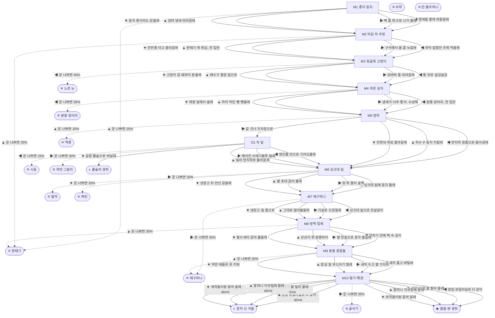

# 생쥐 (Mus musculus)

> 이 문서는 `node scripts/scenario-docs.js`로 만든다. 고칠 때는 `js/data/species/mouse.js`를 고친다.

- 몸길이 7cm · 눈높이 2.5cm · 시작 스탯 체력 100 / 포만 50 (장면마다 체력 -9 · 포만 -10)
- 체력이나 포만 중 하나라도 0이 되면 스토리와 상관없이 죽는다 (쇠약 / 굶주림)
- 해피엔딩: **봄을 본 생쥐** (생후 1년 6개월)
- 나는 생쥐야. 식당가 순댓국집 주방 벽 속, 신문지랑 영수증을 잘게 찢은 둥지에서 형제 다섯이랑 같이 태어났어. 우리 종은 사람 사는 데서만 살고, 길어야 한두 해 산대.

## 흐름도
실선은 진행, 점선은 운이 나쁠 때(즉사 확률).

## 장면 (카드를 미는 방향 ◀ ▶ ▲ ▼, ★ 메인 루트)

| 장면 | 배경(등장) | 시기 | ◀ | ▶ | ▲ | ▼ |
|---|---|---|---|---|---|---|
| M1 종이 둥지 | 식당 주방 (mouse:paperNest, mouse:wallHole) | 생후 3주 | 형제들 틈에 파묻힐래 (포만 -4, 체력 +6) ★ | 벽 틈 밖으로 나가 볼래 (포만 +20 · 다침 35% 체력 -15) | 엄마 냄새 따라갈래 (포만 +12 · 즉사 25%) | 둥지 종이라도 갉을래 (포만 +6, 체력 -4) |
| M2 마감 뒤 주방 | 식당 주방 (mouse:riceScraps, mouse:glueBoard) | 생후 5주 | 바닥 밥알만 주워 먹을래 (포만 +20) ★ | 구석에서 몸 좀 녹일래 (포만 -3, 체력 +10) | 판때기 위 튀김, 한 입만 (포만 +32 · 즉사 35%) | 잔반통 타고 올라갈래 (포만 +28 · 다침 40% 체력 -20) |
| M3 뒷골목 고양이 | 식당가 뒷골목 (mouse:foodBin) | 생후 7주 | 통 뒤로 살금살금 (포만 +30 · 즉사 30%) | 담벼락 틈 따라갈래 (포만 +12) ★ | 배수구 철망 밑으로 (포만 +16 · 다침 35% 체력 -15) | 고양이 갈 때까지 참을래 (포만 -5, 체력 +5) |
| M4 까만 상자 | 빌라 골목 (mouse:baitBox, mouse:breadCrust) | 생후 2개월 | 분홍 덩어리, 한 입만 (포만 +30 · 즉사 35%) | 냄새가 너무 좋아, 수상해 (포만 +3) ★ | 까치 먹던 빵 뺏을래 (포만 +22 · 다침 35% 체력 -18) | 화분 밑에서 쉴래 (포만 -4, 체력 +8) |
| M5 장마 | 빌라 골목 (mouse:stormDrain, mouse:basementWindow) | 생후 3개월 | 반지하 창틈으로 들어갈래 (포만 +10) ★ | 길 건너 주차장으로 (포만 -3) | 하수구 둥지 지킬래 (체력 -6 · 즉사 30%) | 전봇대 위로 올라갈래 (체력 -12, 포만 -2) |
| O1 차 밑 | 빌라 주차장 (mouse:tire) | 생후 4개월 | 엔진룸 안으로 기어오를래 (체력 +10, 포만 -3 · 즉사 25%) | 찢어진 쓰레기봉투 털래 (포만 +25 · 즉사 30%) | 빌라 반지하로 돌아갈래 (포만 +3) | 공원 풀숲으로 떠날래 (포만 +5) |
| M6 싱크대 밑 | 가정집 부엌 (mouse:sinkPipe, mouse:snapTrap) | 생후 4개월 | 싱크대 밑에 둥지 틀래 (체력 +10, 포만 +8) ★ | 덫 위 멸치 슬쩍 (포만 +25 · 즉사 30%) | 쌀 포대 갉아 볼래 (포만 +30 · 다침 40% 체력 -18) | 냉장고 뒤 전선 갉을래 (체력 +4 · 즉사 25%) |
| M7 에구머니 | 가정집 부엌 (mouse:broom, mouse:grandmaLegs) | 생후 5개월 | 싱크대 밑으로 쏜살같이 (포만 -2 · 다침 30% 체력 -10) ★ | 거실로 도망칠래 (포만 +12 · 즉사 35%) | 그대로 얼어붙을래 (다침 50% 체력 -20) | 냉장고 밑 틈으로 (포만 -3, 체력 -3) |
| M8 방역 업체 | 가정집 부엌 (mouse:steelWool, mouse:workerBoots, mouse:glueBoard) | 생후 6개월 | 막히기 전에 벽 속 깊이 (포만 -5, 체력 +4) ★ | 옆 빈집으로 혼자 옮길래 (포만 +8 · 플래그 alone) | 끈끈이 위 땅콩버터 (포만 +25 · 즉사 30%) | 철수세미 갉아 뚫을래 (포만 +4 · 다침 45% 체력 -20) |
| M9 분홍 콩알들 | 가정집 부엌 (mouse:pinkPups, mouse:riceBag) | 생후 7개월 | 새끼 품고 버틸래 (자손 +7, 포만 -6, 체력 +4) | 새끼 두고 쌀 가지러 (자손 +7, 포만 +26 · 다침 30% 체력 -18) ★ | 밥상 밑 부스러기 털래 (자손 +7, 포만 +20 · 즉사 30%) | 약한 애들은 못 키워 (자손 +3, 포만 +6 · 플래그 alone) |
| M10 철거 예정 | 빌라 골목 (mouse:demolitionWall, mouse:grownKids) | 생후 10개월 | 앞집 보일러실로 다 같이 (포만 -4, 체력 +6) ★ | 빈집 부엌 쌀 털어 올래 (포만 +20 · 즉사 35%) | 할머니 이삿짐에 탈래 (포만 +10 · 플래그 alone) | 새끼들이랑 뭉쳐 잘래 (체력 +6, 포만 -6) |

## 엔딩

| 엔딩 | 종류 | 사인(가해자) | 마지막 문장 |
|---|---|---|---|
| H1 봄을 본 생쥐 | 해피 | 노쇠 | 겨울을 넘기고 봄에 또 새끼를 낳았어. 손주까지 마흔 마리. 보일러 배관은 아직도 따뜻해. |
| N1 풀숲의 생쥐 | 노멀 | 노쇠 | 공원 풀숲은 넓고 추웠어. 오래는 못 살았지만 별은 실컷 봤어. |
| N2 혼자 난 겨울 | 노멀 | 노쇠 | 겨울은 넘겼어. 봄이 오니까 갉을 것도 많더라. 같이 볼 식구가 없었을 뿐이야. |
| D1 판때기 | 데드 | 끈끈이 트랩 (mouse:glueBoard) | 발이 넷 다 붙으면 소리 지르는 것밖에 할 게 없어. 다들 그렇게 소리 지르다 갔대. |
| D2 분홍 덩어리 | 데드 | 쥐약 (mouse:baitBox) | 독은 천천히 와. 피가 멈추지 않게 하는 약이래. |
| D3 노란 눈 | 데드 | 고양이 (strayCat) | 고양이는 배가 불러도 사냥을 한대. 나는 놀잇감이었어. |
| D4 역류 | 데드 | 하수 침수 (mouse:floodSurge) | 물은 아래로만 흐르는 줄 알았어. |
| D5 시동 | 데드 | 자동차 엔진 (mouse:tire) | 따뜻한 데는 다 이유가 있더라. |
| D6 딸깍 | 데드 | 쥐덫 (mouse:snapTrap) | 멸치 한 마리였어. 겨우 멸치 한 마리. |
| D7 찌릿 | 데드 | 감전 (mouse:sparkWire) | 이빨이 근질거린 게 죄였어. |
| D8 에구머니 | 데드 | 빗자루 (mouse:broom) | 할머니도 나만큼 무서웠대. |
| D9 까만 그림자 | 데드 | 까마귀 (crow) | 위를 볼 생각을 못 했어. 생쥐는 늘 땅만 보니까. |
| D10 굴삭기 | 데드 | 재개발 철거 (mouse:excavator) | 사람들 새집 짓는 날, 우리 집이 없어졌어. |
| W0 쇠약 | 데드 | 쇠약 | 수염이 이제 안 떨려. 좀 쉬고 싶었어. |
| W1 빈 볼주머니 | 데드 | 굶주림 | 하루에 제 몸무게 반은 먹어야 사는데, 그게 너무 어려웠어. |
