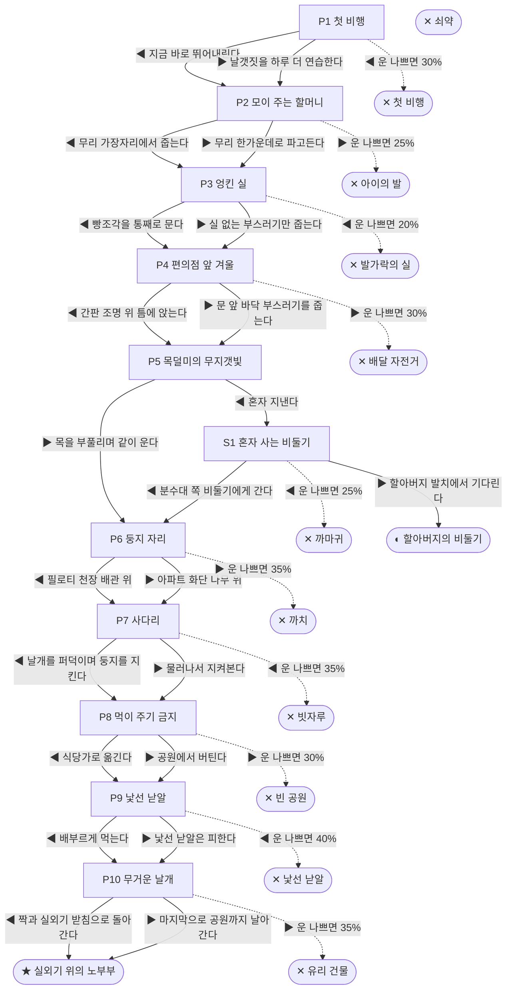

# 집비둘기 (Columba livia)

> 이 문서는 `node scripts/scenario-docs.js`로 만든다. 고칠 때는 `js/data/species/pigeon.js`를 고친다.

- 몸길이 32cm · 눈높이 200cm · 시작 스탯 체력 100 / 포만 60 (장면마다 포만 -15)
- 해피엔딩: **실외기 위의 노부부** (생후 6년)
- 빌라 3층 에어컨 실외기 받침대, 나뭇가지 몇 개로 엮은 둥지에서 깼다. 도시 비둘기는 보통 3~5년을 산다.

## 흐름도
실선은 진행, 점선은 운이 나쁠 때(즉사 확률).

## 장면 (◀ 왼쪽 / ▶ 오른쪽, ★ 메인 루트)

| 장면 | 배경 | 시기 | ◀ 왼쪽 | ▶ 오른쪽 |
|---|---|---|---|---|
| P1 첫 비행 | 빌라 골목 | 생후 4주 | 지금 바로 뛰어내린다 (즉사 30%) | 날갯짓을 하루 더 연습한다 (포만 -5) ★ |
| P2 모이 주는 할머니 | 근린공원 | 생후 2개월 | 무리 가장자리에서 줍는다 (포만 +25) ★ | 무리 한가운데로 파고든다 (포만 +40 · 즉사 25%) |
| P3 엉킨 실 | 식당가 뒷골목 | 생후 6개월 | 빵조각을 통째로 문다 (포만 +30 · 즉사 20% · 다침 50%) | 실 없는 부스러기만 줍는다 (포만 +15) ★ |
| P4 편의점 앞 겨울 | 편의점 앞 | 생후 8개월 | 간판 조명 위 틈에 앉는다 (체력 +5, 포만 +10) ★ | 문 앞 바닥 부스러기를 줍는다 (포만 +25 · 즉사 30%) |
| P5 목덜미의 무지갯빛 | 아파트 단지 화단 | 생후 11개월 | 혼자 지낸다 (포만 +10) | 목을 부풀리며 같이 운다 (포만 +5) ★ |
| P6 둥지 자리 | 빌라 주차장 | 생후 1년 | 필로티 천장 배관 위 ★ | 아파트 화단 나무 위 (즉사 35%) |
| P7 사다리 | 빌라 주차장 | 생후 1년 1개월 | 날개를 퍼덕이며 둥지를 지킨다 (자손 +2 · 즉사 35%) | 물러나서 지켜본다 (자손 +2) ★ |
| P8 먹이 주기 금지 | 근린공원 | 생후 3년 | 식당가로 옮긴다 (포만 +30) ★ | 공원에서 버틴다 (포만 -20 · 즉사 30%) |
| P9 낯선 낟알 | 식당가 뒷골목 | 생후 4년 1개월 | 배부르게 먹는다 (포만 +30 · 즉사 40%) | 낯선 낟알은 피한다 (포만 +15) ★ |
| P10 무거운 날개 | 빌라 골목 | 생후 6년 | 짝과 실외기 받침으로 돌아간다 ★ | 마지막으로 공원까지 날아간다 (즉사 35%) |
| S1 혼자 사는 비둘기 | 아파트 단지 화단 | +10개월 | 분수대 쪽 비둘기에게 간다 (포만 +5 · 즉사 25%) | 할아버지 발치에서 기다린다 |

## 엔딩

| 엔딩 | 종류 | 사인 | 마지막 문장 |
|---|---|---|---|
| H1 실외기 위의 노부부 | 해피 | 노환 | 태어난 그 실외기 받침에서, 짝의 곁에서 눈을 감았다. 새끼들은 이 골목 어딘가에 산다. |
| N1 할아버지의 비둘기 | 노멀 | 노환 | 매일 아침 같은 벤치, 같은 과자 부스러기. 혼자였지만 굶지는 않았다. |
| D1 첫 비행 | 데드 | 길고양이 | 날개보다 고양이가 빨랐다. |
| D2 아이의 발 | 데드 | 압사 | 아이는 그냥 비둘기를 날려 보고 싶었다. |
| D3 발가락의 실 | 데드 | 감염 | 발가락이 없는 도시 비둘기가 많은 이유다. |
| D4 배달 자전거 | 데드 | 충돌 | 편의점 앞은 밤에도 바쁘다. |
| D5 까치 | 데드 | 까치 | 도시의 까치는 비둘기 둥지를 노린다. |
| D6 빗자루 | 데드 | 타격 | 서로 겁이 났던 것이다. |
| D7 빈 공원 | 데드 | 굶주림 | 할머니는 다시 오지 않았다. |
| D8 낯선 낟알 | 데드 | 중독 | 도시에는 비둘기를 미워하는 사람도 있다. |
| D9 유리 건물 | 데드 | 유리창 충돌 | 통유리에 하늘이 비쳤다. |
| D10 까마귀 | 데드 | 까마귀 | 분리수거장은 까마귀의 영역이었다. |
| W0 쇠약 | 데드 | 굶주림 | 날개가 더는 몸을 들어 올리지 못했다. |
