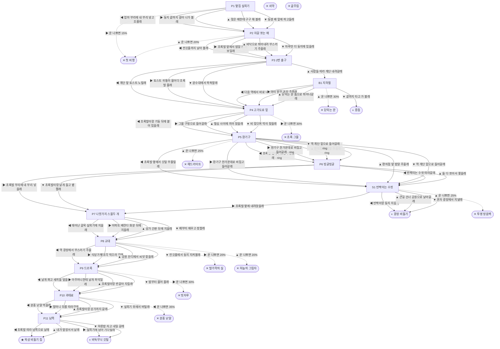

# 비둘기 (Columba livia)

> 이 문서는 `node scripts/scenario-docs.js`로 만든다. 고칠 때는 `js/data/species/pigeon.js`를 고친다.

- 몸길이 32cm · 눈높이 200cm · 시작 스탯 체력 70 / 포만 45 (장면마다 체력 -5 · 포만 -12)
- 체력이나 포만 중 하나라도 0이 되면 스토리와 상관없이 죽는다 (쇠약 / 굶주림)
- 해피엔딩: **옥상 비둘기 집** (생후 6년 6개월)
- 나는 빌라 3층 에어컨 실외기 받침대에서 깼어. 나뭇가지 몇 개 엮은 게 우리 집이야. 비둘기는 알을 꼭 두 개 낳아. 그래서 나한텐 동생이 하나 있어. 도시 비둘기는 보통 서너 해를 산대.

## 흐름도
실선은 진행, 점선은 운이 나쁠 때(즉사 확률).

## 장면 (카드를 미는 방향 ◀ ▶ ▲ ▼, ★ 메인 루트)

| 장면 | 배경(등장) | 시기 | ◀ | ▶ | ▲ | ▼ |
|---|---|---|---|---|---|---|
| P1 옆집 실외기 | 빌라 골목 (pigeon:acNest, pigeon:soakedRing) | 생후 3주 | 엄마 부리에 내 부리 넣고 조를래 (포만 +25 · 다침 30% 체력 -10) | 둥지 끝까지 걸어 나가 볼래 (포만 +10 · 즉사 15%) | 젖은 애한테 구구 해 볼래 (체력 +5, 포만 +5) | 동생 배 밑에 파고들래 (체력 +10, 포만 +10) ★ |
| P2 자갈 쪼는 애 | 빌라 골목 (pigeon:pebblePeck, strayCat) | 생후 5주 | 전깃줄까지 날아 볼래 (포만 +5 · 다침 30% 체력 -10) | 초록발 앞에서 밥알 쪼아 보일래 (포만 +20 · 다침 30% 체력 -10 · 플래그 ring) ★ | 바닥으로 뛰어내려 부스러기 주울래 (포만 +20 · 즉사 20%) | 하루만 더 둥지에 있을래 (체력 +10, 포만 -5) |
| P3 2번 출구 | 지하철역 출구 광장 (pigeon:toastDrop, pigeonFlock, pigeon:shyRing) | 생후 2개월 | 계단 앞 토스트 노릴래 (포만 +30 · 다침 40% 체력 -15) | 토스트 귀퉁이 물어다 초록발 줄래 (포만 +15 · 플래그 ring) ★ | 사람들 따라 계단 내려갈래 (포만 +5) | 분수대에서 목욕할래 (체력 +15, 포만 -5) |
| B1 지하철 | 지하철 안 (pigeon:subwayKid, pigeon:snackDrop) | +0일 | 다음 역에서 바로 내릴래 (포만 -5) | 아이 발밑 과자 주울래 (포만 +20 · 다침 30% 체력 -10) | 닫히는 문 틈으로 뛰어나갈래 (체력 +5 · 즉사 30%) | 끝까지 타고 가 볼래 (포만 +10) |
| P4 고가도로 밑 | 고가도로 밑 (pigeon:spikeLedge, pigeon:netHole) | 생후 3개월 | 초록발이랑 기둥 뒤에 붙어 있을래 (체력 +5) ★ | 그물 구멍으로 들어갈래 (체력 +15 · 즉사 30%) | 철심 사이에 끼어 앉을래 (체력 +5 · 다침 40% 체력 -15) | 비 맞으며 먹이 찾을래 (포만 +25 · 다침 40% 체력 -15) |
| P5 환기구 | 지하철역 출구 광장 (pigeon:ventGrate, scooter) | 생후 8개월 | 초록발 옆에서 깃털 부풀릴래 (체력 +10) ★ | 환기구 한가운데로 비집고 들어갈래 (체력 +15 · 다침 35% 체력 -10) | 편의점 앞 밥알 주울래 (포만 +30 · 즉사 25%) | 역 계단 밑으로 들어갈래 (체력 +5, 포만 +10 · 다침 30% 체력 -10) |
| P6 빙글빙글 | 지하철역 출구 광장 (pigeon:ringCourt, pigeon:courtingMale) | 생후 11개월 | 반짝이는 수컷 따라갈래 (포만 +10) | 초록발 부리에 내 부리 넣을래 (포만 +15) | 둘 다 쪼아서 쫓을래 (포만 +15 · 다침 30% 체력 -10) | 초록발이랑 날개 들고 볕 쬘래 (체력 +10, 포만 -5) |
| S1 반짝이는 수컷 | 지하철역 출구 광장 (pigeon:courtingMale, pigeon:duskWatch) | +4주 | 반짝이랑 둥지 지을래 (포만 +10 · 다침 30% 체력 -10) | 초록발 옆에 내려앉을래 (포만 +5 · 플래그 ring) ★ | 큰길 건너 공원으로 날아갈래 (포만 +15 · 즉사 25%) | 혼자 광장에서 지낼래 (체력 +5) |
| P7 나뭇가지 스물두 개 | 빌라 골목 (pigeon:twigRelay) | 생후 1년 | 태어난 골목 실외기에 지을래 (포만 +10) ★ | 아파트 베란다 화분 뒤에 지을래 (포만 +5 · 다침 40% 체력 -15) | 상가 간판 뒤에 지을래 (체력 +5 · 다침 30% 체력 -15) | 배부터 채우고 정할래 (포만 +25 · 다침 30% 체력 -10) |
| P8 교대 | 빌라 골목 (pigeon:shiftChange, pigeonFlock) | 생후 1년 | 역 광장에서 부스러기 주울래 (포만 +25 · 다침 30% 체력 -5) ★ | 식당가 빵조각 먹으러 갈래 (포만 +30 · 즉사 20% · 다침 40% 체력 -20) | 공원 잔디에서 씨앗 찾을래 (포만 +20 · 즉사 20%) | 전깃줄에서 둥지 지켜볼래 (체력 +10, 포만 -5) |
| P9 드르륵 | 빌라 골목 (pigeon:acSquabs, pigeon:windowBroom) | 생후 1년 1개월 | 날개 펴고 새끼들 덮을래 (자손 +2, 체력 -5) ★ | 아주머니한테 날개 퍼덕일래 (자손 +2 · 즉사 30%) | 초록발이랑 번갈아 지킬래 (자손 +2, 포만 -10) | 밥부터 물어 올래 (자손 +1, 포만 +20) |
| P10 과태료 | 지하철역 출구 광장 (pigeon:banBanner, pigeon:pinkGrain, pigeon:pocketGrandma) | 생후 3년 | 분홍 낟알 먹을래 (포만 +35 · 즉사 35%) | 할머니 뒤를 따라갈래 (포만 +20) ★ | 초록발이랑 강가까지 갈래 (포만 +25 · 다침 40% 체력 -15) | 실외기 위에서 버틸래 (체력 +5, 포만 -5) |
| P11 남쪽 | 빌라 골목 (pigeon:oldCoupleAc) | 생후 6년 6개월 | 초록발 따라 남쪽으로 날래 (포만 +10) ★ | 실외기에 남아 기다릴래 (체력 +5) | 내가 앞장서서 날래 (포만 +5) | 하룻밤 자고 내일 갈래 (체력 +5) |

## 엔딩

| 엔딩 | 종류 | 사인(가해자) | 마지막 문장 |
|---|---|---|---|
| H1 옥상 비둘기 집 | 해피 | 노환 | 할아버지가 초록발 발목 고리를 들여다보더니 한참 웃었어. "육 년 만이네. 짝까지 데려왔어?" 할아버지가 콩을 한 줌 뿌려 줬어. 처음 먹어 보는 콩이야. 딱딱해. 초록발이 골목에서 왜 자갈을 쪼았는지 이제 알겠어. |
| N1 광장 비둘기 | 노멀 | 노환 | 광장 비둘기로 늙었어. 해 질 녘이면 나도 가끔 남쪽을 봐. 초록발은 집에 갔을까. |
| N2 바둑무늬 깃털 | 노멀 | 노환 | 실외기 위에 초록발 깃털 하나가 남았어. 바둑무늬야. 나는 그 깃털을 둥지 맨 밑에 깔았어. |
| N3 종점 | 노멀 | 노환 | 종점 동네 비둘기들은 구구 소리가 조금 달라. 나는 거기서 늙었어. 지하철 문이 열릴 때마다 초록발이 내릴까 봐 쳐다봤어. |
| D1 첫 비행 | 데드 | 길고양이 (strayCat) | 하루만 더 둥지에 있을걸. |
| D2 닫히는 문 | 데드 | 지하철 문 (pigeon:screenDoor) | 문이 그렇게 빨리 닫힐 줄 몰랐어. |
| D3 초록 그물 | 데드 | 그물 엉킴 (pigeon:netTangle) | 그물 구멍은 들어오는 쪽에서만 보였어. |
| D4 헤드라이트 | 데드 | 오토바이 (pigeon:scooterGlare) | 밥알만 보였어. |
| D5 발가락의 실 | 데드 | 낚싯줄 괴사 (pigeon:lineFoot) | 발가락이 까매졌어. 이제 서 있을 수가 없어. |
| D6 빗자루 | 데드 | 타격 (pigeon:broomSwing) | 아주머니도 나도 겁이 났던 거야. |
| D7 하늘의 그림자 | 데드 | 참매 (pigeon:hawkDive) | 씨앗만 보느라 하늘을 안 봤어. |
| D8 분홍 낟알 | 데드 | 중독 (pigeon:pinkGrain) | 배가 고팠어. 그게 다야. |
| D9 투명 방음벽 | 데드 | 방음벽 충돌 (pigeon:noiseBarrier) | 아무것도 없었는데. 분명히 없었는데. |
| W0 쇠약 | 데드 | 쇠약 | 날개가 이제 안 올라가. |
| W1 굶주림 | 데드 | 굶주림 | 도시엔 먹을 게 많다던데, 오늘은 하나도 못 찾았어. |
