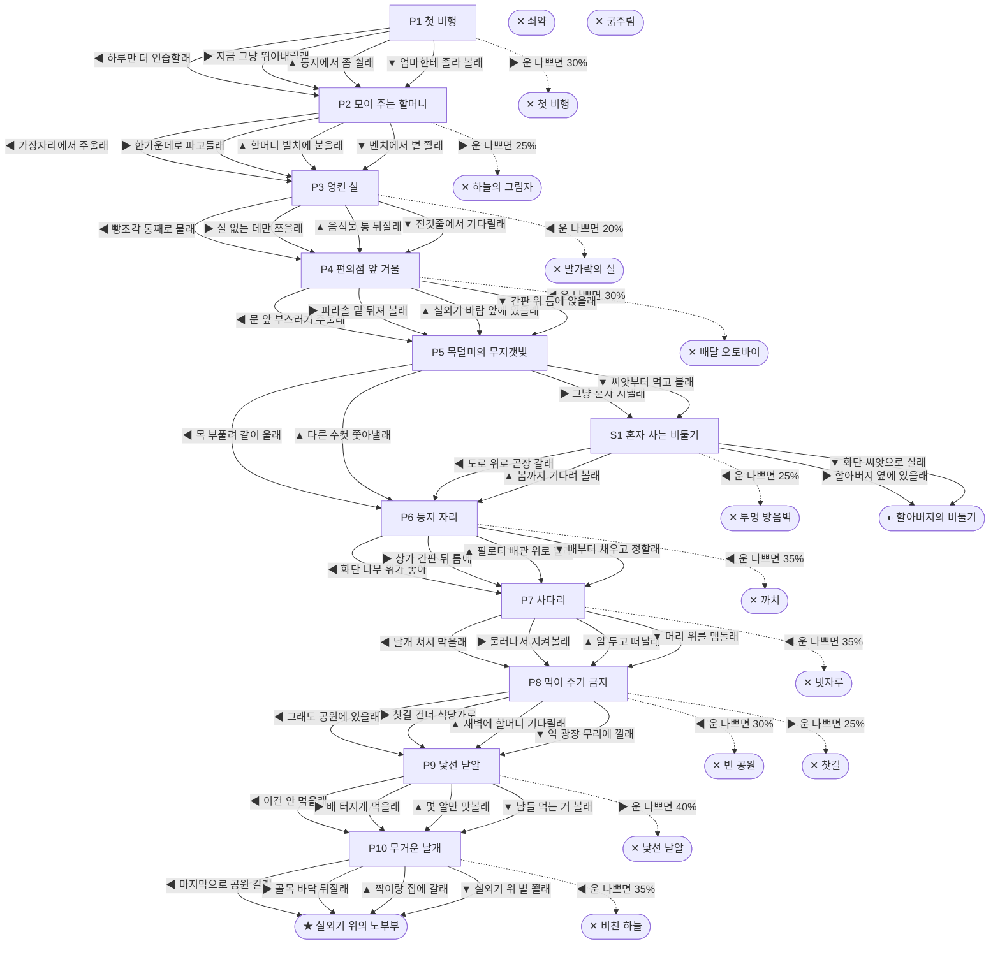

# 비둘기 (Columba livia)

> 이 문서는 `node scripts/scenario-docs.js`로 만든다. 고칠 때는 `js/data/species/pigeon.js`를 고친다.

- 몸길이 32cm · 눈높이 200cm · 시작 스탯 체력 70 / 포만 45 (장면마다 체력 -5 · 포만 -15)
- 체력이나 포만 중 하나라도 0이 되면 스토리와 상관없이 죽는다 (쇠약 / 굶주림)
- 해피엔딩: **실외기 위의 노부부** (생후 6년)
- 나는 빌라 3층 에어컨 실외기 받침대에서 깼어. 나뭇가지 몇 개 엮은 게 우리 집이야. 도시 비둘기는 보통 3년에서 5년 산대.

## 흐름도
실선은 진행, 점선은 운이 나쁠 때(즉사 확률).

## 장면 (카드를 미는 방향 ◀ ▶ ▲ ▼, ★ 메인 루트)

| 장면 | 배경(등장) | 시기 | ◀ | ▶ | ▲ | ▼ |
|---|---|---|---|---|---|---|
| P1 첫 비행 | 빌라 골목 (pigeon:acNest, strayCat) | 생후 4주 | 하루만 더 연습할래 ★ | 지금 그냥 뛰어내릴래 (포만 +20 · 즉사 30%) | 둥지에서 좀 쉴래 (체력 +10, 포만 -5) | 엄마한테 졸라 볼래 (포만 +20 · 다침 40% 체력 -20) |
| P2 모이 주는 할머니 | 근린공원 (pigeon:riceRush, pigeon:riceGrandma, pigeon:hawkCircle) | 생후 2개월 | 가장자리에서 주울래 (포만 +15) | 한가운데로 파고들래 (포만 +40 · 즉사 25% · 다침 30% 체력 -10) | 할머니 발치에 붙을래 (포만 +30 · 다침 30% 체력 -5) ★ | 벤치에서 볕 쬘래 (체력 +10) |
| P3 엉킨 실 | 식당가 뒷골목 (pigeon:tangledBread, pigeon:toelessPigeon, scooter) | 생후 6개월 | 빵조각 통째로 물래 (포만 +35 · 즉사 20% · 다침 50% 체력 -30) | 실 없는 데만 쪼을래 (포만 +20 · 다침 30% 체력 -5) ★ | 음식물 통 뒤질래 (포만 +30 · 다침 40% 체력 -20) | 전깃줄에서 기다릴래 (체력 +5, 포만 -5) |
| P4 편의점 앞 겨울 | 편의점 앞 (pigeon:cvsSign, pigeon:crumbDoor, scooter) | 생후 8개월 | 문 앞 부스러기 주울래 (포만 +35 · 즉사 30%) | 파라솔 밑 뒤져 볼래 (포만 +15 · 다침 30% 체력 -10) | 실외기 바람 앞에 있을래 (체력 +10, 포만 -5) | 간판 위 틈에 앉을래 (체력 +5, 포만 +20 · 다침 30% 체력 -5) ★ |
| P5 목덜미의 무지갯빛 | 아파트 단지 화단 (pigeon:seedPatch, pigeon:courtingMale, magpie) | 생후 11개월 | 목 부풀려 같이 울래 (포만 +10) ★ | 그냥 혼자 지낼래 (포만 +15) | 다른 수컷 쫓아낼래 (포만 +10 · 다침 50% 체력 -20) | 씨앗부터 먹고 볼래 (포만 +25 · 다침 30% 체력 -15) |
| S1 혼자 사는 비둘기 | 아파트 단지 화단 (pigeon:grandpaBench, pigeon:fountain, pigeon:noiseBarrier) | +10개월 | 도로 위로 곧장 갈래 (포만 +5 · 즉사 25%) | 할아버지 옆에 있을래 | 봄까지 기다려 볼래 (포만 -10 · 다침 30% 체력 -15) | 화단 씨앗으로 살래 (포만 +10 · 다침 30% 체력 -10) |
| P6 둥지 자리 | 빌라 주차장 (pigeon:pilotisPipes, pigeon:swayTree, magpie) | 생후 1년 | 화단 나무 위가 좋아 (포만 +10 · 즉사 35%) | 상가 간판 뒤 틈에 (포만 -5 · 다침 30% 체력 -15) | 필로티 배관 위로 할래 ★ | 배부터 채우고 정할래 (포만 +25 · 다침 40% 체력 -15) |
| P7 사다리 | 빌라 주차장 (pigeon:squabs, pigeon:ladderBroom) | 생후 1년 1개월 | 날개 쳐서 막을래 (자손 +2, 포만 +5 · 즉사 35%) | 물러나서 지켜볼래 (자손 +2, 포만 +5) ★ | 알 두고 떠날래 (포만 +25) | 머리 위를 맴돌래 (자손 +1, 포만 -5 · 다침 40% 체력 -15) |
| P8 먹이 주기 금지 | 근린공원 (car, worker, pigeon:emptyBench, pigeon:banBanner) | 생후 3년 | 그래도 공원에 있을래 (포만 -10 · 즉사 30%) | 찻길 건너 식당가로 (포만 +35 · 즉사 25% · 다침 40% 체력 -20) | 새벽에 할머니 기다릴래 (포만 +5) | 역 광장 무리에 낄래 (포만 +25 · 다침 40% 체력 -5) ★ |
| P9 낯선 낟알 | 식당가 뒷골목 (pigeon:poisonGrain, pigeon:peckers) | 생후 4년 1개월 | 이건 안 먹을래 (포만 +15) ★ | 배 터지게 먹을래 (포만 +35 · 즉사 40%) | 몇 알만 맛볼래 (포만 +15 · 다침 50% 체력 -25) | 남들 먹는 거 볼래 (체력 +5, 포만 -5) |
| P10 무거운 날개 | 빌라 골목 (pigeon:oldCoupleAc, strayCat, pigeon:glassTower) | 생후 6년 | 마지막으로 공원 갈래 (포만 +10 · 즉사 35%) | 골목 바닥 뒤질래 (포만 +20 · 다침 40% 체력 -20) | 짝이랑 집에 갈래 (포만 +5) ★ | 실외기 위 볕 쬘래 (체력 +5, 포만 -10) |

## 엔딩

| 엔딩 | 종류 | 사인(가해자) | 마지막 문장 |
|---|---|---|---|
| H1 실외기 위의 노부부 | 해피 | 노환 | 태어난 실외기 위야. 짝이 옆에 있어. 우리 새끼들도 이 골목 어딘가 있겠지. |
| N1 할아버지의 비둘기 | 노멀 | 노환 | 매일 같은 벤치, 같은 과자. 혼자였지만 배는 안 곯았어. |
| D1 첫 비행 | 데드 | 길고양이 (strayCat) | 하루만 더 연습할걸. |
| D2 하늘의 그림자 | 데드 | 매 습격 (pigeon:hawkDive) | 쌀알만 보느라 하늘을 안 봤어. |
| D3 발가락의 실 | 데드 | 낚싯줄 괴사 (pigeon:lineFoot) | 발가락이 까매졌어. 이젠 서 있을 수가 없어. |
| D4 배달 오토바이 | 데드 | 충돌 (pigeon:scooterGlare) | 밥알만 보였어. |
| D5 까치 | 데드 | 까치 (pigeon:magpieRaid) | 둥지만은 지키고 싶었는데. |
| D6 빗자루 | 데드 | 타격 (pigeon:broomSwing) | 서로 겁이 났던 거야. |
| D7 빈 공원 | 데드 | 굶주림 (pigeon:emptyBench) | 할머니, 오늘은 올까? |
| D8 낯선 낟알 | 데드 | 중독 (pigeon:poisonGrain) | 우리를 미워하는 사람도 있구나. |
| D9 비친 하늘 | 데드 | 유리창 충돌 (pigeon:glassTower) | 저건 진짜 하늘인 줄 알았어. |
| D10 투명 방음벽 | 데드 | 방음벽 충돌 (pigeon:noiseBarrier) | 아무것도 없었는데. 분명히 없었는데. |
| D11 찻길 | 데드 | 차량 충돌 (car) | 조금만 더 높이 날걸. |
| W0 쇠약 | 데드 | 쇠약 | 날개가 이제 안 올라가. |
| W1 굶주림 | 데드 | 굶주림 | 도시엔 먹을 게 많다던데, 내 몫은 없었어. |
