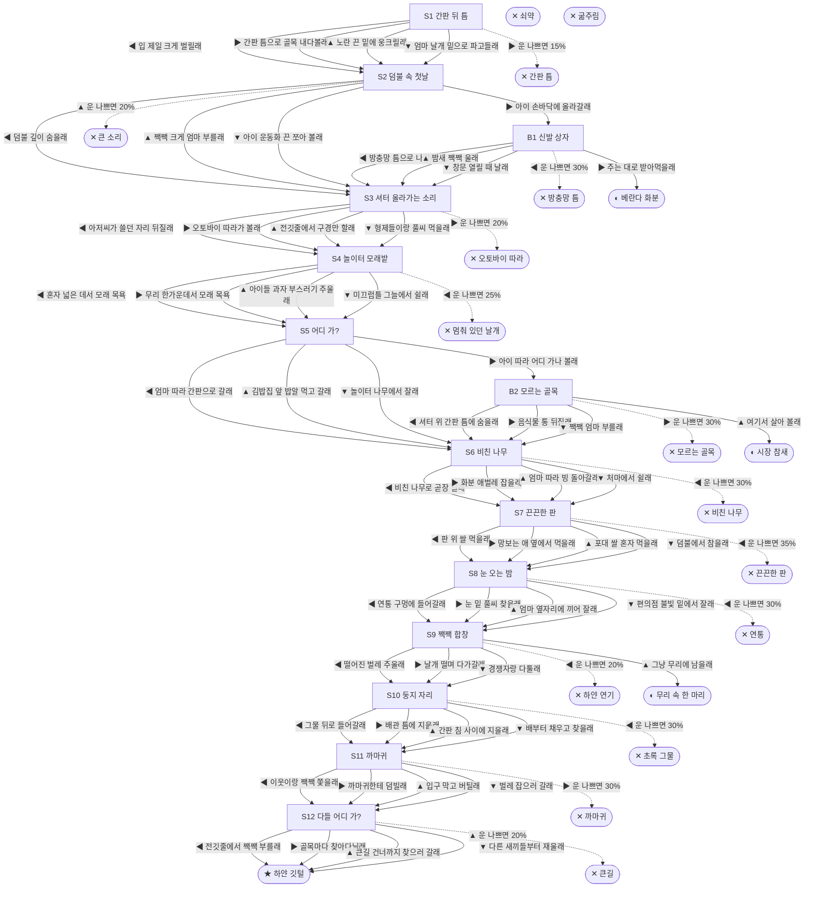

# 참새 (Passer montanus)

> 이 문서는 `node scripts/scenario-docs.js`로 만든다. 고칠 때는 `js/data/species/sparrow.js`를 고친다.

- 몸길이 14cm · 눈높이 90cm · 시작 스탯 체력 60 / 포만 40 (장면마다 체력 -4 · 포만 -14)
- 체력이나 포만 중 하나라도 0이 되면 스토리와 상관없이 죽는다 (쇠약 / 굶주림)
- 해피엔딩: **하얀 깃털** (생후 1년 1개월)
- 나는 세탁소 간판 뒤 틈에서 깼어. 지푸라기에 노란 비닐끈을 엮은 게 우리 집이야. 간판 틈으로 골목이 보여. 아침부터 저녁까지 사람들이 지나가. 다들 어디 가는 걸까. 도시 참새는 보통 두 해쯤 산대.

## 흐름도
실선은 진행, 점선은 운이 나쁠 때(즉사 확률).

## 장면 (카드를 미는 방향 ◀ ▶ ▲ ▼, ★ 메인 루트)

| 장면 | 배경(등장) | 시기 | ◀ | ▶ | ▲ | ▼ |
|---|---|---|---|---|---|---|
| S1 간판 뒤 틈 | 상가 골목 (sparrow:signNest, magpie) | 생후 12일 | 입 제일 크게 벌릴래 (포만 +25 · 다침 30% 체력 -10) | 간판 틈으로 골목 내다볼래 (포만 +10 · 즉사 15%) | 노란 끈 밑에 웅크릴래 (체력 +10, 포만 -5) | 엄마 날개 밑으로 파고들래 (체력 +5, 포만 +15) ★ |
| S2 덤불 속 첫날 | 아파트 단지 화단 (sparrow:bushParent, sparrow:kidReach, strayCat) | 생후 2주 | 덤불 깊이 숨을래 (포만 +15) ★ | 아이 손바닥에 올라갈래 (포만 +5) | 짹짹 크게 엄마 부를래 (포만 +25 · 즉사 20%) | 아이 운동화 끈 쪼아 볼래 (포만 +10 · 다침 35% 체력 -12) |
| B1 신발 상자 | 가정집 거실 (sparrow:shoeBox, sparrow:screenGap, kid) | +1일 | 방충망 틈으로 나갈래 (포만 -5 · 즉사 30%) | 주는 대로 받아먹을래 (포만 +20) | 밤새 짹짹 울래 (포만 -5) | 창문 열릴 때 날래 (체력 +5, 포만 +5 · 다침 30% 체력 -10) |
| S3 셔터 올라가는 소리 | 상가 골목 (sparrow:laundryMan, scooter) | 생후 6주 | 아저씨가 쓸던 자리 뒤질래 (포만 +20) ★ | 오토바이 따라가 볼래 (포만 +20 · 즉사 20%) | 전깃줄에서 구경만 할래 (체력 +5, 포만 -5) | 형제들이랑 풀씨 먹을래 (포만 +15 · 다침 30% 체력 -10) |
| S4 놀이터 모래밭 | 근린공원 (sparrow:sandBath, sparrow:kestrelHover) | 생후 6주 | 혼자 넓은 데서 모래 목욕 (체력 +20 · 즉사 25%) | 무리 한가운데서 모래 목욕 (체력 +5, 포만 +10) ★ | 아이들 과자 부스러기 주울래 (포만 +25 · 다침 35% 체력 -12) | 미끄럼틀 그늘에서 쉴래 (체력 +10, 포만 -5) |
| S5 어디 가? | 빌라 골목 (sparrow:momCall, kid) | 생후 6주 | 엄마 따라 간판으로 갈래 (포만 +5) ★ | 아이 따라 어디 가나 볼래 (포만 +5) | 김밥집 앞 밥알 먹고 갈래 (포만 +20 · 다침 35% 체력 -10) | 놀이터 나무에서 잘래 (포만 -5 · 다침 40% 체력 -12) |
| B2 모르는 골목 | 식당가 뒷골목 (sparrow:tteokShutter, strayCat) | +0일 | 셔터 위 간판 틈에 숨을래 (체력 -5, 포만 -5) | 음식물 통 뒤질래 (포만 +25 · 즉사 30%) | 여기서 살아 볼래 (포만 +15) | 짹짹 엄마 부를래 (포만 -5 · 다침 40% 체력 -15) |
| S6 비친 나무 | 상가 골목 (sparrow:cafeGlass, sparrow:planterBugs) | 생후 5개월 | 비친 나무로 곧장 날래 (포만 +25 · 즉사 30%) | 화분 애벌레 잡을래 (포만 +20 · 다침 30% 체력 -10) | 엄마 따라 빙 돌아갈래 (포만 +15) ★ | 처마에서 쉴래 (체력 +10, 포만 -5) |
| S7 끈끈한 판 | 분리수거장 (sparrow:glueTrap, sparrow:riceSack, strayCat) | 생후 7개월 | 판 위 쌀 먹을래 (포만 +35 · 즉사 35%) | 망보는 애 옆에서 먹을래 (포만 +20 · 다침 30% 체력 -10) ★ | 포대 쌀 혼자 먹을래 (포만 +30 · 다침 50% 체력 -20) | 덤불에서 참을래 (체력 +5, 포만 -5) |
| S8 눈 오는 밤 | 빌라 골목 (sparrow:huddleEave, sparrow:flue) | 생후 8개월 | 연통 구멍에 들어갈래 (체력 +15 · 즉사 30%) | 눈 밑 풀씨 찾을래 (포만 +25 · 다침 40% 체력 -15) | 엄마 옆자리에 끼어 잘래 (체력 +10, 포만 +10) ★ | 편의점 불빛 밑에서 잘래 (포만 +15 · 다침 30% 체력 -10) |
| S9 짹짹 합창 | 근린공원 (sparrow:chorusShrub, sparrow:fogMachine) | 생후 11개월 | 떨어진 벌레 주울래 (포만 +35 · 즉사 20% · 다침 40% 체력 -20) | 날개 떨며 다가갈래 (포만 +5) ★ | 그냥 무리에 남을래 (포만 +10) | 경쟁자랑 다툴래 (포만 +5 · 다침 40% 체력 -15) |
| S10 둥지 자리 | 빌라 주차장 (sparrow:pipeGap, sparrow:birdNet, sparrow:spikeSign) | 생후 11개월 | 그물 뒤로 들어갈래 (포만 +10 · 즉사 30%) | 배관 틈에 지을래 (포만 +10) ★ | 간판 침 사이에 지을래 (포만 +5 · 다침 40% 체력 -15) | 배부터 채우고 찾을래 (포만 +25 · 다침 30% 체력 -10) |
| S11 까마귀 | 빌라 주차장 (sparrow:chicksPipe, crow) | 생후 1년 | 이웃이랑 짹짹 쫓을래 (자손 +5, 포만 +10 · 다침 30% 체력 -10) ★ | 까마귀한테 덤빌래 (자손 +5, 포만 +5 · 즉사 30%) | 입구 막고 버틸래 (자손 +3 · 다침 40% 체력 -15) | 벌레 잡으러 갈래 (자손 +2, 포만 +20) |
| S12 다들 어디 가? | 빌라 골목 (sparrow:fledglings, auntie) | 생후 1년 | 전깃줄에서 짹짹 부를래 ★ | 골목마다 찾아다닐래 (포만 -10 · 다침 40% 체력 -15) | 큰길 건너까지 찾으러 갈래 (포만 -5 · 즉사 20%) | 다른 새끼들부터 재울래 (체력 +5, 포만 -5) |

## 엔딩

| 엔딩 | 종류 | 사인(가해자) | 마지막 문장 |
|---|---|---|---|
| H1 하얀 깃털 | 해피 | 노환 | "엄마, 사람들은 저녁마다 어디 가?" "집에." 막내가 내 날개 밑으로 파고들어. 왼쪽 날개에 하얀 깃털이 하나. 우리 엄마 거랑 똑같아. |
| N1 베란다 화분 | 노멀 | 노환 | 날 수 있게 되자 아이가 창문을 열어 줬어. 나는 멀리 안 갔어. 그 집 베란다 화분이 내 집이 됐어. 아이가 학교 갈 때마다 내가 물어. 어디 가? |
| N2 무리 속 한 마리 | 노멀 | 노환 | 짝은 끝내 못 찾았어. 겨울밤이면 무리랑 처마 밑에 붙어 잤어. 맨 끝, 하얀 깃털이 앉던 자리엔 이제 내가 앉아. |
| N3 시장 참새 | 노멀 | 노환 | 그 골목에서 두 해를 살았어. 저녁마다 사람들이 셔터를 내리고 집에 가. 나는 떡집 간판 밑으로 가. 여기가 내 집이야. |
| D1 간판 틈 | 데드 | 까치 (sparrow:magpieGrab) | 엄마가 머리 넣으라고 했는데. |
| D2 큰 소리 | 데드 | 길고양이 (strayCat) | 엄마를 불렀을 뿐인데. |
| D3 멈춰 있던 날개 | 데드 | 황조롱이 (sparrow:kestrelDive) | 무리 한가운데 있을걸. |
| D4 오토바이 따라 | 데드 | 트럭 (truck) | 아저씨가 어디 가는지 끝내 못 봤어. |
| D5 비친 나무 | 데드 | 유리창 충돌 (sparrow:cafeGlass) | 유리 속 은행나무가 진짜인 줄 알았어. |
| D6 끈끈한 판 | 데드 | 끈끈이 (sparrow:glueTrap) | 쌀알이 너무 반듯하게 놓여 있었어. |
| D7 연통 | 데드 | 연통 추락 (sparrow:flue) | 김이 따뜻해서 들어갔는데, 붙잡을 데가 없었어. |
| D8 초록 그물 | 데드 | 퇴치망 얽힘 (sparrow:birdNet) | 들어갈 땐 틈이 있었는데, 나올 땐 없었어. |
| D9 까마귀 | 데드 | 까마귀 (sparrow:crowRaid) | 새끼들아, 배관 틈 안쪽에 꼭 붙어 있어. |
| D10 방충망 틈 | 데드 | 방충망 끼임 (sparrow:screenGap) | 창밖에서 엄마가 계속 불렀어. |
| D11 하얀 연기 | 데드 | 살충제 중독 (sparrow:fogMachine) | 벌레가 왜 그렇게 많이 떨어져 있었는지 몰랐어. |
| D12 모르는 골목 | 데드 | 길고양이 (strayCat) | 엄마 목소리가 들리는 데까지만 갈걸. |
| D13 큰길 | 데드 | 차량 충돌 (car) | 막내는 집에 왔을까. |
| W0 쇠약 | 데드 | 쇠약 | 깃털을 부풀려도 이제 따뜻해지지 않아. |
| W1 굶주림 | 데드 | 굶주림 | 하루만 굶어도 위험한데, 사흘째야. |
