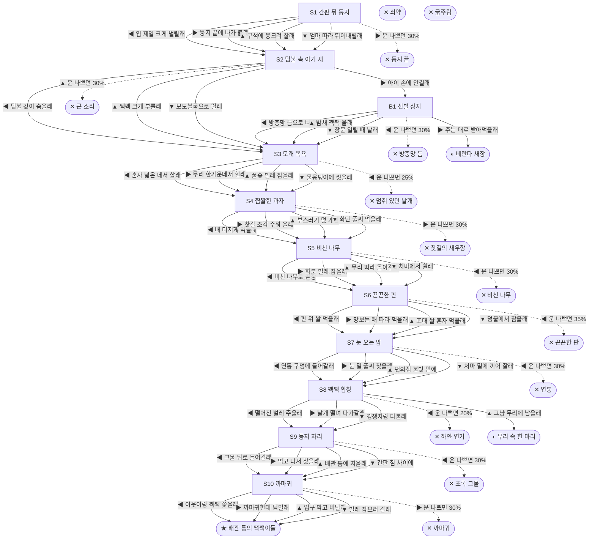

# 참새 (Passer montanus)

> 이 문서는 `node scripts/scenario-docs.js`로 만든다. 고칠 때는 `js/data/species/sparrow.js`를 고친다.

- 몸길이 14cm · 눈높이 90cm · 시작 스탯 체력 60 / 포만 40 (장면마다 체력 -4 · 포만 -16)
- 체력이나 포만 중 하나라도 0이 되면 스토리와 상관없이 죽는다 (쇠약 / 굶주림)
- 해피엔딩: **배관 틈의 짹짹이들** (생후 1년 1개월)
- 나는 빌라 1층 상가 간판 뒤 틈에서 깼어. 지푸라기랑 비닐 끈을 엮은 게 우리 집이야. 도시 참새는 보통 2년쯤 산대. 첫겨울을 넘기는 건 열에 서넛뿐이래.

## 흐름도
실선은 진행, 점선은 운이 나쁠 때(즉사 확률).

## 장면 (카드를 미는 방향 ◀ ▶ ▲ ▼, ★ 메인 루트)

| 장면 | 배경(등장) | 시기 | ◀ | ▶ | ▲ | ▼ |
|---|---|---|---|---|---|---|
| S1 간판 뒤 둥지 | 빌라 골목 (sparrow:signNest, magpie) | 생후 12일 | 입 제일 크게 벌릴래 (포만 +25 · 다침 40% 체력 -10) | 둥지 끝에 나가 볼래 (포만 +20 · 즉사 30%) | 구석에 웅크려 잘래 (체력 +10, 포만 -5) | 엄마 따라 뛰어내릴래 (포만 +10 · 다침 30% 체력 -5) ★ |
| S2 덤불 속 아기 새 | 아파트 단지 화단 (sparrow:bushParent, sparrow:kidReach, strayCat) | 생후 2주 | 덤불 깊이 숨을래 (포만 +20) ★ | 아이 손에 안길래 (포만 +5) | 짹짹 크게 부를래 (포만 +30 · 즉사 30%) | 보도블록으로 뛸래 (포만 +15 · 다침 40% 체력 -15) |
| B1 신발 상자 | 가정집 거실 (sparrow:shoeBox, sparrow:screenGap, kid) | +1일 | 방충망 틈으로 나갈래 (포만 -5 · 즉사 30%) | 주는 대로 받아먹을래 (포만 +20) | 밤새 짹짹 울래 (포만 -5) | 창문 열릴 때 날래 (체력 +5, 포만 +5 · 다침 30% 체력 -10) |
| S3 모래 목욕 | 근린공원 (sparrow:sandBath, sparrow:kestrelHover) | 생후 7주 | 혼자 넓은 데서 할래 (체력 +20 · 즉사 25%) | 무리 한가운데서 할래 (체력 +10, 포만 +10) ★ | 풀숲 벌레 잡을래 (포만 +30 · 다침 30% 체력 -10) | 물웅덩이에 씻을래 (체력 +5, 포만 +5) |
| S4 짭짤한 과자 | 편의점 앞 (sparrow:snackMan, sparrow:snackBits, pigeonFlock) | 생후 3개월 | 배 터지게 먹을래 (포만 +40 · 다침 50% 체력 -20) | 찻길 조각 주워 올래 (포만 +30 · 즉사 30%) | 부스러기 몇 개만 (포만 +15 · 다침 30% 체력 -5) | 화단 풀씨 먹을래 (포만 +20) ★ |
| S5 비친 나무 | 식당가 뒷골목 (sparrow:cafeGlass, sparrow:planterBugs) | 생후 5개월 | 비친 나무로 곧장 (포만 +25 · 즉사 30%) | 화분 벌레 잡을래 (포만 +20 · 다침 30% 체력 -10) | 무리 따라 돌아갈래 (포만 +15) ★ | 처마에서 쉴래 (체력 +10, 포만 -5) |
| S6 끈끈한 판 | 분리수거장 (sparrow:glueTrap, sparrow:riceSack, strayCat) | 생후 6개월 | 판 위 쌀 먹을래 (포만 +35 · 즉사 35%) | 망보는 애 따라 먹을래 (포만 +20 · 다침 30% 체력 -10) ★ | 포대 쌀 혼자 먹을래 (포만 +30 · 다침 50% 체력 -20) | 덤불에서 참을래 (체력 +5, 포만 -5) |
| S7 눈 오는 밤 | 빌라 골목 (sparrow:huddleEave, sparrow:flue) | 생후 8개월 | 연통 구멍에 들어갈래 (체력 +15 · 즉사 30%) | 눈 밑 풀씨 찾을래 (포만 +25 · 다침 40% 체력 -15) | 편의점 불빛 밑에 (포만 +15 · 다침 30% 체력 -10) | 처마 밑에 끼어 잘래 (체력 +5, 포만 +10 · 다침 30% 체력 -5) ★ |
| S8 짹짹 합창 | 근린공원 (sparrow:chorusShrub, sparrow:fogMachine) | 생후 11개월 | 떨어진 벌레 주울래 (포만 +35 · 즉사 20% · 다침 40% 체력 -20) | 날개 떨며 다가갈래 (포만 +15) ★ | 그냥 무리에 남을래 (포만 +10) | 경쟁자랑 다툴래 (포만 +5 · 다침 40% 체력 -15) |
| S9 둥지 자리 | 빌라 주차장 (sparrow:pipeGap, sparrow:birdNet, sparrow:spikeSign) | 생후 11개월 | 그물 뒤로 들어갈래 (포만 +10 · 즉사 30%) | 먹고 나서 찾을래 (포만 +25 · 다침 30% 체력 -10) | 배관 틈에 지을래 (포만 +10) ★ | 간판 침 사이에 (포만 +5 · 다침 40% 체력 -15) |
| S10 까마귀 | 빌라 주차장 (sparrow:chicksPipe, crow) | 생후 1년 | 이웃이랑 짹짹 쫓을래 (자손 +4, 포만 +10 · 다침 30% 체력 -10) ★ | 까마귀한테 덤빌래 (자손 +5, 포만 +5 · 즉사 30%) | 입구 막고 버틸래 (자손 +3 · 다침 40% 체력 -15) | 벌레 잡으러 갈래 (자손 +2, 포만 +20) |

## 엔딩

| 엔딩 | 종류 | 사인(가해자) | 마지막 문장 |
|---|---|---|---|
| H1 배관 틈의 짹짹이들 | 해피 | 노환 | 새끼들이 전깃줄에 한 줄로 앉았어. 내년 봄엔 걔네도 어딘가 둥지를 틀겠지. |
| N1 베란다 새장 | 노멀 | 노환 | 아이가 매일 좁쌀을 줬어. 창밖 무리 소리가 들릴 때만 좀 쓸쓸했어. |
| N2 무리 속 한 마리 | 노멀 | 노환 | 짝은 끝내 못 찾았지만, 겨울을 두 번 넘겼어. 무리 속이라 춥지 않았어. |
| D1 둥지 끝 | 데드 | 까치 (sparrow:magpieGrab) | 하루만 더 안쪽에 있을걸. |
| D2 큰 소리 | 데드 | 길고양이 (strayCat) | 엄마를 불렀을 뿐인데. |
| D3 멈춰 있던 날개 | 데드 | 황조롱이 (sparrow:kestrelDive) | 무리 속에 있을걸. |
| D4 찻길의 새우깡 | 데드 | 차량 충돌 (car) | 과자 한 조각이었는데. |
| D5 비친 나무 | 데드 | 유리창 충돌 (sparrow:cafeGlass) | 저기 진짜 나무가 있는 줄 알았어. |
| D6 끈끈한 판 | 데드 | 끈끈이 (sparrow:glueTrap) | 쌀알이 너무 반듯하게 놓여 있었어. |
| D7 연통 | 데드 | 연통 추락 (sparrow:flue) | 따뜻한 데는 다 이유가 있었어. |
| D8 초록 그물 | 데드 | 퇴치망 얽힘 (sparrow:birdNet) | 아늑해 보였는데, 나가는 길이 없었어. |
| D9 까마귀 | 데드 | 까마귀 (sparrow:crowRaid) | 새끼들아, 숨어 있어. |
| D10 방충망 틈 | 데드 | 방충망 끼임 (sparrow:screenGap) | 조금만 더 작았으면. |
| D11 하얀 연기 | 데드 | 살충제 중독 (sparrow:fogMachine) | 벌레가 왜 그렇게 많이 떨어져 있었는지 몰랐어. |
| W0 쇠약 | 데드 | 쇠약 | 깃털을 부풀려도 이제 따뜻해지지 않아. |
| W1 굶주림 | 데드 | 굶주림 | 하루만 굶어도 위험한데, 사흘째야. |
