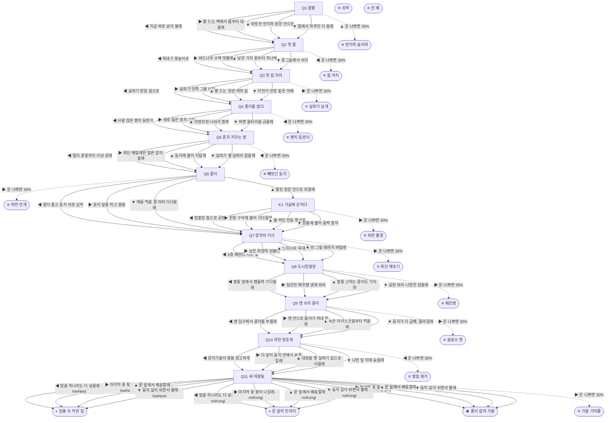

# 말벌 (Vespa velutina)

> 이 문서는 `node scripts/scenario-docs.js`로 만든다. 고칠 때는 `js/data/species/wasp.js`를 고친다.

- 몸길이 3cm · 눈높이 1.2cm · 시작 스탯 체력 100 / 포만 45 (장면마다 체력 -5 · 포만 -8)
- 체력이나 포만 중 하나라도 0이 되면 스토리와 상관없이 죽는다 (쇠약 / 굶주림)
- 해피엔딩: **종이 집의 가을** (생후 7개월)
- 빌라 외벽 갈라진 틈에서 겨울을 났어. 나는 등검은말벌 여왕이야. 지난가을 태어난 둥지는 겨울에 다 사라졌어. 엄마도, 언니들도. 이제 나 혼자 종이를 씹어 집을 짓고, 첫 아이들도 혼자 키워야 해.

## 흐름도
실선은 진행, 점선은 운이 나쁠 때(즉사 확률).

## 장면 (카드를 미는 방향 ◀ ▶ ▲ ▼, ★ 메인 루트)

| 장면 | 배경(등장) | 시기 | ◀ | ▶ | ▲ | ▼ |
|---|---|---|---|---|---|---|
| Q1 봄볕 | 빌라 골목 (wasp:wallCrack, wasp:basementWindow) | 생후 1일 | 지금 바로 날아 볼래 (포만 +6 · 다침 35% 체력 -15) | 볕 드는 벽에서 몸부터 데울래 (체력 +6, 포만 -2) ★ | 따뜻한 반지하 창문 안으로 (체력 +10 · 즉사 30%) | 틈에서 하루만 더 잘래 (체력 +3, 포만 -6) |
| Q2 첫 꿀 | 근린공원 (wasp:cherryTwig) | 생후 5일 | 꼭대기 꽃송이로 (포만 +30 · 즉사 30%) | 버드나무 수액 맛볼래 (포만 +22, 체력 -3 · 다침 30% 체력 -12) | 낮은 가지 꽃부터 하나씩 (포만 +22) ★ | 꽃그늘에서 쉬자 (체력 +8, 포만 +3) |
| Q3 첫 집 자리 | 빌라 주차장 (wasp:acCorner) | 생후 10일 | 실외기 받침 밑으로 (체력 -2) ★ | 실외기 안쪽 그물 너머 (체력 +4 · 즉사 30%) | 볕 드는 현관 처마 밑 (체력 -2, 포만 -3 · 다침 35% 체력 -14) | 자전거 안장 밑은 어때 (포만 -2 · 다침 30% 체력 -10) |
| Q4 종이를 씹다 | 근린공원 (wasp:woodFence) | 생후 13일 | 사람 앉은 벤치 등받이 (체력 -2, 포만 +4 · 즉사 30%) | 새로 칠한 정자 기둥 (체력 -3 · 다침 40% 체력 -14) | 쉬엄쉬엄 나눠서 할래 (체력 +4, 포만 -5) | 바랜 울타리를 긁을래 (체력 -5) ★ |
| Q5 혼자 키우는 방 | 빌라 주차장 (wasp:primaryNest, wasp:rivalQueen) | 생후 4주 | 멀리 꽃밭까지 사냥 갈래 (포만 +20, 체력 -4 · 즉사 35%) | 화단 애벌레만 얼른 잡아 올래 (포만 +12, 체력 -4) ★ | 둥지에 붙어 지킬래 (체력 +2, 포만 -8) | 실외기 옆 날파리 잡을래 (포만 +10, 체력 -3 · 다침 30% 체력 -12) |
| Q6 콩이 | 빌라 주차장 (wasp:primaryNest, wasp:kongi, wasp:sprayHand) | 생후 8주 | 콩이 품고 둥지 뒤로 납작 (체력 -3) ★ | 둥지 앞을 막고 붕붕 (체력 -3 · 즉사 35%) | 열린 창문 안으로 피할래 (체력 +2) | 애들 먹을 꿀 따러 다녀올래 (포만 +15, 체력 -2 · 다침 35% 체력 -12) |
| K1 거실에 갇히다 | 가정집 거실 (wasp:screenGap, eSwatter) | 생후 8주 | 방충망 틈으로 곧장 (체력 -6) | 천장 구석에 붙어 기다릴래 (체력 +3, 포만 -6 · 즉사 30%) | 불 켜진 전등 쪽으로 (체력 -4 · 다침 35% 체력 -12) | 창틀에 붙어 꼼짝 말자 (체력 -2, 포만 -4) |
| Q7 장맛비 이사 | 아파트 단지 화단 (wasp:kongi, wasp:branchNest) | 생후 3개월 | 3층 베란다 처마 밑 (체력 -5 · 다침 35% 체력 -14) | 낮은 회양목 덤불에 (체력 -2 · 즉사 30% · 플래그 lowNest) | 느티나무 꼭대기로 (체력 -8, 포만 +6) ★ | 비 그칠 때까지 버틸래 (체력 +4, 포만 -8) |
| Q8 도시양봉장 | 근린공원 (wasp:beeTrap, wasp:beehive) | 생후 3개월 | 벌통 앞에서 맴돌며 기다릴래 (포만 +25, 체력 -4 · 다침 40% 체력 -18) | 달큰한 페트병 냄새 따라 (포만 +15 · 즉사 35%) | 벌통 근처는 콩이도 가지 마 (체력 +3, 포만 -6) | 공원 파리·나방만 잡을래 (포만 +18, 체력 -4) ★ |
| Q9 캔 속의 콩이 | 편의점 앞 (wasp:sodaCan, wasp:iceDrip) | 생후 4개월 | 캔 입구에서 콩이를 부를래 (체력 -4, 포만 +10) ★ | 캔 안으로 들어가 꺼내 올래 (포만 +18, 체력 -2 · 즉사 30%) | 녹은 아이스크림부터 먹을래 (포만 +22 · 다침 35% 체력 -15) | 둥지가 더 급해, 돌아갈래 (체력 +4, 포만 -4 · 플래그 noKongi) |
| Q10 하얀 방호복 | 아파트 단지 화단 (wasp:bigNest, wasp:beeSuit) | 생후 5개월 | 문지기들이 붕붕 경고하게 (체력 -2 · 즉사 35%) | 다 같이 둥지 안에서 숨죽일래 (체력 -2, 포만 +8) ★ | 대원을 옛 실외기 집으로 이끌래 (체력 -8 · 다침 35% 체력 -12) | 나만 잎 뒤에 숨을래 (체력 +4, 포만 -3) |
| Q11 새 여왕들 | 아파트 단지 화단 (wasp:bigNest, wasp:newQueens, spider) | 생후 6개월 | 알을 하나라도 더 낳을래 (자손 +300, 체력 -8) | 마지막 꽃 찾아 나갈래 (자손 +260, 포만 +15 · 즉사 30%) | 문 앞에서 배웅할래 (자손 +320, 체력 -4) ★ | 둥지 깊이 쉬면서 볼래 (자손 +280, 체력 +6) |

## 엔딩

| 엔딩 | 종류 | 사인(가해자) | 마지막 문장 |
|---|---|---|---|
| H1 종이 집의 가을 | 해피 | 노쇠 | 봄에 빌라 틈에서 혼자 깼던 내가, 종이를 씹어 천 마리를 키웠어. 콩이가 처음 붙인 층에서 새 여왕들이 날아갔어. 겨울은 너희가 건너. 봄볕에 깨면, 종이부터 씹으렴. |
| N1 덤불 속 작은 집 | 노멀 | 노쇠 | 덤불 둥지는 끝내 작았어. 새 여왕은 몇 안 됐지만 그래도 날아갔어. 한 마리면 충분해. 나도 한 마리였으니까. |
| N2 문 앞의 빈자리 | 노멀 | 노쇠 | 새 여왕들이 날아갔어. 근데 그 여름 편의점 앞에서 왜 돌아섰을까. 문 앞 콩이 자리가 자꾸 눈에 밟혀. |
| D1 반지하 슬리퍼 | 데드 | 슬리퍼 (slipper) | 따뜻한 데로 간 건데. 사람 집은 아직 일렀나 봐. |
| D2 봄 까치 | 데드 | 까치 (magpie) | 꽃 한 송이만 더 먹으려다가. 집 지을 자리도 못 봤는데. |
| D3 실외기 날개 | 데드 | 실외기 팬 (wasp:acCorner) | 아늑해 보였는데, 거긴 바람 만드는 곳이었어. |
| D4 벤치 등받이 | 데드 | 손바닥 (hand) | 종이 한 덩이만 가져가려 했어. 쏘려던 게 아니야. |
| D5 빼앗긴 둥지 | 데드 | 다른 여왕 (wasp:rivalQueen) | 내가 씹어 만든 방에, 남의 알이 들어가겠지. |
| D6 하얀 안개 | 데드 | 살충 스프레이 (wasp:sprayHand) | 콩이가 태어난 날이었어. |
| D7 화단 예초기 | 데드 | 예초기 (worker) | 덤불째 날아갔어. 높이 지을걸. |
| D8 페트병 | 데드 | 말벌 포획기 (wasp:beeTrap) | 달콤한 냄새는 다 함정이었어. 안에 다른 말벌들이 잔뜩이야. |
| D9 음료수 캔 | 데드 | 음료수 캔에 갇힘 (wasp:sodaCan) | 캔 속은 깜깜하고 달아. 콩이 날개가 옆에 있어서 덜 무서웠어. |
| D10 벌집 제거 | 데드 | 119 벌집 제거 (wasp:beeSuit) | 대원 아저씨는 할 일을 한 거야. 우리도 그냥 살았던 거고. |
| D11 가을 거미줄 | 데드 | 무당거미 (spider) | 딸들은 다 떠났어. 이제 됐어. |
| D12 파란 불꽃 | 데드 | 전기 파리채 (eSwatter) | 나가는 창문만 찾고 있었는데. |
| W0 쇠약 | 데드 | 쇠약 | 날개가 무거워. 종이 한 장만 더 붙이고 쉴게. |
| W1 빈 배 | 데드 | 굶주림 | 꿀 한 모금이면 됐는데. |
